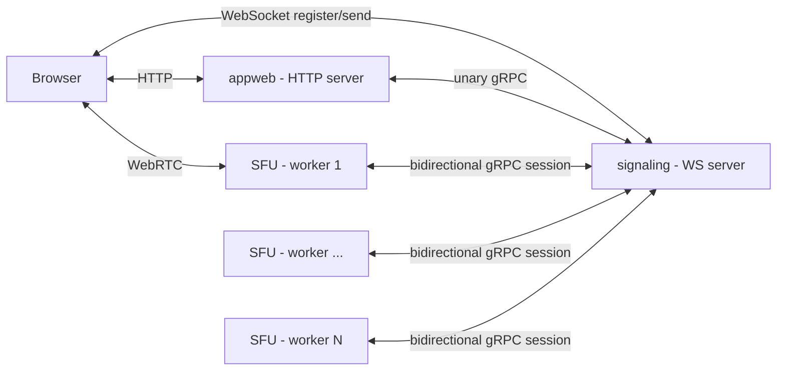
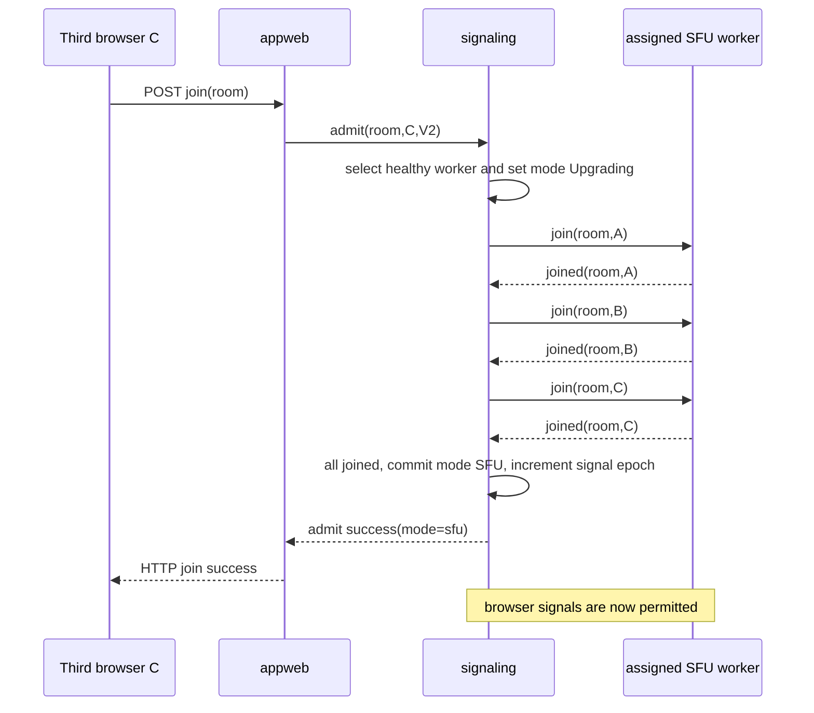

# AppRTC Signaling Architecture: P2P and SFU Call Modes

## Background and motivation

This architecture supports two browser protocols. V1 provides two-party P2P compatibility with HTTP join/leave, initiator election, queued messages, reconnect grace, and opaque string room/client IDs. V2 adds numeric `u64` IDs, token-bound browser registration, P2P→SFU mode transition, and multi-party SFU media. The Rust `sfu` crate is a signaling-agnostic `sansio::Protocol` media engine whose `RoomId` and `ClientId` are `u64` and whose `SFUEvent` API accepts joins, SDP, ICE candidates, and leaves.

The current implementation preserves the V1 contract for existing AppRTC-compatible clients while adding a V2 protocol that starts as two-party P2P and upgrades to multi-party SFU media. SFU→P2P downgrade remains a planned extension and is explicitly labeled as such below. One signaling authority owns room state and routes browser SDP/ICE either to the P2P peer or to the assigned SFU worker.

Browsers use long-lived, full-duplex WebSocket signaling channels, AppWeb uses unary gRPC calls multiplexed over a reusable HTTP/2 channel, and SFU workers use long-lived bidirectional gRPC streams. The media plane remains WebRTC between browser and SFU.

The implementation is organized as four core Rust crates plus the SFU crate:

| Component         | Network role                                              | Owns                                                                                                                 |
|-------------------|-----------------------------------------------------------|----------------------------------------------------------------------------------------------------------------------|
| `apprtc`          | HTTP, WebSocket, gRPC, and UDP runtime adapters            | standalone `appweb`, `signaling`, and `sfu` binaries, TLS listeners, browser WebSocket sessions, gRPC adapters, Collider/SFU drivers, logging, and graceful shutdown |
| `appweb`          | HTTP server; gRPC **client** of `signaling`               | app/web server, static assets, HTTP room API, ICE config, templates, client-id minting                               |
| `signaling`       | no network role; Sans-I/O signaling authority             | authoritative V1/V2 room model, queue/reconnect grace, P2P relay, SFU worker registry, room assignment, upgrade barrier, and recovery state |
| `signaling-proto` | no network role; shared Protobuf/tonic schema             | generated AppWeb/signaling/SFU gRPC request, response, command, result, and event types                              |
| `sfu`             | no network role; Sans-I/O WebRTC media engine             | per-client WebRTC state, SDP/ICE application, RTP/RTCP forwarding; the `apprtc` `sfu` binary supplies UDP and gRPC I/O |

`appweb` and `signaling` are separate crates; the standalone `appweb` and `signaling` processes communicate through the `RoomAuthority` boundary defined by the §8.4 gRPC protocol. `signaling-proto` owns that shared contract without depending on either implementation. The standalone `sfu` process uses the §8.5 stream while keeping the Sans-I/O `Sfu` engine independent from its gRPC/UDP driver. Browser protocols (§8.2 and §8.3) remain public JSON WebSocket protocols, while AppWeb and SFU use the private `signaling.v2.SignalingService` API on a separate HTTP/2 listener.

Within the `apprtc` runtime crate, `ws_server.rs` owns the public TCP/TLS listener, HTTP upgrade, WebSocket framing, and browser-session tasks; `grpc_server.rs` owns the private tonic service adapter; and `signaling_server.rs` owns the command channel and single event loop that drives the Sans-I/O `Collider`. Both network adapters submit typed commands to that event loop and never mutate signaling state directly. `tls.rs` provides the shared certificate and listener support used by the binaries.

## 1. Topology and authority



`appweb` serves the browser HTTP routes, but it does not hold room membership or live browser socket state. `signaling` owns separate V1 and V2 room tables, so the same visible text (for example `"42"`) can independently identify a V1 string-keyed room and V2 numeric room:

```text
V1RoomTable: Map<String, V1Room<String>>

V2Room {
  id: u64,
  mode: P2P | Upgrading | SFU | Failed,
  members: Map<u64, BrowserClient>,
  signal_epoch: u64,                // increments when P2P→SFU commits
  assigned_sfu: Option<InstanceId>, // selected SFU process incarnation
  assignment_epoch: u64,            // assignment generation, stable across same-instance reconnect
}
```

`Downgrading` remains reserved in the Protobuf enum and in the future design, but it is not a current signaling-core state.

`BrowserClient` owns the registered WebSocket (if any), its bounded outbound queue, and its reconnect-grace timer. The
SFU owns only a projection of members assigned to it. It must never decide occupancy, initiate a P2P→SFU upgrade, or
route a browser frame to another browser.

For **v2**, room and client IDs are `u64` end-to-end. Browser JSON represents them as canonical decimal strings and
validates with `BigInt`, avoiding JavaScript `Number` precision loss. V2 client IDs are random `u64` values. A v2 value
must be canonical unsigned decimal (`0` or a non-zero digit followed by digits) and parse without overflow as `u64`;
invalid room/client IDs return an error to the browser and create no room/member state. **V1 remains wire-compatible:**
its `roomid` and `clientid` remain arbitrary opaque JSON strings because compatible clients may use non-numeric values.
A V1 room is never assigned to an SFU, so those strings never cross the SFU boundary.

## 2. Current SFU integration contract

The existing `sfu` source is authoritative. The signaling adapter drives `Sfu` through `sansio::Protocol`:

| Hub→worker command              | Current engine input           |
|---------------------------------|--------------------------------|
| member admitted to an SFU room  | `SFUEvent::Join`               |
| browser SDP offer or answer     | `SFUEvent::SessionDescription` |
| browser trickle candidate       | `SFUEvent::IceCandidate`       |
| member removed from an SFU room | `SFUEvent::Leave`              |

The worker drains `Sfu::poll_event()` and sends each emitted `SFUEvent::SessionDescription` to its addressed browser
through `signaling`. An answer is emitted for a browser publish offer; a server-created subscribe re-offer is also the
same event variant, distinguished by SDP type `offer` and its `request_id`. At this Rust API boundary only, the worker
adapter maps that field to the signaling protocol's `requestid` field.

The worker owns the only mutable `Sfu` instance in its event loop. gRPC stream reads enqueue commands for that loop; the
loop performs `handle_event`, drains `poll_write()` to socket, feeds packets to `handle_read`, calls `handle_timeout`,
and drains `poll_event()` back to the SFU session stream. Transport tasks never mutate `Sfu` concurrently. The current standalone SFU binary feeds and drains this loop through the §8.5 bidirectional gRPC session plus UDP sockets.

ICE candidates are first-class application-signaling messages in both P2P and SFU mode. The current engine accepts
`SFUEvent::IceCandidate` and currently places its host candidate in an SDP answer. A deployment may therefore send no
incremental SFU candidates, but it uses the same candidate protocol when it does. Enabling richer local candidate
gathering later requires only worker/engine work: the worker adapter emits the already-defined candidate `signal` frame.
It must not require a browser, hub, or wire-protocol revision.

## 3. Signaling endpoints and authenticated roles

Browsers reach the public `wss://signaling/ws` endpoint. AppWeb and SFU processes reach a separate private HTTP/2 listener implementing `signaling.v2.SignalingService`. V2 browser credentials are cryptographically random admission tokens created by `signaling` during `AdmitV2` and returned to the browser through AppWeb; the V1 browser path deliberately retains its current tokenless framing. The current gRPC transport supports server-authenticated TLS but not client authentication. `RequestContext.app_id` validates protocol role, not caller identity, so deployments must restrict the gRPC listener to trusted AppWeb/SFU hosts with host and provider firewalls. mTLS remains future hardening.

| Role              | Transport/API                                      | Session or request identity                                      | Traffic after admission or registration                                               |
|-------------------|----------------------------------------------------|------------------------------------------------------------------|----------------------------------------------------------------------------------------|
| Browser V1        | JSON WebSocket `/ws`                               | `{cmd:"register", roomid, clientid}`                            | Existing `{cmd:"send", msg}` and `{msg}` framing, with no new required field          |
| Browser V2        | JSON WebSocket `/ws`                               | `{cmd:"register", roomid, clientid, ver:2, token}`              | Same `send`/`msg` framing plus required `epoch` and V2-only controls                   |
| AppWeb            | Unary `SignalingService` RPCs                      | `RequestContext{APP_ID_APPWEB, instance_id, request_id}`         | `AdmitV1/V2`, `RemoveV1/V2`, `OccupancyV1/V2`, `InjectV1`, and `GetStatus`             |
| SFU worker        | Bidirectional `OpenSfuSession` RPC                 | First stream message is `RegisterSfu` with `APP_ID_SFU` context  | Ordered commands/results and reliable worker events/acknowledgements                   |

The hub validates a service role before processing any other command. A V2 browser may register only after an `admit`
has created its member record; V2 `register` and `send` never lazily create rooms or clients. The V1 path preserves its
established `register`/`send` semantics and does not require a new token or frame field. Its weaker admission model is
isolated to V1 and is not available to V2 rooms.

The browser `register` frame selects the internal key namespace unambiguously: `ver:2` requires a valid V2 admission
token and selects `RoomKey::V2(parsed_u64_roomid)` / `ClientKey::V2(parsed_u64_clientid)`; a frame with no `ver` is
handled as V1 and uses opaque-string keys. A frame that says `ver:2` but omits/invalidates its token is rejected, never
downgraded to V1. Therefore a V1 room named `"42"` and a V2 room whose ID is `42` are distinct rooms even though their
browser-visible text is the same.

### 3.1 Browser frames

```jsonc
// browser -> signaling after register (v2 stamps the room's current signal epoch)
{ "cmd": "send", "epoch": "0", "msg": "{...application signaling JSON...}" }

// signaling -> browser
{ "msg": "{...same application signaling JSON...}" }
{ "control": "registered",    "roomid": "42", "epoch": "0", "mode": "p2p", "is_initiator": true }  // v2 register acknowledgement
{ "control": "p2p-promote",   "roomid": "42", "epoch": "0", "is_initiator": true }
{ "control": "sfu-upgrade",   "roomid": "42", "epoch": "1" }
{ "control": "sfu-downgrade", "roomid": "42", "epoch": "2", "is_initiator": true } // optional, disabled initially
{ "control": "room-failed",   "roomid": "42", "reason": "WORKER_UNAVAILABLE" }
```

`msg` is opaque to `signaling`: it never parses the inner object — not SDP, not ICE, not `bye`. It selects the
destination from the authoritative room mode and the room's current signal epoch (§3.1.2). In P2P it relays to the other
member (or queues while absent); in SFU mode it wraps the source `(roomid, clientid)` and forwards the frame to the
assigned worker unmodified. SFU-mode membership is changed solely by the hub's `remove`/worker `leave` lifecycle path;
the **worker adapter silently drops** an inner `bye` (stock hangup flows emit it, so it is not an error), and the hub
ignores frames from a member that has completed `/v2/leave`.

Candidate messages use the same opaque `send`/`msg` envelope as SDP. The hub forwards them in both directions without
parsing, coalescing, or waiting for ICE gathering to finish. It only preserves per-client arrival order after the member
has reached `joined`; before that barrier it holds a bounded SDP/ICE queue. The worker adapter may receive a candidate
before the corresponding remote description has been applied; it buffers that candidate by client and applies it
immediately after the description. A candidate queued for a superseded negotiation or a departed lifecycle is discarded.
These rules make trickle optional at runtime but fully supported by the protocol.

When a V2 P2P room changes from two members to one, `signaling` promotes the survivor to initiator and sends
`p2p-promote` with the current epoch. This is required on every removal path — `remove` (from `/v2/leave`) and
reconnect-grace expiry — and is never conditional on a relayed `bye` reaching the survivor: the hub cannot see byes,
which are opaque `msg` payloads. The browser closes its retired direct PC, sets its initiator state from the control,
and is ready to queue the offer for a future second member. Because each member has one FIFO writer (§3.1.2), the
promote is enqueued after any relay already accepted from the departed peer, so no departed-peer frame follows it. This
is a membership change, not a mode transition, so it does not increment the epoch. A later `registered` snapshot
supersedes a missed promotion.

`room-failed` is the V2 failure notification. When the assigned SFU instance remains disconnected past recovery grace, signaling marks each assigned committed SFU room `Failed` and pushes `{control:"room-failed"}` to currently connected members. The current browser surfaces an error, and the failed room remains in authority state; new admits receive `WORKER_UNAVAILABLE`. Automatic room cleanup, token invalidation, and browser rejoin after committed worker loss are remaining recovery work. A failed pre-commit upgrade is different: it removes the provisional third member and restores the original P2P pair.

### 3.1.1 V1/V2 compatibility contract

Protocol version is selected by the HTTP route and WebSocket registration frame, not stored as a mutable property of one shared room. V1 uses `/r`, `/join`, and a registration with no `ver`; V2 uses `/v2/r`, `/v2/join`, and `ver:2`. The two signaling tables are separate namespaces, so a V1 room named `"42"` and V2 room `42` may coexist and never exchange members or signaling.

| Surface                      | V1 — compatibility protocol                                                                                           | V2 — SFU-capable protocol                                                                                                                                                                                                  |
|------------------------------|-----------------------------------------------------------------------------------------------------------------------|----------------------------------------------------------------------------------------------------------------------------------------------------------------------------------------------------------------------------|
| Browser WebSocket            | Same `/ws`, `{cmd:"register", roomid, clientid}`, `{cmd:"send", msg}`, `{msg}`, `{error}`                             | Same `/ws` and `register`/`send` envelope; `register` adds required `ver:2` + admission token, `send` adds the required `epoch`, and the hub pushes v2 `registered`, `p2p-promote`, `room-failed`, and mode-control frames |
| P2P signaling                | Stock initiator posts to `POST /message/{room}/{client}`; callee uses WS; `wss_post_url` POST/DELETE fallback remains | Both peers send all offer/answer/candidate/bye payloads through their own WS                                                                                                                                               |
| `/join` response             | Existing `result`/`params`, including `messages[]`, `wss_url`, and `wss_post_url`                                     | Adds `mode` and `epoch`, omits `messages[]` and `wss_post_url`                                                                                                                                                             |
| Capacity                     | Hard cap of two; return `FULL` for a third join                                                                       | P2P through two; third join may upgrade only when an SFU worker is ready                                                                                                                                                   |
| Room and client ID wire form | Existing strings, unchanged                                                                                           | Canonical decimal strings representing `u64`                                                                                                                                                                               |
| SFU routing                  | Never                                                                                                                 | Only after an explicit P2P→SFU transition                                                                                                                                                                                  |

The Rust `appweb` V1 handlers preserve `/join`, `/leave`, `/message`, `/params`, `/v1alpha/iceconfig`, `/r/{room}`, and
`wss_post_url` behavior. They translate V1 HTTP injection/fallback calls into an internal app→hub `inject` control frame
while preserving the V1 HTTP response and WebSocket payloads. The Rust `signaling` hub preserves the V1 queue and
reconnect-grace behavior.

`sfu-upgrade`, worker frames, `Upgrading`, and all SFU assignment are V2-only. The future `sfu-downgrade`/`Downgrading` path is also V2-only but is not implemented. A stock V1 browser never receives a control it cannot process.

For v2 validation, `POST /v2/join/{roomid}` returns `{result:"INVALID_ROOM_ID"}` when the path segment is not a
canonical `u64`. The v2 browser WebSocket returns `{error:"INVALID_ROOM_ID"}` or `{error:"INVALID_CLIENT_ID"}` and
closes when its `register` frame contains a non-canonical/out-of-range value. The same values on v1 routes and frames
are forwarded as strings without numeric parsing.

### 3.1.2 Signal epochs

Every V2 room carries a `signal_epoch`, a small monotonic counter starting at `0` that currently increments when P2P→SFU commits. A future downgrade commit would increment it again. It is distinct from `assignment_epoch`, which identifies the room-to-worker assignment generation and remains stable across a same-instance stream reconnect. The hub reports the current `epoch` in the V2 `registered` control, the `/v2/join` response, and `p2p-promote`/`sfu-upgrade` controls. A V2 browser stamps the epoch it currently knows on every `{cmd:"send"}` frame and adopts the new value when a control arrives.

The epoch is what makes mode transitions race-free: the transition states gate *joins*, but they cannot classify
in-flight browser frames, which otherwise arrive after a commit and get routed by the wrong mode (a pre-upgrade P2P
renegotiation offer becomes a bogus publish offer at the worker; an in-flight subscribe answer after a downgrade commit
would be relayed to the surviving P2P peer). The rules:

- The hub silently drops any V2 `send` whose `epoch` is not the room's current value or while the room is `Upgrading`. Such a frame belongs to the retired P2P transport or arrived before the transition committed.
- A missing or malformed `epoch` on a V2 `send` is dropped before the inner message is routed. V1 `send` frames never carry an epoch.
- At upgrade commit, signaling increments the epoch, clears queued P2P messages, and enqueues `sfu-upgrade` to the two existing registered browsers before accepting new-epoch SFU signaling.
- Each browser WebSocket has one bounded FIFO writer, so controls and `{msg}` frames produced by the serialized Collider event loop retain their output order.
- The hub accepts worker→browser `signal` events only while the room is assigned to that worker in `SFU` mode with matching assignment and lifecycle IDs.
- V1 rooms have no epoch and never transition modes.

### 3.2 SFU session envelopes

The bidirectional gRPC stream uses distinct directional envelopes. `SignalingToSfu` contains registration response, command, or event acknowledgement messages. `SfuToSignaling` contains registration, command result, or reliable worker event messages. This keeps lifecycle commands, health, failures, and opaque browser signaling separate while preserving request correlation across transient reconnects.

```proto
message SfuToSignaling {
  oneof message {
    RegisterSfu register = 1;
    SfuCommandResult command_result = 2;
    SfuEvent event = 3;
  }
}

message SignalingToSfu {
  oneof message {
    RegisterSfuResponse registered = 1;
    SfuCommand command = 2;
    SfuEventAck event_ack = 3;
  }
}
```

`JoinMember` and `LeaveMember` are idempotent by `(room_id, client_id, lifecycle_id)`, and every `SfuCommand` additionally has a signaling-allocated `request_id` used for transport replay and result correlation. This is an SFU adapter concern; `Sfu` itself does not interpret or retain `lifecycle_id`. The adapter returns `MemberJoined` only after successfully applying `SFUEvent::Join`; that result is the barrier required to commit an upgrade safely. The stream preserves command order, and the adapter preserves per-room order while multiplexing many rooms.

#### Lifecycle ID versus SDP request ID

`lifecycle_id` identifies a **membership operation**, not an SDP transaction. It is a strictly increasing `u64` per `(room_id, client_id)`, minted by `signaling`:

```text
JoinMember(room=42, client=101, lifecycle_id=7)  → MemberJoined(..., lifecycle_id=7)
LeaveMember(room=42, client=101, lifecycle_id=8) → MemberLeft(..., lifecycle_id=8)
```

If a command result is lost or the gRPC stream reconnects, the hub resends the operation with the same command `request_id` and lifecycle ID. The SFU adapter records the last applied IDs, does not call `Sfu` twice, and returns the cached result. It ignores a stale `MemberJoined(7)` after `LeaveMember(8)` has been applied. This makes the hub's SFU membership projection safe to verify with `SyncRoom` after a same-process reconnect. A restarted SFU has a new `instance_id`; the hub never treats it as reconstruction of the old media process.

`requestid` is different: it correlates an SDP offer/answer negotiation, especially the browser answer to an
SFU-initiated subscribe offer. A browser may renegotiate many times during one membership lifetime, so a `requestid`
must never be used as a membership id.

The hub does not mint or inspect a `requestid` because browser `msg` remains opaque. The worker adapter mints one when
it converts a browser publish offer into the current `SFUEvent::SessionDescription`; the SFU echoes it on the resulting
publish answer. When the SFU emits a subscribe offer, the adapter inserts that event's Rust `request_id` as `requestid`
in the inner browser JSON. The browser echoes it in its answer, and the adapter reads it back before constructing the
corresponding `SFUEvent::SessionDescription`.

## 4. Call modes and flows

### 4.1 P2P, one or two members

1. Browser calls `POST /join/{room}` on `appweb`.
2. `appweb` calls the appropriate `AdmitV1` or `AdmitV2` unary gRPC method with its process `instance_id` and a nonzero `request_id`.
3. `signaling` creates the member, elects the first member as initiator, and replies.
4. Browser registers its own WebSocket with `signaling`.
5. Every browser `{cmd:"send"}` is relayed to the other member; early messages queue and flush when that member
   registers.

No SFU worker sees this room or its signaling. For a **v1** room this flow remains the current asymmetric protocol: the
initiator's early offer/message uses `/message` and the callee uses its WebSocket; `messages[]` and `wss_post_url`
continue to work. For a **v2** room, both P2P peers use their WebSocket uniformly and `/message` is absent.

### 4.2 Third joiner: P2P to SFU upgrade

`Upgrading` is a real state, not a flag. It applies only to V2 rooms; V1 returns `FULL` at two members. It prevents late
P2P traffic from being misrouted and prevents a browser offer from reaching a worker before that worker has created the
client.



(A and B in the `join` payloads are the room's two existing browser members.)

At commit, `signaling` queues/pushes `{control:"sfu-upgrade", epoch}` to existing A and B. All A/B/C browsers create a
fresh PC to the SFU, attach their local tracks, and send a publish offer stamped with the new epoch. A and B may retain
their old P2P PC until their SFU PC connects; any frame they sent under the old epoch is dropped by the epoch rule (
§3.1.2).

The SFU answers each publish offer. Once it has learned tracks it creates forwarding senders, then emits subscribe
offers for affected clients. Browsers use perfect negotiation: browser is polite; the SFU serializes its own outgoing
offers per client and rejects/conflicts safely according to its existing negotiation state. The **browser answer** to an
SFU subscribe offer must carry the worker `requestid`.

Glare is resolved by those roles, and a rejected offer is **silently dropped**: when a browser publish offer reaches the
engine while the engine's own subscribe offer is outstanding, the engine rejects it (`ErrTransactionExists`) and the
worker emits an `error` frame that terminates hub-side bookkeeping only — no failure is delivered to the browser.
Recovery is the polite browser's normal perfect-negotiation path: it rolls back its pending offer when the SFU's
subscribe offer arrives, answers it, and its `negotiationneeded` handler re-issues the publish offer, which the now-idle
engine accepts. The engine's negotiation timeout (rollback after a bounded wait) covers the symmetric case of a browser
answer that never arrives.

If a `joined` acknowledgement fails or times out, `signaling` removes C's provisional membership, leaves the original
P2P room unchanged, and does **not** send upgrade control to A/B. If a worker fails after commitment, the room cannot
silently fail over: the hub pushes `room-failed` (§3.1) and requires a controlled rejoin. Cross-worker room migration is
a later feature.

### 4.3 Later joins and leaves

For member four and later, the hub sends `join` to the assigned worker, waits for `joined`, returns `mode:"sfu"`, and
routes the new member's publish offer. On leave, the hub removes membership, sends idempotent `leave` to the worker, and
routes the SFU's resulting subscribe re-offers to the remaining members.

SFU→P2P downgrade is not implemented. The reserved future design uses a dwell timer at exactly two members and transitions `SFU → Downgrading → P2P`. It is intentionally break-before-make: commit P2P and its new signal epoch, send both SFU leaves immediately, then push `sfu-downgrade` with one elected initiator for direct negotiation. That future path deliberately permits a media gap.

The current `Upgrading` state serializes membership changes: an additional join receives retryable `ROOM_TRANSITION`, and browser `send` frames are dropped until the ordered three-member worker join barrier commits or aborts. A successful commit increments the epoch and clears queued P2P messages; a failed upgrade removes the provisional third member and restores the original P2P pair without changing the epoch.

## 5. Worker assignment, reconnect, and scale

Workers register capacity and then become eligible after reporting `Ready` health. For the initial three-member upgrade, `signaling` filters out disconnected/draining workers and workers that have reached `max_rooms` or cannot accept three more assigned clients. It selects the minimum tuple `(assigned_clients, assigned_rooms, instance_id)`. The final `instance_id` comparison makes an exact tie deterministic; this is least-loaded placement rather than round-robin. The whole room remains affine to the selected worker until it empties or fails.

Later joins to an existing SFU room do not run the global selector again and cannot move the room. They are serialized through `JoinMember` on the assigned worker and succeed only after its result. The current authority uses advertised `max_clients` during initial three-member placement but does not pre-reject a later join from that counter; strict per-room growth enforcement is therefore a remaining capacity-control improvement.

- A transient `OpenSfuSession` disconnect puts that SFU instance in grace: do not assign new rooms and retain a bounded command backlog. A reconnect with the same `instance_id` resumes the same process incarnation; a restarted process has a new `instance_id` and registers as a new worker.
- On reconnect with the same `instance_id` — a transport interruption with engine state intact — the hub sends a `SyncRoom` roster before any queued browser signal, then replays unacknowledged commands. `SyncRoom` verifies membership projection only and never reconstructs media state.
- On grace expiry, mark rooms assigned to the disconnected instance failed and push `room-failed` (§3.1) to their members. A restarted SFU registers with a new `instance_id` and is treated as a new worker; it does not claim the old instance's rooms. Do not move a live WebRTC transport to another worker because that requires a new peer connection and re-publish.
- Bound every queue: browser outbound queue, worker outbound queue, per-room command backlog, and SDP/ICE frame size.
  Backpressure is a room/client failure, never a reason to block the media UDP loop.

The SFU gRPC session, like the AppWeb unary API, is the cross-process binding of the internal authority boundary. The current repository ships only separate `signaling` and `sfu` processes; there is no all-in-one production binary.

A single `signaling` hub instance owning all authoritative room state is a first-release deployment assumption. Hub
replication, partitioning, and failover are out of scope for this document; the room-affine assignment policy above is
the seam a later multi-hub design would shard along.

## 6. Browser and API work

The implemented room-selection page exposes a checked **V2 P2P/SFU** checkbox, so V2 is the web UI default while V1 remains available by unchecking it. V1 navigates through `/r/{roomid}` and `/join/{roomid}`; V2 uses `/v2/r/{roomid}` and `/v2/join/{roomid}`. The V2 namespace is preserved in returned room links and embedded page parameters. The current browser implements P2P, Upgrading, and SFU modes, the responsive grid, transport handoff, and polite-peer perfect negotiation; Downgrading remains future work.

### 6.1 One browser application, two layouts

`appweb/html/full_template.html` is the P2P layout baseline: one remote participant occupies the full-screen stage and the existing self-view, device controls, mute-video, mute-audio, hangup, status, and error UI retain their behavior. `appweb/html/grid_template.html` is included by the shared page and supplies the SFU grid container. JavaScript/CSS switches between the existing full-screen remote video and responsive per-publisher grid without loading a second application or page.

These are layouts of one call session, not separate applications. A P2P→SFU or SFU→P2P transition must not reload the
page, replace the signaling socket, reacquire camera/microphone, or reset the selected devices/mute state. Common
controls and the self-view should be implemented as shared markup/CSS/components used by both templates, not copied into
two independent pages.

```text
CallSessionController
├── LocalMediaController     one captured MediaStream and device/mute state
├── SignalingRouter          one registered v2 WebSocket and mode controls
├── ModeController           P2P | Upgrading | SFU | Downgrading
├── P2PTransport             one RTCPeerConnection
├── SfuTransport             one RTCPeerConnection, server subscribe offers
└── ParticipantStore         Map<ClientId, ParticipantTile>
    ├── full_template.html   one remote tile shown as the stage in P2P
    └── grid_template.html   all remote tiles shown in SFU
```

The current `AppController` keeps the P2P remote video as its existing singleton and maintains an SFU tile map keyed by publisher identity parsed from the SFU-forwarded `peer-<clientid>` track/stream metadata. Audio and video from one publisher share a tile. A future refactor may unify both layouts behind one participant store, but that is not required by the current code.

Each SFU tile has a stable participant key plus separate audio/video elements. Track-ended callbacks and post-negotiation transceiver reconciliation remove stale media and then empty tiles. If publisher metadata is unavailable, the implementation falls back to stream/track identity.

### 6.2 Transport and layout transition behavior

The browser owns its local mode state machine while `signaling` owns authoritative room mode. Their `Upgrading` lifetimes are intentionally different: hub `Upgrading` ends at commit before browsers learn of the transition, while browser `Upgrading` begins when `sfu-upgrade` arrives and ends when the SFU ICE state becomes connected/completed. `Downgrading` in the table is reserved future behavior.

| Browser state | Active layout                                 | Transport behavior                                                 | UI behavior                                                                                                 |
|---------------|-----------------------------------------------|--------------------------------------------------------------------|-------------------------------------------------------------------------------------------------------------|
| `P2P`         | `full_template.html`                          | One direct P2P PC                                                  | Full-screen remote stage and persistent self-view.                                                          |
| `Upgrading`   | Keep full layout visible                      | Keep P2P PC alive; create SFU PC and add the existing local tracks | Show non-blocking “Switching to group call” status; do not clear the remote stage.                          |
| `SFU`         | `grid_template.html`                          | SFU PC publishes local tracks and receives all participants        | Cross-fade to grid after the SFU PC is connected and remote media is available; update tiles per publisher. |
| `Downgrading` | Keep grid visible until direct media is ready | Begin/await direct P2P negotiation using the same local tracks     | Retain surviving participant tile or last-frame placeholder and show “Switching to direct call”.            |

For **P2P→SFU**, on `sfu-upgrade` the client adopts the control's `epoch` for every subsequent `send`, then creates a
fresh `RTCPeerConnection` for the SFU and adds the *same* existing local `MediaStreamTrack` instances to it. A track may
be sent by the old and new peer connections during the handoff; it must not be stopped or recaptured. The old P2P PC
remains live until the SFU PC's ICE state is `connected` or `completed`. At that point, the implementation switches to the grid and closes the old P2P PC.

For the future **SFU→P2P** path, the reserved protocol uses break-before-make. The intended client behavior is to preserve the grid DOM and self-view while closing the SFU PC and establishing the direct PC, then promote the surviving participant into the full-screen stage. No current browser control handler or signaling-core transition performs this downgrade.

Both current transports use the V2 `{cmd:"send",epoch,msg}` envelope for SDP and trickle ICE. During upgrade, `Call.pcClient_` is replaced by the new SFU `PeerConnectionClient` while the old P2P instance is retained separately only for media continuity, so subsequent inbound signaling is queued and processed by the SFU client. Its Promise-based drain preserves V2 wire order, which is required to apply a publish answer before a following subscribe offer. SFU subscribe answers alone echo `requestid`.

The server's `registered` snapshot is suitable for P2P re-registration during grace, but the current JavaScript `SignalingChannel` contains a reconnect TODO and does not automatically reopen a closed browser WebSocket. Its per-peer-connection signaling queue is not explicitly bounded. Automatic browser reconnect, queue limits, and explicit transport-generation guards remain reliability work.

### 6.3 Current browser behavior and remaining acceptance work

- Start in P2P with `full_template.html`; local mute/device state and self-view work as they do today.
- On a third member, upgrade without a second permission prompt and without losing the local track objects; existing P2P
  media remains visible until SFU media is ready.
- In SFU, audio and video from the same publisher appear in one stable grid tile, and a leave/re-offer removes only that
  publisher's tile.
- Future downgrade acceptance: keep self-view and controls responsive, show a transition state during the expected break-before-make gap, then promote the remaining peer to the full-screen P2P stage.
- Remaining reliability work: automatically reconnect a P2P V2 WebSocket within server grace and reconcile `mode`, `epoch`, and `is_initiator` from the new `registered` snapshot.
- Remaining reliability work: bound browser SDP/ICE queues and explicitly ignore callbacks from retired transport generations.
- Current `room-failed` behavior surfaces the failure through the call error callback. Desired follow-up behavior is to tear down transports, clean up failed authority state, and support a fresh admission without reacquiring devices.

`appweb` continues to expose `/join`, `/leave`, `/params`, `/v1alpha/iceconfig`, room pages, and static assets. It
becomes a thin HTTP/gRPC adapter: all room mutations round-trip to `signaling`; it has no second occupancy or
initiator model.

## 7. Security and acceptance criteria

- Current browser authorization binds each random V2 admission token to `(roomid, clientid)`, validates it during WebSocket registration and authenticated HTTP leave, and invalidates it when membership is removed. P2P members can re-register during reconnect grace; an SFU-member WebSocket disconnect initiates immediate worker leave/removal instead. Failed-room cleanup/token invalidation is not yet implemented.
- Current service-channel protection uses server-authenticated TLS plus network firewalls. `app_id` is a typed role assertion but is not cryptographic authentication.
- Required production hardening is mTLS identities for AppWeb/SFU roles and browser `Origin` validation. These are not implemented by the current runtime.
- Validate V2 `u64` room/client IDs, request ownership, room assignment, command order, bounded queues, and lifecycle/assignment epochs before forwarding; leave V1 ID strings opaque.
- Run a V1 wire-compatibility suite covering `call.js`, `/join` params/messages, initiator `/message`, `wss_post_url`
  POST/DELETE fallback, queued-offer flush, reconnect grace, and `FULL` at the third join.
- The current suite covers V2 P2P relay, third-join upgrade ordering, stale-epoch drops, same-instance worker reconnect/sync, old-instance grace-expiry room failure, three-client data channels, and three-publisher RTP forwarding. Future downgrade tests are required when that state is implemented.

## 8. Detailed wire-protocol definitions

This section is normative. All browser WebSocket frames are UTF-8 JSON text frames; `msg` is a JSON **string** containing a second JSON application-signaling object. The outer hub never parses that inner object. Unknown mandatory fields or commands are errors; unknown optional fields are ignored. The private service protocol uses Protobuf messages over gRPC as defined by `signaling-proto/proto/signaling.v2.proto`. Numbers in browser JSON are represented as strings where `u64` precision is required.

§8.4 and §8.5 are the cross-process bindings used by the current three-process deployment. Only the browser protocols (§8.2 and §8.3) are public wire protocols.

### 8.1 Common types and error rules

```text
LegacyId       = any non-empty JSON string                 // v1 only
U64Decimal     = "0" | ("1".."9") { "0".."9" }          // must parse as u64
RoomIdV2       = U64Decimal
ClientIdV2     = U64Decimal
requestid      = U64Decimal on browser messages
lifecycle_id   = Protobuf uint64 on the SFU gRPC session
epoch          = U64Decimal on browser frames; the room's signal epoch (§3.1.2)
AppMessage     = JSON string containing Offer | Answer | Candidate | EndOfCandidates | Bye
```

The spelling of browser JSON fields is deliberately `roomid`, `clientid`, and `requestid`, while service Protobuf fields use snake case: `request_id`, `room_id`, `client_id`, `lifecycle_id`, `assignment_epoch`, and `instance_id`.
The adapter converts between browser `requestid` and the current Rust core's `SFUEvent::request_id`; `lifecycle_id` is
adapter/hub state and is never supplied to `Sfu`.

V2 rejects leading zeroes other than `"0"`, signs, whitespace, decimal points, and values exceeding
`18446744073709551615`. The HTTP API returns a JSON result code; a WebSocket returns one error frame and closes. V1
never applies this numeric validation.

```jsonc
// browser-facing protocol error; no `msg` is delivered
{ "error": "INVALID_ROOM_ID" }
{ "error": "INVALID_CLIENT_ID" }
{ "error": "UNAUTHORIZED" }
{ "error": "Invalid message: unexpected 'cmd'" }
```

The inner `AppMessage` syntax is unchanged from AppRTC:

```jsonc
{ "type": "offer",     "sdp": "v=0\r\n..." }
{ "type": "answer",    "sdp": "v=0\r\n...", "requestid": "17" } // browser answer to v2 subscribe offer
{ "type": "candidate", "label": 0, "id": "0", "candidate": "candidate:..." }
{ "type": "end-of-candidates" }
{ "type": "bye" }
```

`requestid` is required only when answering a v2 SFU-initiated subscribe offer. V1 and normal P2P offer/answer messages
omit it. Candidate frames remain supported and unchanged for V1 and V2 P2P, and are equally valid in V2 SFU mode. A
candidate has the AppRTC-compatible `label` (m-line index), `id` (mid), and candidate-string fields. `{type:"end-of-candidates"}` is the explicit end marker. A browser sends each candidate as its `icecandidate` callback fires and sends the marker when gathering completes.
It does not wait to collect candidates into SDP.

In SFU mode, candidate messages are addressed by the outer registered `(roomid, clientid)` rather than a new
candidate-specific identifier. `requestid` is optional diagnostic correlation on an outer worker frame, but is not
required on an inner candidate: browser candidates can occur before the worker has returned an SDP answer with a request
ID. The worker adapter binds candidates to the current serialized peer-connection negotiation for that client, buffers
early candidates until `set_remote_description` succeeds, and drops candidates that belong to a closed or superseded
peer connection. This also defines the behavior when a deployment emits incremental local candidates: it sends the same
inner `candidate` object in a worker `signal` frame and the browser calls `addIceCandidate`.

### 8.2 V1 browser protocol — compatibility mode

V1 preserves the AppRTC-compatible public contract. V1 is selected when the first join for a room uses the V1
route/client; all subsequent members of that room must remain V1.

#### HTTP

| Method and path                                             | Request                           | Response/behavior                                                                                                                      |
|-------------------------------------------------------------|-----------------------------------|----------------------------------------------------------------------------------------------------------------------------------------|
| `POST /join/{roomid}`                                       | legacy query parameters unchanged | `{result:"SUCCESS", params:{client_id, room_id, room_link, is_initiator, messages, wss_url, wss_post_url, ...}}`, or `{result:"FULL"}` |
| `POST /leave/{roomid}/{clientid}`                           | empty                             | Existing successful HTTP response; removes membership/promotes surviving P2P peer                                                      |
| `POST /message/{roomid}/{clientid}`                         | raw `AppMessage` JSON             | `{result:"SUCCESS"}` after queue-or-relay; legacy error result on failure                                                              |
| `GET /params`, `POST /v1alpha/iceconfig`, `GET /r/{roomid}` | unchanged                         | Existing AppRTC configuration, ICE, and room-page behavior                                                                             |
| `POST`/`DELETE {wss_post_url}/{roomid}/{clientid}`          | raw `AppMessage` / empty          | V1 WebSocket POST/DELETE fallback (POST maps to the app→hub `inject`; DELETE maps to `remove` with `ver:1`)                            |

`roomid` and `clientid` are opaque strings in every v1 HTTP route. The initiator may send its initial offer through
`/message` before the peer's WebSocket is registered; the hub queues it and flushes it at registration. `messages[]` in
`/join` remains part of the v1 response shape.

#### WebSocket

```jsonc
// client -> signaling, first frame; no new token or version field
{ "cmd": "register", "roomid": "legacy-room", "clientid": "legacy-client" }

// client -> signaling after register
{ "cmd": "send", "msg": "{\"type\":\"answer\",\"sdp\":\"v=0\\r\\n...\"}" }

// signaling -> client
{ "msg": "{\"type\":\"offer\",\"sdp\":\"v=0\\r\\n...\"}" }
{ "error": "Duplicated register request" }
```

The v1 hub maintains the current register timeout/reconnect grace and per-client queued-message behavior. It relays to
at most one other member and returns `FULL` on a third join. It never emits v2 `control` frames and never contacts an
SFU worker.

### 8.3 V2 browser protocol — SFU-capable mode

V2 uses a separate route namespace and numeric room table so that a V1 client cannot accidentally opt into SFU semantics.

#### HTTP

| Method and path                        | Request                                                                            | Response/behavior |
|----------------------------------------|------------------------------------------------------------------------------------|-------------------|
| `POST /v2/join/{roomid}`               | empty; path must be `RoomIdV2`                                                     | `{result:"SUCCESS", params:{client_id,room_id,room_link,mode,epoch,wss_url,admission_token,...}}`; `mode` is `"p2p"` or `"sfu"` and `is_initiator` is present only for P2P. Domain failures include `INVALID_ROOM_ID`, `NO_SFU_AVAILABLE`, `ROOM_TRANSITION`, and `WORKER_UNAVAILABLE`. |
| `POST /v2/leave/{roomid}/{clientid}`   | empty; both IDs must be `U64Decimal`; `Authorization: Bearer <admission_token>`     | `{result:"SUCCESS"}` or an ID/authorization/worker error. |
| `GET /v2/params`, `GET /v2/r/{roomid}` | V2 validation                                                                      | V2 configuration and room-page response; `/v2/params` carries ICE/TURN configuration. |

There is no v2 `/message` endpoint and no `wss_post_url`. `client_id` is minted by `appweb` as a random `u64`, returned
as `ClientIdV2`, and is not supplied by the browser at join time. `appweb` holds no room state, so uniqueness is
enforced by the hub: an `admit` that collides with a live member returns `DUPLICATE_CLIENT` and `appweb` retries with a fresh ID up to eight times. A third join with no eligible worker returns `NO_SFU_AVAILABLE`. Later joins remain affine to the assigned worker and wait for `MemberJoined`. `is_initiator` in the join params is present only when `mode` is `"p2p"` and omitted otherwise, mirroring the `registered` rule.

#### WebSocket

```jsonc
// client -> signaling, first frame
{ "cmd": "register", "roomid": "42", "clientid": "101", "ver": 2, "token": "admission-token" }

// signaling -> client; explicit v2 register acknowledgement and authoritative state
{ "control": "registered", "roomid": "42", "epoch": "0", "mode": "p2p", "is_initiator": true }

// client -> signaling after register; v1 envelope plus the required epoch
{ "cmd": "send", "epoch": "0", "msg": "{\"type\":\"offer\",\"sdp\":\"v=0\\r\\n...\"}" }
{ "cmd": "send", "epoch": "0", "msg": "{\"type\":\"candidate\",\"label\":0,\"id\":\"0\",\"candidate\":\"candidate:...\"}" }

// signaling -> client; same base envelope as v1
{ "msg": "{\"type\":\"answer\",\"sdp\":\"v=0\\r\\n...\"}" }

// signaling -> existing P2P participants after an upgrade commits
{ "control": "sfu-upgrade", "roomid": "42", "epoch": "1" }

// signaling -> the sole P2P survivor after the other member leaves
{ "control": "p2p-promote", "roomid": "42", "epoch": "0", "is_initiator": true }

// optional future downgrade only; is_initiator elects the single direct offerer
{ "control": "sfu-downgrade", "roomid": "42", "epoch": "2", "is_initiator": true }

// signaling -> every member when the assigned worker is lost (grace expiry or restart)
{ "control": "room-failed", "roomid": "42", "reason": "WORKER_UNAVAILABLE" }
```

The hub validates canonical `u64` IDs, token binding, and that the admitted member matches the registering socket, then
acknowledges with the `registered` control carrying the room's current `epoch`, `mode`, and, for P2P, `is_initiator` —
v2 registration is explicitly confirmed, unlike v1's silent registration, which is preserved unchanged. `registered`
always reports the last committed mode (`"p2p"` or `"sfu"`) and its epoch; transition states are never exposed to browsers. In P2P it is the authoritative snapshot for registration or re-registration within reconnect grace. In SFU mode a WebSocket disconnect initiates immediate worker leave/removal, so the current implementation does not preserve an SFU membership for browser re-registration. For `mode:"p2p"`, `is_initiator` elects the sole offerer; `is_initiator` is omitted when `mode` is `"sfu"` and must not be interpreted there. Independently, `p2p-promote` updates the one surviving browser
after a P2P peer removal: the survivor closes the old direct PC and becomes the offerer for the next peer, without any
change to the room epoch. The `registered` control is the first frame after successful registration and precedes any queued P2P `{msg}` flush. A V2 `send` with a stale, missing, or
malformed `epoch` is silently dropped (§3.1.2). After a `sfu-upgrade` control, browser SDP/ICE messages retain their
v1-compatible `{cmd:"send", msg}` envelope (with the new epoch); only their destination changes from the other browser
to the assigned SFU worker. The browser treats an SFU offer as a subscribe offer and returns an answer carrying the
worker-issued `requestid`. In an SFU room, the browser leaves through `POST /v2/leave/{roomid}/{clientid}`; it does not
send `{type:"bye"}` to the worker path. The hub then owns the ordered worker `leave` operation and any resulting
subscribe re-offers.

### 8.4 AppWeb unary gRPC API

`appweb` keeps HTTP request/response compatibility but delegates every room query and mutation to `signaling.v2.SignalingService` through concurrent unary RPCs over one reusable tonic HTTP/2 channel. Browser `send`/`msg` relay traffic still terminates at signaling's public `/ws` endpoint and never routes through AppWeb. The normative schema is `signaling-proto/proto/signaling.v2.proto`; both processes compile against its generated tonic types.

```proto
service SignalingService {
  rpc AdmitV1(AdmitV1Request) returns (AdmitV1Response);
  rpc RemoveV1(RemoveV1Request) returns (OperationResponse);
  rpc OccupancyV1(OccupancyV1Request) returns (OccupancyResponse);
  rpc InjectV1(InjectV1Request) returns (OperationResponse);
  rpc AdmitV2(AdmitV2Request) returns (AdmitV2Response);
  rpc RemoveV2(RemoveV2Request) returns (OperationResponse);
  rpc OccupancyV2(OccupancyV2Request) returns (OccupancyResponse);
  rpc GetStatus(StatusRequest) returns (StatusResponse);
  rpc OpenSfuSession(stream SfuToSignaling) returns (stream SignalingToSfu);
}
```

Every AppWeb request carries `RequestContext{app_id: APP_ID_APPWEB, instance_id, request_id}`. `instance_id` is generated once per process incarnation. `request_id` is a nonzero `uint64`, allocated monotonically within that instance and retained if a caller retries the same logical operation. Signaling caches the most recent 4096 completed AppWeb operations: an identical `(instance_id, request_id)` retry returns the cached domain result without repeating the room mutation, while reuse of that key for different operation content returns gRPC `ALREADY_EXISTS`. Every application response carries `ResponseContext.request_id` copied from its request and selects exactly one typed `result` arm. Expected room-domain failures use the response `Error` message; malformed requests, authorization failure, deadline expiry, and unavailable transport use native gRPC status codes.

| RPC           | Required operation fields                           | Successful result             | Current semantics                                                       |
|---------------|-----------------------------------------------------|-------------------------------|-------------------------------------------------------------------------|
| `AdmitV1`     | opaque non-empty `room_id`, `client_id`; `is_loopback` | `V1Admission`               | Admit a member, enforce capacity, elect the initiator, return queued messages. |
| `RemoveV1`    | opaque non-empty `room_id`, `client_id`              | `Empty`                       | Remove a member and close its live browser WebSocket.                   |
| `OccupancyV1` | opaque non-empty `room_id`                           | `Occupancy{member_count,P2P}` | Return current room occupancy.                                          |
| `InjectV1`    | opaque non-empty `room_id`, `client_id`, `message_json` | `Empty`                     | Implement legacy `/message` queue-or-relay behavior without parsing payload. |
| `AdmitV2`     | numeric `room_id`, `client_id`                       | `V2Admission{mode,signal_epoch,admission_token,is_initiator?}` | Admit the first two members in P2P. A third member selects a ready worker, waits for all `MemberJoined` barriers, and returns committed SFU mode; later SFU joins also wait for their worker barrier. `NO_SFU_AVAILABLE` is returned when no eligible worker has capacity. |
| `RemoveV2`    | numeric `room_id`, `client_id`; `admission_token`    | `Empty`                       | Validate and invalidate the admission, close its browser socket, and promote the sole survivor. |
| `OccupancyV2` | numeric `room_id`                                   | `Occupancy{member_count,mode}` | Return V2 occupancy and the authority's current P2P, Upgrading, SFU, or Failed mode. |
| `GetStatus`   | context only                                        | `Status`                      | Return V1 and V2 room/client/browser WebSocket counters plus connected and ready SFU worker counts. |

V1 `room_id` and `client_id` remain opaque strings and retain legacy failures such as `FULL` and `DUPLICATE_CLIENT`. The implemented V2 authority validates token-bound WebSocket registration, requires the current epoch on every send, relays opaque SDP and trickle-ICE messages in P2P, preserves browser reconnect grace, and emits `registered` and `p2p-promote` controls. It also implements `OpenSfuSession`, worker selection, the P2P→SFU join barrier, SFU signal routing, later SFU joins and leaves, same-instance worker reconnection/synchronization, command replay, event acknowledgement/deduplication, and worker-loss room failure. SFU→P2P downgrade remains deferred.

One tonic `Channel` is shared by all AppWeb requests. Concurrent unary calls are multiplexed as independent HTTP/2 streams, so no application pending-response map or registration handshake is required. The channel uses a 10-second connection timeout, a 15-second RPC timeout, HTTP/2 keepalive every 30 seconds with a 10-second acknowledgement timeout, and lazy connection establishment so AppWeb can start while signaling is unavailable. Tonic reconnects the underlying channel for later RPCs after a transport failure. Both sides log the operation, `instance_id` where available, `request_id`, result, safe reason metadata, and elapsed time without logging signaling payloads or credentials.

### 8.5 SFU bidirectional gRPC session

An out-of-process SFU opens exactly one long-lived `OpenSfuSession(stream SfuToSignaling) returns (stream SignalingToSfu)` RPC per process incarnation. The stream has the state `Connecting → Registered → Syncing → Ready → Draining/Closed`. Only V2 `uint64` room/client IDs cross this boundary; a V1 room never reaches an SFU.

The first `SfuToSignaling` message must be `RegisterSfu`. Its `RequestContext.app_id` is `APP_ID_SFU`; `instance_id` is the globally unique process-incarnation identity and replaces a separate `sfu_id`; and `request_id` identifies the registration operation. The same running process reuses `instance_id` after transient stream reconnection. A restarted process generates a new `instance_id` and cannot inherit the prior process's media state.

#### Registration and health

`RegisterSfu` carries nonzero capacity limits. `RegisterSfuResponse` echoes the registration `request_id` and returns `SfuRegistered{health_interval_ms,resumed}` or a typed error. `resumed=true` means signaling recognized the same process incarnation after a transient disconnect and will send `SyncRoom` commands before replaying unacknowledged work. The current adapter rejects a missing/malformed context with `INVALID_ARGUMENT` and the wrong declared `app_id` with `PERMISSION_DENIED`; caller authentication itself awaits mTLS.

After registration, the SFU sends a reliable `SfuEvent{health}` immediately and every server-recommended 30 seconds. `SfuHealth.state` is `READY` or `DRAINING`; the current worker reports `READY`. Signaling uses the health state and reported capacity plus its own assigned-room/client counters for placement; reported `current_rooms` and `current_clients` are operational health metrics. HTTP/2 keepalive detects dead transport independently.

#### signaling → SFU commands

Every `SignalingToSfu.command` carries a signaling-allocated nonzero `request_id`. The ID remains stable when an unacknowledged command is replayed after reconnect. The SFU adapter deduplicates commands by `(signaling instance, request_id)` and returns exactly one `SfuCommandResult` echoing the command ID.

| Command       | Required payload fields                                                | Adapter action |
|---------------|------------------------------------------------------------------------|----------------|
| `SyncRoom`    | `room_id`, `assignment_epoch`, repeated `{client_id,lifecycle_id}`      | Reconcile the local membership projection to the authoritative roster; accept no browser SDP/ICE for the room until synchronization succeeds. |
| `JoinMember`  | `room_id`, `client_id`, `lifecycle_id`, `assignment_epoch`             | Apply `SFUEvent::Join` once and return `MemberJoined` with all identity fields echoed. |
| `LeaveMember` | `room_id`, `client_id`, `lifecycle_id`, `assignment_epoch`, `reason`   | Apply `SFUEvent::Leave` once and return `MemberLeft` with all identity fields echoed. |
| `SfuSignal`   | `room_id`, `client_id`, `lifecycle_id`, `assignment_epoch`, opaque `message_json` | Parse the inner AppRTC SDP/candidate/end-of-candidates JSON and apply it only to the matching current member lifecycle. An inner `bye` is ignored because membership is owned by `LeaveMember`. |
| `DrainSfu`    | optional `deadline_unix_ms`                                            | Reserved by the Protobuf contract. The current adapter acknowledges it, but signaling does not issue it and the worker does not change readiness. |

`SfuCommandResult.ok` contains `RoomSynced`, `MemberJoined`, `MemberLeft`, or an empty acknowledgement as appropriate. Expected operation failures use its typed `Error` arm. A stale `assignment_epoch` or `lifecycle_id` is rejected without mutating the engine.

#### SFU → signaling events

Each `SfuEvent` carries an SFU-allocated nonzero `request_id`. Signaling deduplicates the event by `(APP_ID_SFU, instance_id, request_id)` and returns `SfuEventAck` with that ID after accepting or recognizing a duplicate. The SFU retains and retransmits an unacknowledged event after a same-instance reconnect.

| Event       | Required payload fields                                             | Signaling action |
|-------------|---------------------------------------------------------------------|------------------|
| `SfuSignal` | `room_id`, `client_id`, `lifecycle_id`, `assignment_epoch`, opaque `message_json` | Validate assignment and current member lifecycle, then deliver the opaque SDP, candidate, or end-of-candidates message only to the addressed browser. |
| `SfuHealth` | state, capacity, current room/client counts                          | Update worker readiness and assignment eligibility. |
| `SfuFailure`| typed `Error` plus optional room/client/lifecycle/SDP correlation    | If `room_id` is present and valid, mark that room failed and notify its browsers. A failure without `room_id` is acknowledged without a room mutation. |

The adapter, not `Sfu`, owns lifecycle and transport deduplication. It maps emitted `SFUEvent::SessionDescription` values to `SfuSignal` and uses SDP type plus the optional `sdp_request_id` to distinguish a publish answer from a subscribe offer. Inside browser-bound `message_json`, subscribe correlation remains the browser protocol's decimal-string `requestid`. Locally gathered candidates and end-of-candidates use the same `SfuSignal` envelope; signaling forwards the inner JSON without parsing or modifying SDP/ICE content.

#### Ordering and recovery

1. For one room, `SyncRoom`, lifecycle commands, and `SfuSignal` commands are processed in stream order. `JoinMember` precedes every SDP or candidate for that client. Candidate order is preserved per client, and the adapter buffers early candidates until it has applied the relevant remote SDP.
2. `MemberJoined` is the barrier before signaling commits P2P→SFU or releases browser SDP.
3. Repeating a command with the same command `request_id` returns the cached result. `lifecycle_id` independently prevents an older membership operation from affecting a newer incarnation of the same `(room_id, client_id)`; browser SDP `requestid` has no lifecycle meaning.
4. After a same-`instance_id` stream reconnect, signaling sends `SyncRoom` for every room assigned to that process, waits for `RoomSynced`, then replays unacknowledged commands. Event acknowledgement and command-result correlation use separate request-ID spaces by direction.
5. A process restart creates a new `instance_id`. Rooms remain assigned to the disconnected old instance during its grace period and fail with `room-failed` when that grace expires; the new instance is eligible only for new assignments. Signaling never replays an old process's media commands into a new empty engine.

### 8.6 Complete signaling sequence

This sequence is the reference ordering for the selected architecture. V1 and V2 share the same hub but never share a
room. Browser B and C follow the same SFU publish flow as Browser A where omitted for readability.

```mermaid
sequenceDiagram
    autonumber
    participant A as Browser A
    participant B as Browser B
    participant C as Browser C
    participant AR as appweb HTTP
    participant S as signaling hub
    participant F as SFU worker

    rect rgb(238,238,238)
    Note over AR,F: Service startup and SFU registration
    Note over AR,S: AppWeb creates one lazy reusable gRPC channel with no registration RPC
    F->>S: OpenSfuSession - RegisterSfu with instance ID and capacity
    S-->>F: RegisterSfuResponse with request ID and resumed state
    F->>S: SfuEvent health Ready with capacity and current load
    S-->>F: SfuEventAck
    end

    rect rgb(235,245,255)
    Note over A,B: V1 P2P compatibility flow
    A->>AR: POST join legacy room
    AR->>S: gRPC AdmitV1 A with legacy string IDs
    S-->>AR: V1Admission initiator true
    AR-->>A: join result with messages and wss post url
    A->>S: WS register legacy room and client
    A->>AR: POST message offer
    AR->>S: gRPC InjectV1 legacy offer
    Note over S: Queue offer until B registers
    B->>AR: POST join legacy room
    AR->>S: gRPC AdmitV1 B with legacy string IDs
    S-->>AR: V1Admission initiator false with queued offer
    AR-->>B: join result with messages and wss post url
    B->>S: WS register legacy room and client
    S-->>B: WS msg offer from queue
    B->>S: WS send answer
    S-->>A: WS msg answer
    Note over A,B: Direct P2P media
    end

    rect rgb(255,250,230)
    Note over A,C: V2 third join and SFU upgrade
    A->>AR: POST v2 join numeric room
    AR->>S: gRPC AdmitV2 A
    S-->>AR: admit success mode P2P
    AR-->>A: join success with token
    A->>S: WS register V2 numeric IDs token and version
    S-->>A: WS registered mode P2P epoch 0 initiator true
    B->>AR: POST v2 join numeric room
    AR->>S: gRPC AdmitV2 B
    S-->>AR: admit success mode P2P
    AR-->>B: join success with token
    B->>S: WS register V2 numeric IDs token and version
    S-->>B: WS registered mode P2P epoch 0 initiator false
    Note over A,B: V2 P2P offer answer flows through WS send and msg
    C->>AR: POST v2 join numeric room
    AR->>S: gRPC AdmitV2 C
    S->>S: Select min assigned clients, rooms, instance ID; enter Upgrading
    S->>F: SfuCommand JoinMember A with lifecycle ID
    F-->>S: SfuCommandResult MemberJoined A
    S->>F: SfuCommand JoinMember B with lifecycle ID
    F-->>S: SfuCommandResult MemberJoined B
    S->>F: SfuCommand JoinMember C with lifecycle ID
    F-->>S: SfuCommandResult MemberJoined C
    S->>S: Commit room mode SFU and increment signal epoch
    S-->>A: WS control sfu-upgrade epoch 1
    S-->>B: WS control sfu-upgrade epoch 1
    S-->>AR: admit success mode SFU
    AR-->>C: v2 join success mode SFU
    C->>S: WS register V2 numeric IDs token and version
    S-->>C: WS registered mode SFU epoch 1
    Note over A,C: Each browser creates a fresh SFU PC and adds local tracks
    end

    rect rgb(235,255,235)
    Note over A,F: V2 publish and subscribe flow for A
    A->>S: WS send publish offer
    S->>F: A publish offer
    F->>F: apply SessionDescription offer
    F-->>S: A SDP answer
    S-->>A: WS msg SDP answer
    loop Each gathered ICE candidate
        A->>S: WS send A candidate
        S->>F: A candidate signal
        F->>F: buffer or add remote candidate
        F-->>S: A local candidate when available
        S-->>A: WS msg local candidate
    end
    Note over B,C: B and C publish in the same way
    Note over F: Reconcile forwarding graph after another member publishes
    F-->>S: Subscribe offer to A with request ID
    S-->>A: WS msg subscribe offer with request ID
    Note over A: Polite peer rolls back any colliding publish offer
    A->>S: WS send subscribe answer with request ID
    S->>F: A subscribe answer
    F->>F: apply SessionDescription answer
    Note over A: If rolled back, create a fresh publish offer after the answer
    end

    rect rgb(245,235,255)
    Note over A,F: Media is independent of the signaling hub
    A->>F: ICE DTLS SRTP publish media
    F->>B: Selectively forwarded SRTP
    F->>C: Selectively forwarded SRTP
    Note over F,A: RTCP feedback is relayed to the publisher by the SFU
    end

    rect rgb(255,235,235)
    Note over C,F: Leave and SFU room maintenance
    C->>AR: POST v2 leave
    AR->>S: remove C from room
    Note over S: In SFU mode a browser WS disconnect starts immediate worker leave
    S->>F: C leaves room with lifecycle ID
    F->>F: apply SFUEvent Leave
    F-->>S: C left room with lifecycle ID
    F-->>S: A and B subscribe re-offers without C
    S-->>A: WS msg subscribe re-offer
    S-->>B: WS msg subscribe re-offer
    end

    rect rgb(225,245,255)
    Note over A,F: Future SFU to P2P downgrade - not implemented
    opt Future downgrade is implemented and its dwell timer expires
        S->>S: Transition SFU to Downgrading
        S->>S: Commit room mode P2P and increment signal epoch
        S->>F: A leaves room with lifecycle ID
        F-->>S: A left room with lifecycle ID
        S->>F: B leaves room with lifecycle ID
        F-->>S: B left room and SFU room reaped
        S-->>A: WS control sfu-downgrade epoch 2 initiator true
        S-->>B: WS control sfu-downgrade epoch 2 initiator false
        Note over A,B: SFU PCs are closed before direct negotiation
        A->>S: WS send direct P2P offer
        S-->>B: WS msg direct P2P offer
        B->>S: WS send direct P2P answer
        S-->>A: WS msg direct P2P answer
        Note over A,B: Direct P2P media resumes
    end
    end
```

**Failure branches.** If any worker `joined` acknowledgement fails before the SFU commit, the hub rejects C's join and keeps the original V2 P2P pair unchanged. A V1 third join always returns `FULL`. After SFU commitment, a disconnected process may resume only by reconnecting with the same `instance_id` before grace expires. A restarted worker has a new ID and accepts only new assignments; when the old instance's grace expires, the hub sends `room-failed`, leaves the room in `Failed`, and does not silently move live browser WebRTC transports.
