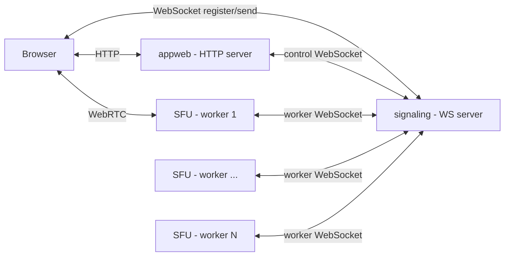
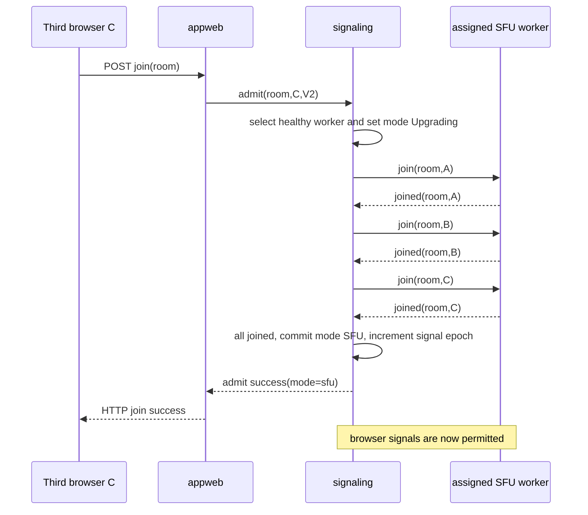

# AppRTC Signaling Architecture: P2P and SFU Call Modes

## Background and motivation

This architecture supports two browser protocols. V1 provides two-party P2P compatibility with HTTP join/leave,
initiator election, queued messages, reconnect grace, and opaque string room/client IDs. V2 adds numeric `u64` IDs,
authenticated browser registration, P2P↔SFU mode transitions, and multi-party SFU media. The Rust `sfu` crate is a
signaling-agnostic `sansio::Protocol` media engine whose `RoomId` and `ClientId` are `u64` and whose `SFUEvent` API
accepts joins, SDP, ICE candidates, and leaves.

The Rust rewrite must preserve that V1 contract for existing AppRTC-compatible clients while adding a V2 protocol that
can start as two-party P2P, upgrade to multi-party SFU media, and optionally downgrade to P2P again. It must also
prevent the HTTP web edge, signaling authority, and media worker from independently deciding room membership or call
mode. The design therefore makes one signaling authority responsible for room state and routes browser SDP/ICE either to
the P2P peer or to the assigned SFU worker.

Browser and service roles use long-lived, full-duplex signaling channels, while the media plane remains WebRTC between
browser and SFU.

The implementation is organized as three Rust crates:

| Component   | Network role                                             | Owns                                                                                                                 |
|-------------|----------------------------------------------------------|----------------------------------------------------------------------------------------------------------------------|
| `apprtc`    | TCP/TLS listeners                                        | Standalone appweb and signaling binaries, CLI parsing, TLS listeners, logging, and graceful shutdown.                |
| `appweb`    | HTTP server; WebSocket **client** of `signaling`         | app/web server, static assets, HTTP room API, ICE config, templates, client-id minting                               |
| `signaling` | WebSocket **server**                                     | authoritative room model, browser sockets, queue/reconnect grace, P2P relay, SFU worker registry and room assignment |
| `sfu`       | WebSocket **client** of `signaling`; WebRTC media server | current `Sfu` engine, its driver, per-client WebRTC state, SDP/ICE application, RTP/RTCP forwarding                  |

The three components are **modules first, binaries second**. `appweb` and `signaling` are separate crates with a defined
interface — the `RoomAuthority` boundary bound as a wire protocol in §8.4 — and a deployment may link them into one
process or run them as separate binaries (both binding are the §8.4 control WebSocket). The same holds for the worker
boundary (§8.5): the `Sfu` engine boundary never changes across deployments — how signaling reaches it (localhost
WebSocket, or cross-host WebSocket) is a *driver* detail. Every §8 service protocol is therefore the cross-process
binding of an internal interface, not the only binding, and an all-in-one binary (`appweb` + `signaling` + `sfu` in one
process) is a supported deployment for demos, integration tests, and small installations. Only the browser protocols (
§8.2, §8.3) are unconditionally wire protocols. WebSocket is the default cross-process transport because browsers
already use it and an SFU worker can initiate one long-lived outbound connection to the hub.

## 1. Topology and authority



`appweb` may serve the browser HTTP routes, but it does not hold room membership or live browser socket state.
`signaling` owns exactly one `Room` record for every room:

```text
RoomKey   = V1(String) | V2(u64)
ClientKey = V1(String) | V2(u64)

Room {
  id: RoomKey,
  version: V1 | V2, // immutable, chosen by first successful join
  mode: P2P | Upgrading | SFU | Downgrading,
  members: Map<ClientKey, BrowserClient>,
  signal_epoch: u64,                // V2 only; increments at each committed mode transition (§3.1.2)
  assigned_sfu: Option<SfuId(u64)>, // V2 only
  assignment_epoch: Option<u64>,    // V2 only; increments on worker recovery
}
```

`BrowserClient` owns the registered WebSocket (if any), its bounded outbound queue, and its reconnect-grace timer. The
SFU owns only a projection of members assigned to it. It must never decide occupancy, initiate a P2P→SFU upgrade, or
route a browser frame to another browser.

For **v2**, room and client IDs are `u64` end-to-end. Browser JSON represents them as canonical decimal strings and
validates with `BigInt`, avoiding JavaScript `Number` precision loss. V2 client IDs are random `u64` values. A v2 value
must be canonical unsigned decimal (`0` or a non-zero digit followed by digits) and parse without overflow as `u64`;
invalid room/client IDs return an error to the browser and create no room/member state. **V1 remains wire-compatible:**
its `roomid` and `clientid` remain arbitrary opaque JSON strings because compatible clients may use non-numeric values.
A V1 room is never assigned to an SFU, so those strings never cross the SFU boundary.

## 2. Current SFU integration contract

The existing `sfu` source is authoritative. The signaling adapter drives `Sfu` through `sansio::Protocol`:

| Hub→worker command              | Current engine input           |
|---------------------------------|--------------------------------|
| member admitted to an SFU room  | `SFUEvent::Join`               |
| browser SDP offer or answer     | `SFUEvent::SessionDescription` |
| browser trickle candidate       | `SFUEvent::IceCandidate`       |
| member removed from an SFU room | `SFUEvent::Leave`              |

The worker drains `Sfu::poll_event()` and sends each emitted `SFUEvent::SessionDescription` to its addressed browser
through `signaling`. An answer is emitted for a browser publish offer; a server-created subscribe re-offer is also the
same event variant, distinguished by SDP type `offer` and its `request_id`. At this Rust API boundary only, the worker
adapter maps that field to the signaling protocol's `requestid` field.

The worker owns the only mutable `Sfu` instance in its event loop. WebSocket reads enqueue commands for that loop; the
loop performs `handle_event`, drains `poll_write()` to socket, feeds packets to `handle_read`, calls `handle_timeout`,
and drains `poll_event()` back to the worker WebSocket. WebSocket tasks never mutate `Sfu` concurrently. This loop shape
is identical in every deployment mode; only the transport that feeds and drains it changes (an in-process channel in a
merged binary, the §8.5 worker WebSocket across processes).

ICE candidates are first-class application-signaling messages in both P2P and SFU mode. The current engine accepts
`SFUEvent::IceCandidate` and currently places its host candidate in an SDP answer. A deployment may therefore send no
incremental SFU candidates, but it uses the same candidate protocol when it does. Enabling richer local candidate
gathering later requires only worker/engine work: the worker adapter emits the already-defined candidate `signal` frame.
It must not require a browser, hub, or wire-protocol revision.

## 3. One WebSocket hub, three authenticated roles

Every connection reaches `wss://signaling/ws`; its first frame chooses an authenticated role. V2 browser credentials are
admission tokens created by `appweb`; the v1 browser path deliberately retains its current tokenless framing. Service
roles use mTLS or a rotated worker/app token and should normally be reachable only on a private listener.

| Role              | First frame                                        | Direction after registration                                                               |
|-------------------|----------------------------------------------------|--------------------------------------------------------------------------------------------|
| Browser v1        | `{cmd:"register", roomid, clientid}`               | Existing `{cmd:"send", msg}` and `{msg}` framing, no new required field                    |
| Browser v2        | `{cmd:"register", roomid, clientid, ver:2, token}` | Same `send`/`msg` framing plus a required `epoch` on `send` and v2-only `{control}` pushes |
| AppRTC front door | `{cmd:"app", appid, token}`                        | `admit`, `remove`, `occupancy`, v1 `inject`; replies correlated by `req`                   |
| SFU worker        | `{cmd:"sfu", sfuid, token, capacity}`              | lifecycle and addressed SDP frames in both directions                                      |

The hub validates a service role before processing any other command. A V2 browser may register only after an `admit`
has created its member record; V2 `register` and `send` never lazily create rooms or clients. The V1 path preserves its
established `register`/`send` semantics and does not require a new token or frame field. Its weaker admission model is
isolated to V1 and is not available to V2 rooms.

The browser `register` frame selects the internal key namespace unambiguously: `ver:2` requires a valid V2 admission
token and selects `RoomKey::V2(parsed_u64_roomid)` / `ClientKey::V2(parsed_u64_clientid)`; a frame with no `ver` is
handled as V1 and uses opaque-string keys. A frame that says `ver:2` but omits/invalidates its token is rejected, never
downgraded to V1. Therefore a V1 room named `"42"` and a V2 room whose ID is `42` are distinct rooms even though their
browser-visible text is the same.

### 3.1 Browser frames

```jsonc
// browser -> signaling after register (v2 stamps the room's current signal epoch)
{ "cmd": "send", "epoch": "0", "msg": "{...application signaling JSON...}" }

// signaling -> browser
{ "msg": "{...same application signaling JSON...}" }
{ "control": "registered",    "roomid": "42", "epoch": "0", "mode": "p2p", "is_initiator": true }  // v2 register acknowledgement
{ "control": "p2p-promote",   "roomid": "42", "epoch": "0", "is_initiator": true }
{ "control": "sfu-upgrade",   "roomid": "42", "epoch": "1" }
{ "control": "sfu-downgrade", "roomid": "42", "epoch": "2", "is_initiator": true } // optional, disabled initially
{ "control": "room-failed",   "roomid": "42", "reason": "worker_lost" }
```

`msg` is opaque to `signaling`: it never parses the inner object — not SDP, not ICE, not `bye`. It selects the
destination from the authoritative room mode and the room's current signal epoch (§3.1.2). In P2P it relays to the other
member (or queues while absent); in SFU mode it wraps the source `(roomid, clientid)` and forwards the frame to the
assigned worker unmodified. SFU-mode membership is changed solely by the hub's `remove`/worker `leave` lifecycle path;
the **worker adapter silently drops** an inner `bye` (stock hangup flows emit it, so it is not an error), and the hub
ignores frames from a member that has completed `/v2/leave`.

Candidate messages use the same opaque `send`/`msg` envelope as SDP. The hub forwards them in both directions without
parsing, coalescing, or waiting for ICE gathering to finish. It only preserves per-client arrival order after the member
has reached `joined`; before that barrier it holds a bounded SDP/ICE queue. The worker adapter may receive a candidate
before the corresponding remote description has been applied; it buffers that candidate by client and applies it
immediately after the description. A candidate queued for a superseded negotiation or a departed lifecycle is discarded.
These rules make trickle optional at runtime but fully supported by the protocol.

When a V2 P2P room changes from two members to one, `signaling` promotes the survivor to initiator and sends
`p2p-promote` with the current epoch. This is required on every removal path — `remove` (from `/v2/leave`) and
reconnect-grace expiry — and is never conditional on a relayed `bye` reaching the survivor: the hub cannot see byes,
which are opaque `msg` payloads. The browser closes its retired direct PC, sets its initiator state from the control,
and is ready to queue the offer for a future second member. Because each member has one FIFO writer (§3.1.2), the
promote is enqueued after any relay already accepted from the departed peer, so no departed-peer frame follows it. This
is a membership change, not a mode transition, so it does not increment the epoch. A later `registered` snapshot
supersedes a missed promotion.

`room-failed` is the v2 failure notification. When the hub marks a room failed — assigned-worker grace expiry, or a
worker process restart detected by its `instance` nonce (§8.5) — it pushes `{control:"room-failed"}` to every member,
then removes the membership and reaps the room; admission tokens die with it (§7). The browser tears down all transports
and, to continue the call, rejoins through `POST /v2/join` as a fresh admission. A member that was disconnected when the
control was pushed discovers the failure at re-register: its token is dead, the hub rejects with `UNAUTHORIZED`, and the
browser falls back to the same fresh `/v2/join`. `room-failed` fires only for a room in committed SFU mode — a P2P room,
v1 or v2, never depends on a worker, and a failed upgrade aborts back to P2P without it (§4.2).

### 3.1.1 V1/V2 compatibility contract

Protocol version is selected by the first successful `/join` and is immutable for the room lifetime. `appweb` sends
`ver:1` for the stock web app and `ver:2` for the new client. A join using the other version is rejected as
`VERSION_MISMATCH` rather than silently changing an active room's semantics. The v1 HTTP compatibility layer maps this
to its existing browser-safe room-not-available result; the v2 API returns the explicit error code.

| Surface                      | V1 — compatibility protocol                                                                                           | V2 — SFU-capable protocol                                                                                                                                                                                                  |
|------------------------------|-----------------------------------------------------------------------------------------------------------------------|----------------------------------------------------------------------------------------------------------------------------------------------------------------------------------------------------------------------------|
| Browser WebSocket            | Same `/ws`, `{cmd:"register", roomid, clientid}`, `{cmd:"send", msg}`, `{msg}`, `{error}`                             | Same `/ws` and `register`/`send` envelope; `register` adds required `ver:2` + admission token, `send` adds the required `epoch`, and the hub pushes v2 `registered`, `p2p-promote`, `room-failed`, and mode-control frames |
| P2P signaling                | Stock initiator posts to `POST /message/{room}/{client}`; callee uses WS; `wss_post_url` POST/DELETE fallback remains | Both peers send all offer/answer/candidate/bye payloads through their own WS                                                                                                                                               |
| `/join` response             | Existing `result`/`params`, including `messages[]`, `wss_url`, and `wss_post_url`                                     | Adds `mode` and `epoch`, omits `messages[]` and `wss_post_url`                                                                                                                                                             |
| Capacity                     | Hard cap of two; return `FULL` for a third join                                                                       | P2P through two; third join may upgrade only when an SFU worker is ready                                                                                                                                                   |
| Room and client ID wire form | Existing strings, unchanged                                                                                           | Canonical decimal strings representing `u64`                                                                                                                                                                               |
| SFU routing                  | Never                                                                                                                 | Only after an explicit P2P→SFU transition                                                                                                                                                                                  |

The Rust `appweb` V1 handlers preserve `/join`, `/leave`, `/message`, `/params`, `/v1alpha/iceconfig`, `/r/{room}`, and
`wss_post_url` behavior. They translate V1 HTTP injection/fallback calls into an internal app→hub `inject` control frame
while preserving the V1 HTTP response and WebSocket payloads. The Rust `signaling` hub preserves the V1 queue and
reconnect-grace behavior.

`sfu-upgrade`, `sfu-downgrade`, worker frames, `Upgrading`, `Downgrading`, and all SFU assignment are v2-only. A stock
v1 browser never receives a control it cannot process.

For v2 validation, `POST /v2/join/{roomid}` returns `{result:"INVALID_ROOM_ID"}` when the path segment is not a
canonical `u64`. The v2 browser WebSocket returns `{error:"INVALID_ROOM_ID"}` or `{error:"INVALID_CLIENT_ID"}` and
closes when its `register` frame contains a non-canonical/out-of-range value. The same values on v1 routes and frames
are forwarded as strings without numeric parsing.

### 3.1.2 Signal epochs

Every v2 room carries a `signal_epoch`, a small monotonic counter starting at `0` that increments exactly when a mode
transition **commits** (P2P→SFU or SFU→P2P). It is distinct from `assignment_epoch`, which tracks worker recovery, not
room mode. The hub reports the current `epoch` in the v2 `registered` control, the `/v2/join` response, and every
`p2p-promote`/`sfu-upgrade`/`sfu-downgrade` control. A v2 browser stamps the epoch it currently knows on every
`{cmd:"send"}` frame and adopts the new value when a control arrives.

The epoch is what makes mode transitions race-free: the transition states gate *joins*, but they cannot classify
in-flight browser frames, which otherwise arrive after a commit and get routed by the wrong mode (a pre-upgrade P2P
renegotiation offer becomes a bogus publish offer at the worker; an in-flight subscribe answer after a downgrade commit
would be relayed to the surviving P2P peer). The rules:

- The hub **drops** any v2 `send` whose `epoch` is not the room's current value. Such a frame belongs to a retired
  transport, or was sent before its browser received the transition control; perfect negotiation on the new transport
  regenerates whatever mattered. The drop is silent (counted in metrics, not answered with an error).
- A missing or malformed `epoch` on a v2 `send` is invalid and is dropped before the inner message is routed. V1 `send`
  frames never carry an epoch.
- At commit, the hub drops every frame still held in the per-room transition queue — they necessarily carry the old
  epoch. On abort, the epoch is unchanged and held frames are released normally.
- The drop rule is **bidirectional**: outbound relay `{msg}` frames carry no epoch on the wire, so the hub tags each
  queued browser-bound relay with the signal epoch at enqueue time and, at commit, purges old-epoch frames from every
  member's outbound queue. A member reconnecting after a transition never receives a relay generated under the previous
  mode.
- Every `BrowserClient` has exactly one FIFO WebSocket writer. A mode commit is a writer barrier: while serializing the
  room transition, the hub increments the epoch, purges old-epoch queued relays, and enqueues the new mode-control
  before allowing any new-epoch relay. A frame already written before this barrier is observed before the later control
  by WebSocket ordering; a frame not yet written is either purged or written after the control. Concurrent tasks must
  not write directly to the socket.
- The hub delivers worker→browser `signal` frames only while the room's mode is `SFU`; a subscribe re-offer in flight
  across a downgrade commit is dropped, never relayed to the surviving P2P peer.
- v1 rooms have no epoch; they never transition modes.

### 3.2 Worker frames

Use a single envelope so worker control notifications and browser payloads remain separate and request correlation
survives reconnects:

```jsonc
// signaling -> worker; ordered per room
{ "cmd":"join",  "roomid":42, "clientid":101, "lifecycleid":7 }
{ "cmd":"signal","roomid":42, "clientid":101,
  "msg":"{\"type\":\"offer\",\"sdp\":\"...\"}" }
{ "cmd":"leave", "roomid":42, "clientid":101, "lifecycleid":8,
  "reason":"leave" }

// worker -> signaling
{ "cmd":"joined", "roomid":42, "clientid":101, "lifecycleid":7 }
{ "cmd":"left",   "roomid":42, "clientid":101, "lifecycleid":8 }
{ "cmd":"signal", "roomid":42, "clientid":101,
  "msg":"{\"type\":\"answer\",\"sdp\":\"...\"}" }
{ "cmd":"error", "roomid":42, "clientid":101, "requestid":11,
  "code":"INVALID_SDP", "reason":"..." }
```

`join` and `leave` are idempotent by `(roomid, clientid, lifecycleid)`. This is a **worker WebSocket-adapter** concern;
`Sfu` itself does not interpret or retain a `lifecycleid`. The adapter replies `joined` only after its loop has
successfully applied `SFUEvent::Join`; that acknowledgement is needed to order an upgrade safely. A worker must preserve
command order for each room even if it multiplexes many rooms on one socket.

#### Lifecycle ID versus SDP request ID

`lifecycleid` identifies a **membership operation**, not an SDP transaction. It is a strictly increasing `u64` per
`(roomid, clientid)`, minted by `signaling`:

```text
join(room=42, client=101, lifecycleid=7)  → joined(..., lifecycleid=7)
leave(room=42, client=101, lifecycleid=8) → left(..., lifecycleid=8)
```

If a worker acknowledgement is lost or its WebSocket reconnects, the hub resends the same operation with the same
`lifecycleid`. The **worker adapter** records the last applied ID, does not call `Sfu` a second time for the same
operation, and returns the corresponding acknowledgement. It ignores a stale/replayed `joined(7)` after `leave(8)` has
been applied. This is what makes the hub's SFU membership projection safe to rebuild after reconnect. If the worker
process itself restarts, its adapter state is empty; the hub sends the current roster as a fresh `sync-room` projection
before browser signaling is released to that worker.

`requestid` is different: it correlates an SDP offer/answer negotiation, especially the browser answer to an
SFU-initiated subscribe offer. A browser may renegotiate many times during one membership lifetime, so a `requestid`
must never be used as a membership id.

The hub does not mint or inspect a `requestid` because browser `msg` remains opaque. The worker adapter mints one when
it converts a browser publish offer into the current `SFUEvent::SessionDescription`; the SFU echoes it on the resulting
publish answer. When the SFU emits a subscribe offer, the adapter inserts that event's Rust `request_id` as `requestid`
in the inner browser JSON. The browser echoes it in its answer, and the adapter reads it back before constructing the
corresponding `SFUEvent::SessionDescription`.

## 4. Call modes and flows

### 4.1 P2P, one or two members

1. Browser calls `POST /join/{room}` on `appweb`.
2. `appweb` sends `admit(req, roomid, clientid, ver)` over its control WebSocket.
3. `signaling` creates the member, elects the first member as initiator, and replies.
4. Browser registers its own WebSocket with `signaling`.
5. Every browser `{cmd:"send"}` is relayed to the other member; early messages queue and flush when that member
   registers.

No SFU worker sees this room or its signaling. For a **v1** room this flow remains the current asymmetric protocol: the
initiator's early offer/message uses `/message` and the callee uses its WebSocket; `messages[]` and `wss_post_url`
continue to work. For a **v2** room, both P2P peers use their WebSocket uniformly and `/message` is absent.

### 4.2 Third joiner: P2P to SFU upgrade

`Upgrading` is a real state, not a flag. It applies only to V2 rooms; V1 returns `FULL` at two members. It prevents late
P2P traffic from being misrouted and prevents a browser offer from reaching a worker before that worker has created the
client.



(A and B in the `join` payloads are the room's two existing browser members.)

At commit, `signaling` queues/pushes `{control:"sfu-upgrade", epoch}` to existing A and B. All A/B/C browsers create a
fresh PC to the SFU, attach their local tracks, and send a publish offer stamped with the new epoch. A and B may retain
their old P2P PC until their SFU PC connects; any frame they sent under the old epoch is dropped by the epoch rule (
§3.1.2).

The SFU answers each publish offer. Once it has learned tracks it creates forwarding senders, then emits subscribe
offers for affected clients. Browsers use perfect negotiation: browser is polite; the SFU serializes its own outgoing
offers per client and rejects/conflicts safely according to its existing negotiation state. The **browser answer** to an
SFU subscribe offer must carry the worker `requestid`.

Glare is resolved by those roles, and a rejected offer is **silently dropped**: when a browser publish offer reaches the
engine while the engine's own subscribe offer is outstanding, the engine rejects it (`ErrTransactionExists`) and the
worker emits an `error` frame that terminates hub-side bookkeeping only — no failure is delivered to the browser.
Recovery is the polite browser's normal perfect-negotiation path: it rolls back its pending offer when the SFU's
subscribe offer arrives, answers it, and its `negotiationneeded` handler re-issues the publish offer, which the now-idle
engine accepts. The engine's negotiation timeout (rollback after a bounded wait) covers the symmetric case of a browser
answer that never arrives.

If a `joined` acknowledgement fails or times out, `signaling` removes C's provisional membership, leaves the original
P2P room unchanged, and does **not** send upgrade control to A/B. If a worker fails after commitment, the room cannot
silently fail over: the hub pushes `room-failed` (§3.1) and requires a controlled rejoin. Cross-worker room migration is
a later feature.

### 4.3 Later joins and leaves

For member four and later, the hub sends `join` to the assigned worker, waits for `joined`, returns `mode:"sfu"`, and
routes the new member's publish offer. On leave, the hub removes membership, sends idempotent `leave` to the worker, and
routes the SFU's resulting subscribe re-offers to the remaining members.

SFU→P2P downgrade is disabled for the first release. If later enabled, use a dwell timer at exactly two members, then
transition `SFU → Downgrading → P2P`. `Downgrading` prevents a third join or a late SFU frame from being routed using
the wrong mode during the handoff. This design chooses **break-before-make**: after committing `P2P` (which increments
the signal epoch), the hub immediately sends `leave` for both survivors to the SFU worker, then pushes `sfu-downgrade`
and relays their new direct P2P offer/answer. The `sfu-downgrade` control's `is_initiator` field elects exactly one
surviving member — the lower `clientid`, which is always defined, unlike the pre-upgrade initiator flag — to create the
direct offer, preventing offer glare on the fresh P2P pair. This deliberately permits a media gap; do not mix it with
make-before-break semantics.

While a room is `Upgrading` or `Downgrading`, `signaling` serializes membership changes: it returns the retryable
`ROOM_TRANSITION` error to an additional join rather than guessing a destination. Existing members' browser messages are
held in their bounded per-room queue until the transition commits or aborts: on abort the epoch is unchanged and held
frames are released normally; on commit the epoch increments and every held frame is dropped (§3.1.2). A failed upgrade
restores P2P; a failed downgrade restores SFU only before the P2P commit point—after the chosen break-before-make
commit, a new third join follows the ordinary P2P→SFU upgrade path.

## 5. Worker assignment, reconnect, and scale

Workers register capacity and health. `signaling` assigns a room once, using a stable room-affine policy such as
least-loaded worker with a deterministic room-id tie-breaker. That assignment remains until the room empties.

- A transient worker WebSocket disconnect puts the worker in grace: do not assign new rooms; queue bounded control
  frames; allow the same `sfuid` to re-register, where the §8.5 `instance` rules decide between projection replay and
  room failure.
- On reconnect with an unchanged `instance` nonce (§8.5) — a socket blip with engine state intact — the hub sends a
  `sync-room` roster before any queued browser signal, then replays unacknowledged commands; repeated join is harmless.
  `sync-room` restores the membership projection only, never media state.
- On grace expiry — or on a reconnect whose `instance` nonce changed, which proves a process restart and lost media
  state — mark the assigned rooms failed and push `room-failed` (§3.1) to their members. Do not move a live WebRTC
  transport to another worker; that requires a new peer connection and re-publish.
- Bound every queue: browser outbound queue, worker outbound queue, per-room command backlog, and SDP/ICE frame size.
  Backpressure is a room/client failure, never a reason to block the media UDP loop.

The worker protocol, like the app control protocol, is the **cross-process binding** of the worker boundary. An
in-process worker (`signaling` and `sfu` linked into one binary) replaces the WebSocket with a channel into the same UDP
loop and keeps the same command semantics; because a channel cannot lose acknowledgements or replay across a reconnect,
the `lifecycleid`/`sync-room`/grace machinery above is inert in that binding — it exists only where a socket can drop,
reconnect, or replay.

A single `signaling` hub instance owning all authoritative room state is a first-release deployment assumption. Hub
replication, partitioning, and failover are out of scope for this document; the room-affine assignment policy above is
the seam a later multi-hub design would shard along.

## 6. Browser and API work

### 6.1 One browser application, two layouts

`web_app` and its `html/full_template.html` are the browser baseline. They remain the P2P layout: one remote participant
occupies the full-screen stage and the existing self-view, device controls, mute-video, mute-audio, hangup, status, and
error UI retain their behavior. The v2 client adds `html/grid_template.html` as the SFU layout. It has the same controls
and the same self-view component, but renders remote participants as a responsive grid rather than a single full-screen
remote video. `group_template.html` is not a design artifact or target filename.

These are layouts of one call session, not separate applications. A P2P→SFU or SFU→P2P transition must not reload the
page, replace the signaling socket, reacquire camera/microphone, or reset the selected devices/mute state. Common
controls and the self-view should be implemented as shared markup/CSS/components used by both templates, not copied into
two independent pages.

```text
CallSessionController
├── LocalMediaController     one captured MediaStream and device/mute state
├── SignalingRouter          one registered v2 WebSocket and mode controls
├── ModeController           P2P | Upgrading | SFU | Downgrading
├── P2PTransport             one RTCPeerConnection
├── SfuTransport             one RTCPeerConnection, server subscribe offers
└── ParticipantStore         Map<ClientId, ParticipantTile>
    ├── full_template.html   one remote tile shown as the stage in P2P
    └── grid_template.html   all remote tiles shown in SFU
```

`ParticipantStore` is required even while the room is P2P. It holds the single remote participant's stable `clientid`
and tile state in P2P, then holds every publisher in SFU. The SFU track-to-publisher mapping uses the publisher identity
carried in forwarded track/stream metadata so that audio and video tracks from one publisher share a tile.

The browser controller must use a participant-tile renderer rather than one singleton remote-video element. Each tile
has a stable participant key, separate audio/video slots, a placeholder/loading state, and receives tracks from either
transport. For P2P, that one tile is displayed in the full-screen stage. For SFU, the same component is displayed in the
grid. A tile must not be identified by an ephemeral `MediaStream.id` alone, since it changes across a new peer
connection; use the admitted `clientid`/SFU publisher identity.

### 6.2 Transport and layout transition behavior

The browser owns the mode state machine below. `signaling` owns the authoritative room mode; controls are commands to
transition, not permission for the browser to change room membership locally. The browser intentionally uses the same
`Upgrading` and `Downgrading` terms as `signaling`, but their lifetimes are not synchronized: hub `Upgrading` ends at
commit — before any browser has learned of the transition — while browser `Upgrading` begins when `sfu-upgrade` arrives
and ends when the SFU PC is ready. The same distinction applies to `Downgrading`.

| Browser state | Active layout                                 | Transport behavior                                                 | UI behavior                                                                                                 |
|---------------|-----------------------------------------------|--------------------------------------------------------------------|-------------------------------------------------------------------------------------------------------------|
| `P2P`         | `full_template.html`                          | One direct P2P PC                                                  | Full-screen remote stage and persistent self-view.                                                          |
| `Upgrading`   | Keep full layout visible                      | Keep P2P PC alive; create SFU PC and add the existing local tracks | Show non-blocking “Switching to group call” status; do not clear the remote stage.                          |
| `SFU`         | `grid_template.html`                          | SFU PC publishes local tracks and receives all participants        | Cross-fade to grid after the SFU PC is connected and remote media is available; update tiles per publisher. |
| `Downgrading` | Keep grid visible until direct media is ready | Begin/await direct P2P negotiation using the same local tracks     | Retain surviving participant tile or last-frame placeholder and show “Switching to direct call”.            |

For **P2P→SFU**, on `sfu-upgrade` the client adopts the control's `epoch` for every subsequent `send`, then creates a
fresh `RTCPeerConnection` for the SFU and adds the *same* existing local `MediaStreamTrack` instances to it. A track may
be sent by the old and new peer connections during the handoff; it must not be stopped or recaptured. The old P2P PC
remains live until the SFU PC has reached the accepted ready condition: ICE/connection state is connected and the
expected SFU media path has arrived. At that point, transition the view from the single stage to the grid and close the
old P2P PC. The existing peer's P2P tile and the corresponding SFU tile share its `clientid`, enabling a cross-fade
rather than a remove/add visual flash.

For **SFU→P2P**, the first-release protocol uses the documented break-before-make downgrade. The client preserves the
grid DOM and self-view while it closes the SFU PC and establishes the direct PC; it shows a transition/last-frame
placeholder instead of blanking the page. Once direct P2P media is connected, the surviving participant tile is promoted
into the full-screen stage and all other tiles are removed. This masks, but cannot eliminate, the intentional media gap.
A later make-before-break downgrade may keep both PCs during the handoff and use the same readiness/cross-fade rule as
upgrade.

Both transports use the normal v2 `{cmd:"send", epoch, msg}` envelope for SDP and trickle ICE. The `SignalingRouter`
dispatches incoming SDP/ICE by `ModeController` state: P2P frames go to `P2PTransport`; SFU publish answers and server
subscribe offers go to `SfuTransport`. Browser `Upgrading` routes to `SfuTransport` and browser `Downgrading` routes to
`P2PTransport`, since every frame delivered after a commit carries the new mode's traffic. The latter echoes `requestid`
only when answering an SFU subscribe offer. Candidate queues are transport-scoped and are discarded with the
corresponding PC, so a late candidate from the old P2P PC can never be applied to the SFU PC.

The same transport scoping applies during V2 WebSocket (re)registration. The browser first receives the authoritative
`registered` snapshot, then may receive queued `{msg}` frames. While it creates or reconciles the PC selected by that
snapshot, it keeps a bounded, transport-scoped SDP/ICE input queue and releases it only after that PC exists and is
bound to the snapshot's mode and epoch. It never applies a queued message to the previous transport. Queue overflow is a
recoverable signaling failure: discard that transport generation and re-establish it from the authoritative snapshot.

### 6.3 Browser acceptance criteria

- Start in P2P with `full_template.html`; local mute/device state and self-view work as they do today.
- On a third member, upgrade without a second permission prompt and without losing the local track objects; existing P2P
  media remains visible until SFU media is ready.
- In SFU, audio and video from the same publisher appear in one stable grid tile, and a leave/re-offer removes only that
  publisher's tile.
- On optional downgrade, keep self-view and controls responsive, show a transition state during the expected
  break-before-make gap, then promote the remaining peer to the full-screen P2P stage.
- Ignore late SDP/ICE and track callbacks from a retired transport generation.
- On V2 WebSocket reconnect, reconcile the active transport to the authoritative `registered` control's `mode` and
  `epoch` (and `is_initiator` when mode is P2P); a missed mode-control must not leave the browser operating its previous
  transport, and a mode-control matching the current mode and epoch is a no-op.
- During that reconciliation, queue inbound SDP/ICE until the snapshot-selected PC is ready; never apply a queued
  message to a retired PC.
- On `room-failed` (or an `UNAUTHORIZED` re-register that reveals a missed one), tear down all transports, surface the
  failure state, and rejoin through `POST /v2/join` without reloading the page or reacquiring devices.

`appweb` continues to expose `/join`, `/leave`, `/params`, `/v1alpha/iceconfig`, room pages, and static assets. It
becomes a thin HTTP/control-WS adapter: all room mutations round-trip to `signaling`; it has no second occupancy or
initiator model.

## 7. Security and acceptance criteria

- Authenticate `app` and `sfu` roles; validate browser `Origin` and the admission token for v2 browsers.
- Scope admission tokens: a token is bound to its `(roomid, clientid)` at admit, is valid for WebSocket registration and
  re-registration within the reconnect grace window, and is invalidated by `/v2/leave`, `remove`, grace expiry, or room
  failure (`room-failed`).
- Use TLS for every public WebSocket and a private/mTLS channel for service workers.
- Validate v2 `u64` room/client IDs, request-id ownership, room assignment, command order, frame sizes, and queue limits
  before forwarding; leave v1 ID strings opaque.
- Run a V1 wire-compatibility suite covering `call.js`, `/join` params/messages, initiator `/message`, `wss_post_url`
  POST/DELETE fallback, queued-offer flush, reconnect grace, and `FULL` at the third join.
- Test v2 P2P regression, third-join upgrade ordering, stale-epoch frame drops across upgrade/downgrade commits,
  duplicate join/leave idempotence, worker reconnect/sync, worker-restart room failure via the `instance` nonce,
  malformed SDP isolation, and three-browser publish/subscribe media. Also test that v1/v2 mixed joins never change an
  existing room's version.

## 8. Detailed wire-protocol definitions

This section is normative. All browser WebSocket frames are UTF-8 JSON text frames; `msg` is a JSON **string**
containing a second JSON application-signaling object. The outer hub never parses that inner object. Unknown mandatory
fields/commands are errors; unknown optional fields are ignored. Service WebSocket frames use the same JSON text
encoding. Numbers in browser JSON are represented as strings where `u64` precision is required.

§8.4 and §8.5 are the **cross-process bindings** of internal interfaces (see Status). A merged deployment implements the
same commands as direct calls and skips the socket-recovery machinery; only the browser protocols (§8.2, §8.3) are
unconditionally wire protocols.

### 8.1 Common types and error rules

```text
LegacyId       = any non-empty JSON string                 // v1 only
U64Decimal     = "0" | ("1".."9") { "0".."9" }          // must parse as u64
RoomIdV2       = U64Decimal
ClientIdV2     = U64Decimal
requestid      = U64Decimal on browser messages; JSON u64 number on worker frames
lifecycleid    = JSON u64 number on worker frames
epoch          = U64Decimal on browser frames; the room's signal epoch (§3.1.2)
AppMessage     = JSON string containing Offer | Answer | Candidate | Bye
```

The spelling of signaling fields is deliberately `roomid`, `clientid`, `requestid`, and `lifecycleid`—not snake case.
The adapter converts between wire `requestid` and the current Rust core's `SFUEvent::request_id`; `lifecycleid` is
adapter/hub state and is never supplied to `Sfu`.

V2 rejects leading zeroes other than `"0"`, signs, whitespace, decimal points, and values exceeding
`18446744073709551615`. The HTTP API returns a JSON result code; a WebSocket returns one error frame and closes. V1
never applies this numeric validation.

```jsonc
// browser-facing protocol error; no `msg` is delivered
{ "error": "INVALID_ROOM_ID" }
{ "error": "INVALID_CLIENT_ID" }
{ "error": "UNAUTHORIZED" }
{ "error": "INVALID_COMMAND" }
```

The inner `AppMessage` syntax is unchanged from AppRTC:

```jsonc
{ "type": "offer",     "sdp": "v=0\r\n..." }
{ "type": "answer",    "sdp": "v=0\r\n...", "requestid": "17" } // browser answer to v2 subscribe offer
{ "type": "candidate", "label": 0, "id": "0", "candidate": "candidate:..." }
{ "type": "candidate", "label": null, "id": null, "candidate": "" } // end-of-candidates
{ "type": "bye" }
```

`requestid` is required only when answering a v2 SFU-initiated subscribe offer. V1 and normal P2P offer/answer messages
omit it. Candidate frames remain supported and unchanged for V1 and V2 P2P, and are equally valid in V2 SFU mode. A
candidate has the AppRTC-compatible `label` (m-line index), `id` (mid), and candidate-string fields. An empty candidate
string with null `label`/`id` is the explicit end-of-candidates marker; receivers that do not need it may safely ignore
it. A browser sends each candidate as its `icecandidate` callback fires and sends the marker when gathering completes.
It does not wait to collect candidates into SDP.

In SFU mode, candidate messages are addressed by the outer registered `(roomid, clientid)` rather than a new
candidate-specific identifier. `requestid` is optional diagnostic correlation on an outer worker frame, but is not
required on an inner candidate: browser candidates can occur before the worker has returned an SDP answer with a request
ID. The worker adapter binds candidates to the current serialized peer-connection negotiation for that client, buffers
early candidates until `set_remote_description` succeeds, and drops candidates that belong to a closed or superseded
peer connection. This also defines the behavior when a deployment emits incremental local candidates: it sends the same
inner `candidate` object in a worker `signal` frame and the browser calls `addIceCandidate`.

### 8.2 V1 browser protocol — compatibility mode

V1 preserves the AppRTC-compatible public contract. V1 is selected when the first join for a room uses the V1
route/client; all subsequent members of that room must remain V1.

#### HTTP

| Method and path                                             | Request                           | Response/behavior                                                                                                                      |
|-------------------------------------------------------------|-----------------------------------|----------------------------------------------------------------------------------------------------------------------------------------|
| `POST /join/{roomid}`                                       | legacy query parameters unchanged | `{result:"SUCCESS", params:{client_id, room_id, room_link, is_initiator, messages, wss_url, wss_post_url, ...}}`, or `{result:"FULL"}` |
| `POST /leave/{roomid}/{clientid}`                           | empty                             | Existing successful HTTP response; removes membership/promotes surviving P2P peer                                                      |
| `POST /message/{roomid}/{clientid}`                         | raw `AppMessage` JSON             | `{result:"SUCCESS"}` after queue-or-relay; legacy error result on failure                                                              |
| `GET /params`, `POST /v1alpha/iceconfig`, `GET /r/{roomid}` | unchanged                         | Existing AppRTC configuration, ICE, and room-page behavior                                                                             |
| `POST`/`DELETE {wss_post_url}/{roomid}/{clientid}`          | raw `AppMessage` / empty          | V1 WebSocket POST/DELETE fallback (POST maps to the app→hub `inject`; DELETE maps to `remove` with `ver:1`)                            |

`roomid` and `clientid` are opaque strings in every v1 HTTP route. The initiator may send its initial offer through
`/message` before the peer's WebSocket is registered; the hub queues it and flushes it at registration. `messages[]` in
`/join` remains part of the v1 response shape.

#### WebSocket

```jsonc
// client -> signaling, first frame; no new token or version field
{ "cmd": "register", "roomid": "legacy-room", "clientid": "legacy-client" }

// client -> signaling after register
{ "cmd": "send", "msg": "{\"type\":\"answer\",\"sdp\":\"v=0\\r\\n...\"}" }

// signaling -> client
{ "msg": "{\"type\":\"offer\",\"sdp\":\"v=0\\r\\n...\"}" }
{ "error": "Duplicated register request" }
```

The v1 hub maintains the current register timeout/reconnect grace and per-client queued-message behavior. It relays to
at most one other member and returns `FULL` on a third join. It never emits v2 `control` frames and never contacts an
SFU worker.

### 8.3 V2 browser protocol — SFU-capable mode

V2 uses a separate route namespace so that a V1 client cannot accidentally opt into SFU semantics. The first successful
join pins `Room.version = V2`.

#### HTTP

| Method and path                        | Request                              | Response/behavior                                                                                                           |
|----------------------------------------|--------------------------------------|-----------------------------------------------------------------------------------------------------------------------------|
| `POST /v2/join/{roomid}`               | empty; path must be `RoomIdV2`       | `{result:"SUCCESS", params:{client_id, room_id, room_link, mode:"p2p"                                                       |"sfu", epoch, wss_url, admission_token, ...}}`; `is_initiator` is present only for `mode:"p2p"`; `{result:"INVALID_ROOM_ID"}`, `FULL`, or `ERROR` |
| `POST /v2/leave/{roomid}/{clientid}`   | empty; both IDs must be `U64Decimal` | `{result:"SUCCESS"}` or an ID/authorization error                                                                           |
| `GET /v2/params`, `GET /v2/r/{roomid}` | v2 validation                        | v2 configuration and room-page response; `/v2/params` carries the ICE/TURN server list — v2 has no separate iceconfig route |

There is no v2 `/message` endpoint and no `wss_post_url`. `client_id` is minted by `appweb` as a random `u64`, returned
as `ClientIdV2`, and is not supplied by the browser at join time. `appweb` holds no room state, so uniqueness is
enforced by the hub: an `admit` that collides with a live member returns `DUPLICATE_CLIENT` and `appweb` retries with a
fresh id. A v2 join returns `FULL` only when the room is at the hub's configured maximum room size; a third join with no
eligible worker returns `NO_SFU_AVAILABLE`, not `FULL`. `is_initiator` in the join params is present only when `mode` is
`"p2p"` and omitted otherwise, mirroring the `registered` rule.

#### WebSocket

```jsonc
// client -> signaling, first frame
{ "cmd": "register", "roomid": "42", "clientid": "101", "ver": 2, "token": "admission-token" }

// signaling -> client; explicit v2 register acknowledgement and authoritative state
{ "control": "registered", "roomid": "42", "epoch": "0", "mode": "p2p", "is_initiator": true }

// client -> signaling after register; v1 envelope plus the required epoch
{ "cmd": "send", "epoch": "0", "msg": "{\"type\":\"offer\",\"sdp\":\"v=0\\r\\n...\"}" }
{ "cmd": "send", "epoch": "0", "msg": "{\"type\":\"candidate\",\"label\":0,\"id\":\"0\",\"candidate\":\"candidate:...\"}" }

// signaling -> client; same base envelope as v1
{ "msg": "{\"type\":\"answer\",\"sdp\":\"v=0\\r\\n...\"}" }

// signaling -> existing P2P participants after an upgrade commits
{ "control": "sfu-upgrade", "roomid": "42", "epoch": "1" }

// signaling -> the sole P2P survivor after the other member leaves
{ "control": "p2p-promote", "roomid": "42", "epoch": "0", "is_initiator": true }

// optional future downgrade only; is_initiator elects the single direct offerer
{ "control": "sfu-downgrade", "roomid": "42", "epoch": "2", "is_initiator": true }

// signaling -> every member when the assigned worker is lost (grace expiry or restart)
{ "control": "room-failed", "roomid": "42", "reason": "worker_lost" }
```

The hub validates canonical `u64` IDs, token binding, and that the admitted member matches the registering socket, then
acknowledges with the `registered` control carrying the room's current `epoch`, `mode`, and, for P2P, `is_initiator` —
v2 registration is explicitly confirmed, unlike v1's silent registration, which is preserved unchanged. `registered`
always reports the last **committed** mode (`"p2p"` or `"sfu"`) and its epoch; transition states are never exposed to
browsers (they remain visible only on the service protocol's `occupancy`). This acknowledgement is also authoritative
reconciliation after a WebSocket reconnect: if its `mode` differs from the browser's active transport, the browser
enters the corresponding `Upgrading` or `Downgrading` state, creates the required PC, and retires the old PC only when
the new transport is ready. For `mode:"p2p"`, `is_initiator` elects the sole offerer; `is_initiator` is omitted when
`mode` is `"sfu"` and must not be interpreted there. Independently, `p2p-promote` updates the one surviving browser
after a P2P peer removal: the survivor closes the old direct PC and becomes the offerer for the next peer, without any
change to the room epoch. The `registered` control is the **first frame** the hub sends after a successful (re)register,
before any queued `{msg}` flush, so reconciliation always precedes application signaling. At (re)registration the hub
discards any queued mode-control or `p2p-promote` for that member — the snapshot supersedes them — and a browser treats
an incoming mode-control that matches its current mode and epoch as a no-op. A v2 `send` with a stale, missing, or
malformed `epoch` is silently dropped (§3.1.2). After a `sfu-upgrade` control, browser SDP/ICE messages retain their
v1-compatible `{cmd:"send", msg}` envelope (with the new epoch); only their destination changes from the other browser
to the assigned SFU worker. The browser treats an SFU offer as a subscribe offer and returns an answer carrying the
worker-issued `requestid`. In an SFU room, the browser leaves through `POST /v2/leave/{roomid}/{clientid}`; it does not
send `{type:"bye"}` to the worker path. The hub then owns the ordered worker `leave` operation and any resulting
subscribe re-offers.

### 8.4 AppRTC control WebSocket

`appweb` keeps HTTP request/response compatibility but delegates every room mutation to the hub. These frames are
private service protocol, not browser API. One connection has the state `Connecting → Registered → Closed`; its first
frame must be `app`.

This protocol is the WebSocket binding of the internal `RoomAuthority` interface (`admit`, `remove`, `occupancy`,
`inject`, plus the `client-disconnected` push). A merged `appweb`+`signaling` binary implements `RoomAuthority` as
direct in-process calls; the `req` correlation, cached terminal replies, and reconnect/replay rules below are properties
of this socket binding only and must not be reimplemented in-process. In every deployment mode, browser `send`/`msg`
relay traffic terminates at the `signaling` module's own listener and never routes through `appweb` — merging the
processes merges listeners, not message paths.

```text
AppId          = random non-empty process-instance string; stable across socket reconnects, regenerated on process restart
ControlReqId   = canonical decimal u64 string, monotonic per appid, never reused across reconnects
Version        = 1 | 2
Mode           = "p2p" | "upgrading" | "sfu" | "downgrading"
```

#### AppRTC → signaling commands

| Frame       | Required fields                                            | Semantics                                                                                                                                                                         | Reply                              |
|-------------|------------------------------------------------------------|-----------------------------------------------------------------------------------------------------------------------------------------------------------------------------------|------------------------------------|
| `app`       | `appid`, `token`                                           | Authenticate and bind this control socket to an AppRTC instance. Must be first.                                                                                                   | `registered` or `error` then close |
| `admit`     | `req`, `roomid`, `clientid`, `ver`; optional `is_loopback` | Create/admit a member, pin room version if first member, elect initiator, and possibly begin a v2 upgrade.                                                                        | `admit`                            |
| `remove`    | `req`, `roomid`, `clientid`, `ver`                         | Remove a member and reply `removed` as soon as membership is removed; in SFU mode the worker `leave` is issued asynchronously (idempotent, hub-owned) and never delays the reply. | `removed`                          |
| `occupancy` | `req`, `roomid`, `ver`                                     | Read current room occupancy/mode for a room page.                                                                                                                                 | `occupancy`                        |
| `inject`    | `req`, `roomid`, `clientid`, `ver:1`, `msg`                | V1 only: implement legacy `/message` and WSS POST fallback queue-or-relay.                                                                                                        | `injected`                         |

```jsonc
// registration
{ "cmd":"app", "appid":"edge-a-8f31", "token":"..." }

// v1 uses opaque string IDs; v2 uses canonical decimal u64 strings
{ "cmd":"admit", "req":"501", "roomid":"legacy-room", "clientid":"old-client", "ver":1 }
{ "cmd":"admit", "req":"502", "roomid":"42", "clientid":"101", "ver":2 }
{ "cmd":"remove", "req":"503", "roomid":"42", "clientid":"101", "ver":2 }
{ "cmd":"occupancy", "req":"504", "roomid":"42", "ver":2 }
{ "cmd":"inject", "req":"505", "roomid":"legacy-room", "clientid":"old-client", "ver":1, "msg":"..." }
```

#### signaling → AppRTC replies and pushes

Every command with `req` receives exactly one terminal reply. Repeating a command with the same `(appid, req)` returns
the cached terminal reply; this lets an HTTP handler retry safely after a control-socket write/read uncertainty.

```jsonc
{ "reply":"registered", "result":"SUCCESS", "appid":"edge-a-8f31" }
{ "reply":"admit", "req":"501", "result":"SUCCESS", "is_initiator":true }
{ "reply":"admit", "req":"502", "result":"SUCCESS", "mode":"sfu", "epoch":"1" }
{ "reply":"removed", "req":"503", "result":"SUCCESS" }
{ "reply":"occupancy", "req":"504", "result":"SUCCESS", "count":2, "mode":"p2p", "epoch":"0" }
{ "reply":"injected", "req":"505", "result":"SUCCESS" }
{ "reply":"error", "req":"502", "code":"INVALID_ROOM_ID", "reason":"..." }

// unsolicited hub event: the hub already removed the membership on grace expiry and,
// in SFU mode, already issued the worker `leave` — appweb is informed, not consulted
{ "event":"client-disconnected", "roomid":"42", "clientid":"101", "ver":2, "reason":"register_timeout" }
```

For v2, `admit` and `occupancy` replies carry the room's current signal `epoch` as a decimal string — this is how
`appweb` populates the `/v2/join` response's `epoch` without holding room state. The `admit` reply also carries
`is_initiator`: always for `ver:1`, and for `ver:2` only when `mode` is `"p2p"` (omitted for `"sfu"`, mirroring the
browser-facing rule) — this is likewise how the stateless `appweb` populates the join response's `is_initiator`.

`result` is one of `SUCCESS`, `FULL`, `DUPLICATE_CLIENT`, or `ERROR`; `code` refines `ERROR` (`UNAUTHORIZED`,
`INVALID_ROOM_ID`, `INVALID_CLIENT_ID`, `VERSION_MISMATCH`, `NO_SFU_AVAILABLE`, `ROOM_TRANSITION`, `NOT_FOUND`, or
`INTERNAL`). `inject` with `ver:2`, or a version change for an existing room, returns `VERSION_MISMATCH`. For `ver:1`,
identifiers are opaque strings. For `ver:2`, they must be canonical decimal `u64` strings.

If the control socket disconnects, `appweb` fails unresolved HTTP requests with a retryable error; it does not invent
occupancy or initiator state locally. On reconnect it re-registers the same process-instance `appid` and may resend only
requests whose `req` has not received a terminal reply. A process restart creates a new `appid` before opening its first
control socket. Because `req` values are never reused for one live `appid`, the `(appid, req)` reply cache — retained
for a bounded window — stays unambiguous; a per-connection `req` namespace would let a new session's request collide
with a previous session's cached reply.

### 8.5 SFU worker WebSocket

The worker socket is the SFU's sole signaling transport when the worker runs as a separate binary; an in-process worker
binds the same commands over a channel and skips the socket-recovery machinery (§5). The socket has the state
`Connecting → Registered → Syncing → Ready → Draining/Closed`. Only V2 `u64` IDs appear on this protocol; a V1 room
never reaches a worker.

```text
sfuid        = JSON u64 number
instance     = random non-empty process-instance string; regenerated on worker
               process restart (mirrors AppId)
roomid       = JSON u64 number
clientid     = JSON u64 number
lifecycleid  = JSON u64 number, monotonic per `(roomid, clientid)`
requestid    = JSON u64 number, allocated/read by the worker adapter for SDP correlation
epoch        = JSON u64 number, monotonic per room assignment/recovery — this is the
               assignment epoch (§1), unrelated to the browser signal epoch (§3.1.2)
```

#### Worker registration and health

```jsonc
// worker -> signaling; required first frame
{ "cmd":"sfu", "sfuid":7, "instance":"w7-4c9d", "token":"...", "capacity":{"rooms":100,"clients":1000} }

// signaling -> worker
{ "cmd":"ready", "sfuid":7, "heartbeat_ms":5000 }

// worker -> signaling, periodically and after a material capacity change
{ "cmd":"health", "sfuid":7, "state":"ready", "rooms":12, "clients":86 }
{ "cmd":"health", "sfuid":7, "state":"draining", "rooms":12, "clients":86 }
```

Authentication failure returns `{cmd:"error", code:"UNAUTHORIZED"}` and closes. A duplicate live `sfuid` is rejected; a
reconnecting worker with the same `sfuid` is accepted only after the previous socket is gone or has entered grace.

The `instance` nonce is how the hub tells a socket blip from a process restart: a re-registering `sfuid` with the same
`instance` still holds its engine state, so the hub follows the replay path (rule 4 below); a new `instance` proves the
adapter and engine state are gone, so the hub marks every room assigned to that `sfuid` failed and pushes `room-failed`
to their members (§5). `sync-room` alone cannot make this distinction — an empty adapter reconciles and replies `synced`
exactly like an intact one.

#### signaling → worker commands

| Frame       | Required fields                                                      | Adapter action                                                                                                                                                                                                                                                                                                                                                                                   |
|-------------|----------------------------------------------------------------------|--------------------------------------------------------------------------------------------------------------------------------------------------------------------------------------------------------------------------------------------------------------------------------------------------------------------------------------------------------------------------------------------------|
| `sync-room` | `roomid`, `epoch`, `members:[{clientid,lifecycleid}]`                | Reconcile the worker projection to this authoritative roster: join missing members and leave locally projected members absent from the roster; no browser SDP is accepted until `synced`.                                                                                                                                                                                                        |
| `join`      | `roomid`, `clientid`, `lifecycleid`                                  | Apply `SFUEvent::Join` once, then emit `joined`.                                                                                                                                                                                                                                                                                                                                                 |
| `leave`     | `roomid`, `clientid`, `lifecycleid`, `reason`                        | Apply `SFUEvent::Leave` once, then emit `left`.                                                                                                                                                                                                                                                                                                                                                  |
| `signal`    | `roomid`, `clientid`, `msg`; optional adapter diagnostic `requestid` | Parse inner browser SDP or candidate JSON. Apply an SDP as `SessionDescription`; apply a candidate as `IceCandidate`, buffering it until its remote description is ready. Forward an end-of-candidates marker to the WebRTC layer when supported. An inner `bye` is dropped silently — membership belongs to the hub `leave` path, and stock hangup flows may emit `bye`, so it is not an error. |
| `drain`     | optional deadline                                                    | Stop accepting new rooms; keep assigned rooms until the hub removes them.                                                                                                                                                                                                                                                                                                                        |

```jsonc
{ "cmd":"sync-room", "roomid":42, "epoch":9,
  "members":[{"clientid":101,"lifecycleid":7},{"clientid":102,"lifecycleid":3}] }
{ "cmd":"join", "roomid":42, "clientid":103, "lifecycleid":1 }
{ "cmd":"signal", "roomid":42, "clientid":101,
  "msg":"{\"type\":\"offer\",\"sdp\":\"v=0\\r\\n...\"}" }
{ "cmd":"signal", "roomid":42, "clientid":101,
  "msg":"{\"type\":\"candidate\",\"label\":0,\"id\":\"0\",\"candidate\":\"candidate:...\"}" }
{ "cmd":"leave", "roomid":42, "clientid":103, "lifecycleid":2, "reason":"leave" }
```

#### Worker → signaling events

| Frame             | Required fields                                                   | Hub action                                                                                                                                                                             |
|-------------------|-------------------------------------------------------------------|----------------------------------------------------------------------------------------------------------------------------------------------------------------------------------------|
| `synced`          | `roomid`, `epoch`                                                 | Mark room projection ready; release ordered queued commands.                                                                                                                           |
| `joined` / `left` | `roomid`, `clientid`, `lifecycleid`                               | Complete the corresponding lifecycle operation.                                                                                                                                        |
| `signal`          | `roomid`, `clientid`, `msg`; optional `requestid` for diagnostics | Deliver the opaque SDP or candidate message to that browser only. Subscribe-offer correlation ID is embedded in `msg`; a locally gathered worker candidate uses the same frame.        |
| `error`           | `code`, `reason`, plus `lifecycleid` or `requestid`               | For a lifecycle error, fail the matching operation; a `signal` error is diagnostic only — the hub tracks no SDP transactions. Isolate the client unless worker/room scope is declared. |
| `health`          | worker capacity/state fields                                      | Update assignment eligibility.                                                                                                                                                         |

```jsonc
{ "cmd":"synced", "roomid":42, "epoch":9 }
{ "cmd":"joined", "roomid":42, "clientid":103, "lifecycleid":1 }
{ "cmd":"signal", "roomid":42, "clientid":101,
  "msg":"{\"type\":\"offer\",\"sdp\":\"v=0\\r\\n...\",\"requestid\":\"11\"}" }
{ "cmd":"signal", "roomid":42, "clientid":101,
  "msg":"{\"type\":\"candidate\",\"label\":0,\"id\":\"0\",\"candidate\":\"candidate:...\"}" }
{ "cmd":"error", "roomid":42, "clientid":101, "requestid":11,
  "code":"INVALID_SDP", "reason":"..." }
```

The worker adapter, not `Sfu`, deduplicates lifecycle IDs and emits `joined`/`left`. It maps the current engine's
emitted `SFUEvent::SessionDescription` to `signal` and uses the SDP type plus `requestid` to distinguish a publish
answer from a subscribe offer. Inside browser-bound inner JSON the adapter writes `requestid` as a decimal **string** (
§8.1) even though outer worker frames carry it as a JSON number, and it converts back when reading a browser answer. It
maps each locally gathered ICE candidate to the same `signal` frame; an engine configuration that gathers only
candidates embedded in SDP simply emits no such incremental frames. `signaling` does not parse or modify the inner
SDP/ICE JSON when forwarding worker→browser `signal` frames.

#### Ordering and recovery

1. For one room, `sync-room`, lifecycle commands, and `signal` frames are processed in order. `join` precedes every SDP
   or candidate `signal` for that client. Candidate order is preserved for each source client; the adapter buffers early
   candidates until it has applied the relevant remote SDP.
2. `joined` is the barrier before `signaling` commits P2P→SFU or releases browser SDP.
3. Repeating a lifecycle command with the same ID returns the prior acknowledgement; an older ID is ignored. `requestid`
   has no lifecycle meaning.
4. After a same-`instance` worker WebSocket reconnect, `signaling` sends `sync-room` for every assigned room, waits for
   `synced`, then replays unacknowledged lifecycle/signal commands.
5. A worker process restart is detected by its changed `instance` nonce; the hub does not replay into an empty engine.
   The assigned rooms are failed (`room-failed`) and browsers rejoin — `sync-room` reconstruction is reserved for same-
   `instance` reconnects.

### 8.6 Complete signaling sequence

This sequence is the reference ordering for the selected architecture. V1 and V2 share the same hub but never share a
room. Browser B and C follow the same SFU publish flow as Browser A where omitted for readability.

```mermaid
sequenceDiagram
    autonumber
    participant A as Browser A
    participant B as Browser B
    participant C as Browser C
    participant AR as appweb HTTP
    participant S as signaling hub
    participant F as SFU worker

    rect rgb(238,238,238)
    Note over AR,F: Service startup and worker registration
    AR->>S: app registration with app id and token
    F->>S: sfu registration with worker id token and capacity
    S-->>F: worker ready
    end

    rect rgb(235,245,255)
    Note over A,B: V1 P2P compatibility flow
    A->>AR: POST join legacy room
    AR->>S: admit A to V1 room with legacy string IDs
    S-->>AR: admit success initiator true
    AR-->>A: join result with messages and wss post url
    A->>S: WS register legacy room and client
    A->>AR: POST message offer
    AR->>S: inject legacy offer
    Note over S: Queue offer until B registers
    B->>AR: POST join legacy room
    AR->>S: admit B to V1 room with legacy string IDs
    S-->>AR: admit success initiator false
    AR-->>B: join result with messages and wss post url
    B->>S: WS register legacy room and client
    S-->>B: WS msg offer from queue
    B->>S: WS send answer
    S-->>A: WS msg answer
    Note over A,B: Direct P2P media
    end

    rect rgb(255,250,230)
    Note over A,C: V2 third join and SFU upgrade
    A->>AR: POST v2 join numeric room
    AR->>S: admit A to V2 room
    S-->>AR: admit success mode P2P
    AR-->>A: join success with token
    A->>S: WS register V2 numeric IDs token and version
    S-->>A: WS registered mode P2P epoch 0 initiator true
    B->>AR: POST v2 join numeric room
    AR->>S: admit B to V2 room
    S-->>AR: admit success mode P2P
    AR-->>B: join success with token
    B->>S: WS register V2 numeric IDs token and version
    S-->>B: WS registered mode P2P epoch 0 initiator false
    Note over A,B: V2 P2P offer answer flows through WS send and msg
    C->>AR: POST v2 join numeric room
    AR->>S: admit C to V2 room
    S->>S: Select worker and enter Upgrading
    S->>F: A joins room with lifecycle ID
    F-->>S: A joined room with lifecycle ID
    S->>F: B joins room with lifecycle ID
    F-->>S: B joined room with lifecycle ID
    S->>F: C joins room with lifecycle ID
    F-->>S: C joined room with lifecycle ID
    S->>S: Commit room mode SFU and increment signal epoch
    S-->>A: WS control sfu-upgrade epoch 1
    S-->>B: WS control sfu-upgrade epoch 1
    S-->>AR: admit success mode SFU
    AR-->>C: v2 join success mode SFU
    C->>S: WS register V2 numeric IDs token and version
    S-->>C: WS registered mode SFU epoch 1
    Note over A,C: Each browser creates a fresh SFU PC and adds local tracks
    end

    rect rgb(235,255,235)
    Note over A,F: V2 publish and subscribe flow for A
    A->>S: WS send publish offer
    S->>F: A publish offer
    F->>F: apply SessionDescription offer
    F-->>S: A SDP answer
    S-->>A: WS msg SDP answer
    loop Each gathered ICE candidate
        A->>S: WS send A candidate
        S->>F: A candidate signal
        F->>F: buffer or add remote candidate
        F-->>S: A local candidate when available
        S-->>A: WS msg local candidate
    end
    Note over F: Reconcile forwarding graph after each publish
    F-->>S: A subscribe offer with request ID
    S-->>A: WS msg subscribe offer with request ID
    A->>S: WS send subscribe answer with request ID
    S->>F: A subscribe answer
    F->>F: apply SessionDescription answer
    Note over B,C: B and C publish and answer subscribe offers in the same way
    end

    rect rgb(245,235,255)
    Note over A,F: Media is independent of the signaling hub
    A->>F: ICE DTLS SRTP publish media
    F->>B: Selectively forwarded SRTP
    F->>C: Selectively forwarded SRTP
    Note over F,A: RTCP feedback is relayed to the publisher by the SFU
    end

    rect rgb(255,235,235)
    Note over C,F: Leave and SFU room maintenance
    C->>AR: POST v2 leave
    AR->>S: remove C from room
    Note over S: A WS disconnect past grace triggers the same removal in the hub, which informs appweb via client-disconnected
    S->>F: C leaves room with lifecycle ID
    F->>F: apply SFUEvent Leave
    F-->>S: C left room with lifecycle ID
    F-->>S: A and B subscribe re-offers without C
    S-->>A: WS msg subscribe re-offer
    S-->>B: WS msg subscribe re-offer
    end

    rect rgb(225,245,255)
    Note over A,F: Optional SFU to P2P downgrade
    opt Optional downgrade is enabled and dwell timer expires
        S->>S: Transition SFU to Downgrading
        S->>S: Commit room mode P2P and increment signal epoch
        S->>F: A leaves room with lifecycle ID
        F-->>S: A left room with lifecycle ID
        S->>F: B leaves room with lifecycle ID
        F-->>S: B left room and SFU room reaped
        S-->>A: WS control sfu-downgrade epoch 2 initiator true
        S-->>B: WS control sfu-downgrade epoch 2 initiator false
        Note over A,B: SFU PCs are closed before direct negotiation
        A->>S: WS send direct P2P offer
        S-->>B: WS msg direct P2P offer
        B->>S: WS send direct P2P answer
        S-->>A: WS msg direct P2P answer
        Note over A,B: Direct P2P media resumes
    end
    end
```



**Failure branches.** If any worker `joined` acknowledgement fails before the SFU commit, the hub rejects C's join and
keeps the original V2 P2P pair unchanged. A V1 third join always returns `FULL`. After SFU commitment, worker loss (
grace expiry, or re-registration with a changed `instance`) is a room failure: the hub pushes `room-failed` to every
member and each browser rejoins through `POST /v2/join`; the hub does not silently send live browser WebRTC transports
to another worker.
