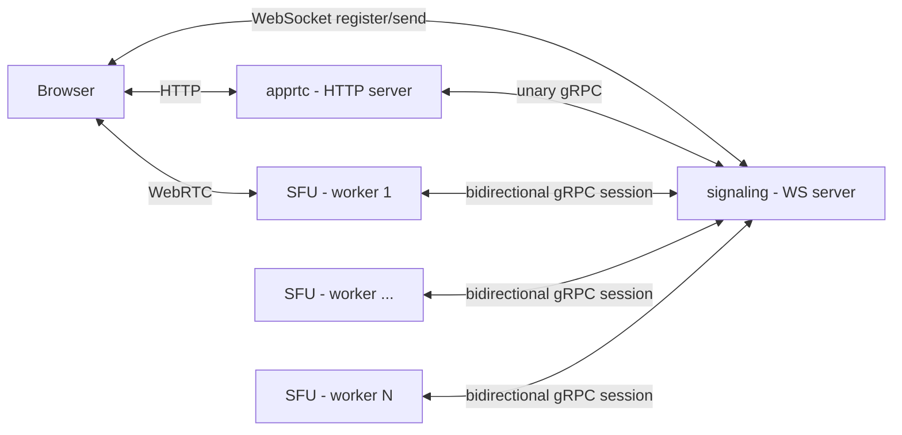
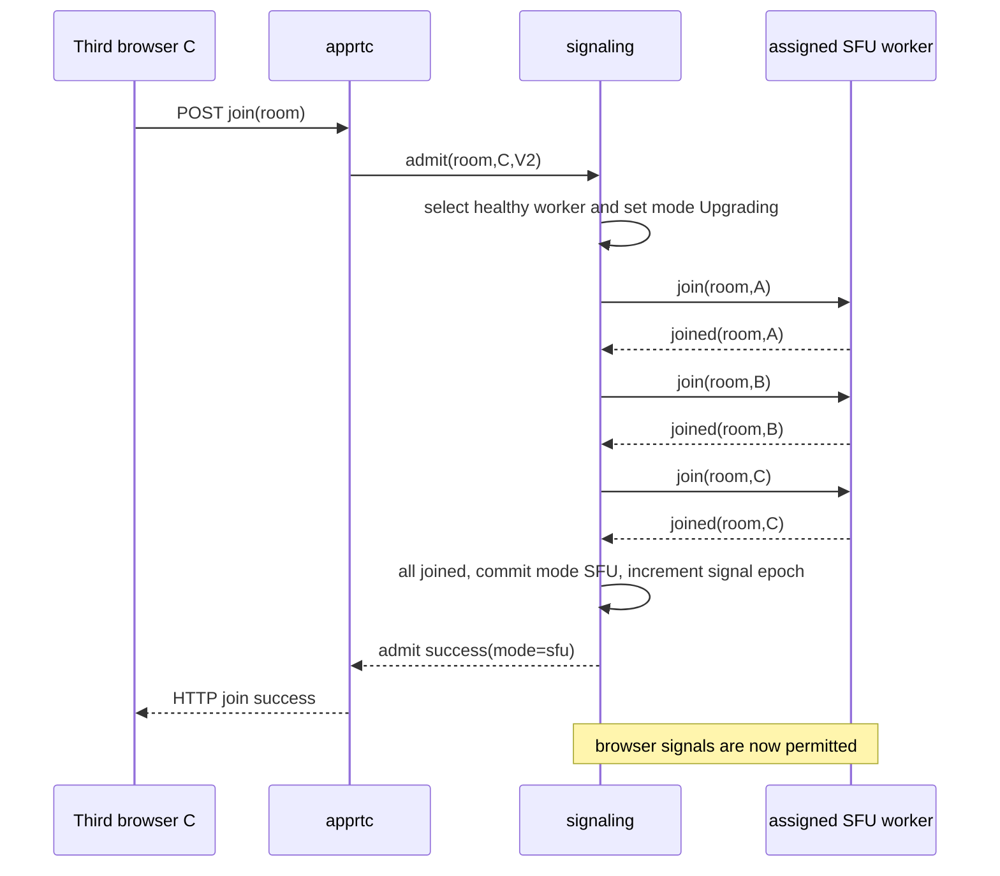
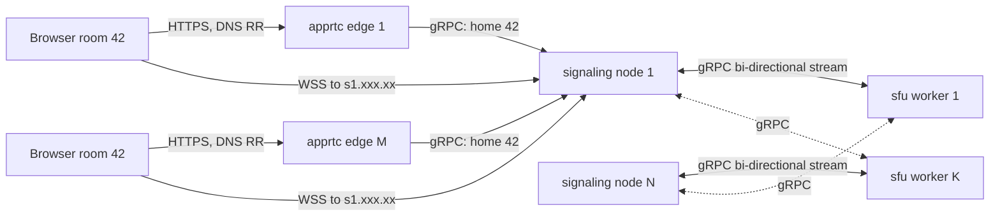

# AppRTC Signaling Architecture: P2P and SFU Call Modes

## Background and motivation

This architecture supports two browser protocols. V1 provides two-party P2P compatibility with HTTP join/leave, initiator election, queued messages, reconnect grace, and opaque string room/client IDs. V2 adds service-minted UUID room ids with numeric `u64` client ids, token-bound browser registration, P2P↔SFU mode transitions, and multi-party SFU media. The Rust `sfu` crate is a signaling-agnostic `sansio::Protocol` media engine whose `RoomId` is a `Uuid` and whose `ClientId` is a `u64`, and whose `SFUEvent` API accepts joins, SDP, ICE candidates, and leaves.

The current implementation preserves the V1 contract for existing AppRTC-compatible clients while adding a V2 protocol that starts as two-party P2P, upgrades to multi-party SFU media, and downgrades back to direct P2P once the room has shrunk to two members again. One signaling authority owns room state and routes browser SDP/ICE either to the P2P peer or to the assigned SFU worker.

Browsers use long-lived, full-duplex WebSocket signaling channels, `apprtc` uses unary gRPC calls multiplexed over a reusable HTTP/2 channel, and SFU workers use long-lived bidirectional gRPC streams. The media plane remains WebRTC between browser and SFU.

The implementation is organized as one binary-producing crate plus three Sans-I/O protocol crates, and deployed as three
processes. Only `apprtc` lives in this repository; `signaling` (which contains `signaling-proto`) and `sfu` are separate
repositories vendored as git submodules and consumed as path dependencies:

| Component         | Network role                                              | Owns                                                                                                                 |
|-------------------|-----------------------------------------------------------|----------------------------------------------------------------------------------------------------------------------|
| `apprtc`          | the only crate in this repository; also the web-server binary | the HTTP room API, static assets, ICE config, templates, and client-id minting, plus the standalone `apprtc`, `signaling`, and `sfu` binaries and every runtime adapter: TLS listeners, browser WebSocket sessions, gRPC adapters, Collider/SFU drivers, logging, and graceful shutdown |
| `signaling`       | no network role; Sans-I/O signaling authority             | authoritative V1/V2 room model, queue/reconnect grace, P2P relay, SFU worker registry, room assignment, upgrade barrier, and recovery state |
| `signaling-proto` | no network role; shared Protobuf/tonic schema             | generated web-server/signaling/SFU gRPC request, response, command, result, and event types                          |
| `sfu`             | no network role; Sans-I/O WebRTC media engine             | per-client WebRTC state, SDP/ICE application, RTP/RTCP forwarding; the `sfu` binary in the root package supplies UDP and gRPC I/O |

Throughout this document `apprtc` names the web-server process — the gRPC **client** of `signaling` — as distinct from
AppRTC the project. It and `signaling` are separate processes communicating through the `RoomAuthority` boundary defined by the §8.4 gRPC protocol, even though the web server now lives in the root package rather than a crate of its own. `signaling-proto` owns that shared contract without depending on either implementation. The standalone `sfu` process uses the §8.5 stream while keeping the Sans-I/O `Sfu` engine independent from its gRPC/UDP driver. Browser protocols (§8.2 and §8.3) remain public JSON WebSocket protocols, while `apprtc` and SFU use the private `signaling.v2.SignalingService` API on a separate HTTP/2 listener.

The repository root is the `apprtc` package. Within its `src/` directory, `room_server.rs`, `params.rs`, `templates.rs`, `config.rs`, `room_id.rs`, and `grpc_client.rs` are the web server (`room_id.rs` converts a V2 room id between its UUIDv8 form and the raw 16 `bytes` carried over gRPC); `ws_server.rs` owns the public TCP/TLS listener, HTTP upgrade, WebSocket framing, and browser-session tasks; `grpc_server.rs` owns the private tonic service adapter; and `signaling_server.rs` owns the command channel and single event loop that drives the Sans-I/O `Collider`. The browser application it serves lives under `web/`. The binary entry points live under `src/bin/`, integration tests under `tests/`, and the bundled development certificate plus the local `start.sh`/`stop.sh` and `log2seq.py` helpers under `scripts/`. Both network adapters submit typed commands to the event loop and never mutate signaling state directly. `src/tls.rs` provides the shared certificate loading and TLS listener support used by the binaries, and `src/lib.rs` only declares the modules.

## 1. Topology and authority


```mermaid
flowchart LR
    B[Browser] <-- HTTP --> A[apprtc - HTTP server]
    B <-- WebSocket register/send --> S[signaling - WS server]
    A <-- unary gRPC --> S
    F1[SFU - worker 1] <-- bidirectional gRPC session --> S
    FK[SFU - worker ...] <-- bidirectional gRPC session --> S
    FN[SFU - worker N] <-- bidirectional gRPC session --> S
    B <-- WebRTC --> F1
```

`apprtc` serves the browser HTTP routes, but it does not hold room membership or live browser socket state. `signaling` owns separate V1 and V2 room tables keyed by different types — opaque strings for V1, UUIDs for V2 — so the two namespaces cannot collide:

```text
V1RoomTable: Map<String, V1Room>          // V1Room { id: String, clients: Map<String, Client> }

V2RoomTable: Map<Uuid, V2Room>         // keyed by the UUIDv8 minted at §8.1; the room holds no id of its own

V2Room {
  members: Map<u64, Member>,           // client ids stay numeric
  mode: P2P | Upgrading | SFU | Failed,
  signal_epoch: u64,                   // increments when P2P→SFU or SFU→P2P commits
  assignment_epoch: u64,               // assignment generation, stable across same-instance reconnect
  assigned_instance: Option<InstanceId>, // selected SFU process incarnation, cleared at downgrade
  upgrade: Option<Upgrade>,            // the P2P→SFU MemberJoined barrier, while it is open (§4.3)
  pending_join: Option<PendingJoin>,   // one in-flight JoinMember against the assigned worker
  pending_leave: Option<PendingLeave>, // one in-flight LeaveMember against the assigned worker
  downgrade_deadline: Option<Instant>, // armed while an SFU room sits at ≤2 members
}
```

**There are four room modes, and `Downgrading` is deliberately not one of them.** The Protobuf `RoomMode` enum does
define `ROOM_MODE_DOWNGRADING = 4`, but nothing ever produces or accepts it — the conversion at the gRPC boundary
maps only the four modes above — so it is a defined-but-unused value rather than a `reserved` one in Protobuf's
sense. The implemented downgrade needs no intermediate state: unlike an upgrade, which must wait for worker
`MemberJoined` barriers, it commits `SFU → P2P` in one step and tears the worker legs down afterwards (§4.4).

`BrowserClient` owns the registered WebSocket (if any), its bounded outbound queue, and its reconnect-grace timer. The
SFU owns only a projection of members assigned to it. It must never decide occupancy, initiate a P2P→SFU upgrade, or
route a browser frame to another browser.

For **v2**, a room is identified by a UUIDv8 the service mints (never a value a client chooses) and a client by a random
`u64`. The room id has three renderings, one per boundary, and they must not be confused — a room is keyed by the value
received, so a second spelling would become a second room:

| Boundary                                     | Rendering                                               |
|----------------------------------------------|---------------------------------------------------------|
| Room links, browser JSON (`roomid`)          | base64url, unpadded — 22 characters                      |
| gRPC to signaling and to workers             | the raw 16 bytes (`bytes room_id`)                       |
| ICE ufrag inside the SFU                     | standard base64, unpadded (§8.5)                         |

Client ids stay canonical decimal strings in browser JSON, validated with `BigInt` to avoid JavaScript `Number`
precision loss. An invalid room token or client id returns an error to the browser and creates no room/member state.
**V1 remains wire-compatible:**
its `roomid` and `clientid` remain arbitrary opaque JSON strings because compatible clients may use non-numeric values.
A V1 room is never assigned to an SFU, so those strings never cross the SFU boundary.

## 2. Current SFU integration contract

The existing `sfu` source is authoritative. The signaling adapter drives `Sfu` through `sansio::Protocol`:

| Hub→worker command              | Current engine input           |
|---------------------------------|--------------------------------|
| member admitted to an SFU room  | `SFUEvent::Join`               |
| browser SDP offer or answer     | `SFUEvent::SessionDescription` |
| browser trickle candidate       | `SFUEvent::IceCandidate`       |
| member removed from an SFU room | `SFUEvent::Leave`              |

The worker drains `Sfu::poll_event()` and sends each emitted `SFUEvent::SessionDescription` to its addressed browser
through `signaling`. An answer is emitted for a browser publish offer; a server-created subscribe re-offer is also the
same event variant, distinguished by SDP type `offer` and its `request_id`. At this Rust API boundary only, the worker
adapter maps that field to the signaling protocol's `requestid` field.

The worker owns the only mutable `Sfu` instance in its event loop. gRPC stream reads enqueue commands for that loop; the
loop performs `handle_event`, drains `poll_write()` to socket, feeds packets to `handle_read`, calls `handle_timeout`,
and drains `poll_event()` back to the SFU session stream. Transport tasks never mutate `Sfu` concurrently. The current standalone SFU binary feeds and drains this loop through the §8.5 bidirectional gRPC session plus UDP sockets.

ICE candidates are first-class application-signaling messages in both P2P and SFU mode. The current engine accepts
`SFUEvent::IceCandidate` and currently places its host candidate in an SDP answer. A deployment may therefore send no
incremental SFU candidates, but it uses the same candidate protocol when it does. Enabling richer local candidate
gathering later requires only worker/engine work: the worker adapter emits the already-defined candidate `signal` frame.
It must not require a browser, hub, or wire-protocol revision.

## 3. Signaling endpoints and authenticated roles

Browsers reach the public `wss://signaling/ws` endpoint. `apprtc` and SFU processes reach a separate private HTTP/2 listener implementing `signaling.v2.SignalingService`. V2 browser credentials are cryptographically random admission tokens created by `signaling` during `AdmitV2` and returned to the browser through `apprtc`; the V1 browser path deliberately retains its current tokenless framing. The current gRPC transport supports server-authenticated TLS but not client authentication. `RequestContext.app_id` validates protocol role, not caller identity, so deployments must restrict the gRPC listener to trusted `apprtc`/SFU hosts with host and provider firewalls. mTLS remains future hardening.

| Role              | Transport/API                                      | Session or request identity                                      | Traffic after admission or registration                                               |
|-------------------|----------------------------------------------------|------------------------------------------------------------------|----------------------------------------------------------------------------------------|
| Browser V1        | JSON WebSocket `/ws`                               | `{cmd:"register", roomid, clientid}`                            | Existing `{cmd:"send", msg}` and `{msg}` framing, with no new required field          |
| Browser V2        | JSON WebSocket `/ws`                               | `{cmd:"register", roomid, clientid, ver:2, token}`              | Same `send`/`msg` framing plus required `epoch` and V2-only controls                   |
| apprtc            | Unary `SignalingService` RPCs                      | `RequestContext{APP_ID_APPWEB, instance_id, request_id}`         | `AdmitV1/V2`, `RemoveV1/V2`, `OccupancyV1/V2`, `InjectV1`, and `GetStatus`             |
| SFU worker        | Bidirectional `OpenSfuSession` RPC                 | First stream message is `RegisterSfu` with `APP_ID_SFU` context  | Ordered commands/results and reliable worker events/acknowledgements                   |

The hub validates a service role before processing any other command. A V2 browser may register only after an `admit`
has created its member record; V2 `register` and `send` never lazily create rooms or clients. The V1 path preserves its
established `register`/`send` semantics and does not require a new token or frame field. Its weaker admission model is
isolated to V1 and is not available to V2 rooms.

The browser `register` frame selects the internal key namespace unambiguously: `ver:2` requires a valid V2 admission
token and selects `RoomKey::V2(parsed_u64_roomid)` / `ClientKey::V2(parsed_u64_clientid)`; a frame with no `ver` is
handled as V1 and uses opaque-string keys. A frame that says `ver:2` but omits/invalidates its token is rejected, never
downgraded to V1. Therefore a V1 room named `"42"` and a V2 room whose ID is `42` are distinct rooms even though their
browser-visible text is the same.

### 3.1 Browser frames

```jsonc
// browser -> signaling after register (v2 stamps the room's current signal epoch)
{ "cmd": "send", "epoch": "0", "msg": "{...application signaling JSON...}" }

// signaling -> browser
{ "msg": "{...same application signaling JSON...}" }
{ "control": "registered",    "roomid": "grYp2g1QjrKVXUZLph46kA", "epoch": "0", "mode": "p2p", "is_initiator": true }  // v2 register acknowledgement
{ "control": "p2p-promote",   "roomid": "grYp2g1QjrKVXUZLph46kA", "epoch": "0", "is_initiator": true }
{ "control": "sfu-upgrade",   "roomid": "grYp2g1QjrKVXUZLph46kA", "epoch": "1" }
{ "control": "sfu-downgrade", "roomid": "grYp2g1QjrKVXUZLph46kA", "epoch": "2", "is_initiator": true }
{ "control": "room-failed",   "roomid": "grYp2g1QjrKVXUZLph46kA", "reason": "WORKER_UNAVAILABLE" }
```

`msg` is opaque to `signaling`: it never parses the inner object — not SDP, not ICE, not `bye`. It selects the
destination from the authoritative room mode and the room's current signal epoch (§3.1.2). In P2P it relays to the other
member (or queues while absent); in SFU mode it wraps the source `(roomid, clientid)` and forwards the frame to the
assigned worker unmodified. SFU-mode membership is changed solely by the hub's `remove`/worker `leave` lifecycle path;
the **worker adapter silently drops** an inner `bye` (stock hangup flows emit it, so it is not an error), and the hub
ignores frames from a member that has completed `/v2/leave`.

Candidate messages use the same opaque `send`/`msg` envelope as SDP. The hub forwards them in both directions without
parsing, coalescing, or waiting for ICE gathering to finish. It only preserves per-client arrival order after the member
has reached `joined`; before that barrier it holds a bounded SDP/ICE queue. The worker adapter may receive a candidate
before the corresponding remote description has been applied; it buffers that candidate by client and applies it
immediately after the description. A candidate queued for a superseded negotiation or a departed lifecycle is discarded.
These rules make trickle optional at runtime but fully supported by the protocol.

When a V2 P2P room changes from two members to one, `signaling` promotes the survivor to initiator and sends
`p2p-promote` with the current epoch. This is required on every removal path — `remove` (from `/v2/leave`) and
reconnect-grace expiry — and is never conditional on a relayed `bye` reaching the survivor: the hub cannot see byes,
which are opaque `msg` payloads. The browser closes its retired direct PC, sets its initiator state from the control,
and is ready to queue the offer for a future second member. Because each member has one FIFO writer (§3.1.2), the
promote is enqueued after any relay already accepted from the departed peer, so no departed-peer frame follows it. This
is a membership change, not a mode transition, so it does not increment the epoch. A later `registered` snapshot
supersedes a missed promotion.

`room-failed` is the V2 failure notification. When the assigned SFU instance remains disconnected past recovery grace, signaling marks each assigned committed SFU room `Failed` and pushes `{control:"room-failed"}` to currently connected members. The current browser surfaces an error, and the failed room remains in authority state; new admits receive `WORKER_UNAVAILABLE`. Automatic room cleanup, token invalidation, and browser rejoin after committed worker loss are remaining recovery work. A failed pre-commit upgrade is different: it removes the provisional third member and restores the original P2P pair.

### 3.1.1 V1/V2 compatibility contract

Protocol version is selected by the HTTP route and WebSocket registration frame, not stored as a mutable property of one shared room. V1 uses `/r`, `/join`, and a registration with no `ver`; V2 uses `/v2/r`, `/v2/join`, and `ver:2`. The two signaling tables are separate namespaces, so a V1 room named `"42"` and V2 room `42` may coexist and never exchange members or signaling.

| Surface                      | V1 — compatibility protocol                                                                                           | V2 — SFU-capable protocol                                                                                                                                                                                                  |
|------------------------------|-----------------------------------------------------------------------------------------------------------------------|----------------------------------------------------------------------------------------------------------------------------------------------------------------------------------------------------------------------------|
| Browser WebSocket            | Same `/ws`, `{cmd:"register", roomid, clientid}`, `{cmd:"send", msg}`, `{msg}`, `{error}`                             | Same `/ws` and `register`/`send` envelope; `register` adds required `ver:2` + admission token, `send` adds the required `epoch`, and the hub pushes v2 `registered`, `p2p-promote`, `room-failed`, and mode-control frames |
| P2P signaling                | Stock initiator posts to `POST /message/{room}/{client}`; callee uses WS; `wss_post_url` POST/DELETE fallback remains | Both peers send all offer/answer/candidate/bye payloads through their own WS                                                                                                                                               |
| `/join` response             | Existing `result`/`params`, including `messages[]`, `wss_url`, and `wss_post_url`                                     | Adds `mode` and `epoch`, omits `messages[]` and `wss_post_url`                                                                                                                                                             |
| Capacity                     | Hard cap of two; return `FULL` for a third join                                                                       | P2P through two; third join may upgrade only when an SFU worker is ready                                                                                                                                                   |
| Room and client ID wire form | Existing strings, unchanged                                                                                           | Room: a service-minted UUIDv8 as 22 base64url characters. Client: a canonical decimal string representing `u64`.                                                                                                            |
| SFU routing                  | Never                                                                                                                 | Only after an explicit P2P→SFU transition                                                                                                                                                                                  |

The Rust `apprtc` V1 handlers preserve `/join`, `/leave`, `/message`, `/params`, `/v1alpha/iceconfig`, `/r/{room}`, and
`wss_post_url` behavior. They translate V1 HTTP injection/fallback calls into an internal app→hub `inject` control frame
while preserving the V1 HTTP response and WebSocket payloads. The Rust `signaling` hub preserves the V1 queue and
reconnect-grace behavior.

`sfu-upgrade`, `sfu-downgrade`, worker frames, `Upgrading`, and all SFU assignment are V2-only. A stock V1 browser never receives a control it cannot process.

For v2 validation, `POST /v2/join/{roomid}` returns `{result:"INVALID_ROOM_ID"}` when the path segment is not a
canonical room token (§8.1): 22 base64url characters decoding to the 16 bytes of a UUIDv8, with zero trailing bits.
The v2 browser WebSocket returns `{error:"INVALID_ROOM_ID"}` or `{error:"INVALID_CLIENT_ID"}` and closes when its
`register` frame carries a token that fails those checks or a client id that is not a canonical `u64`. The same values
on v1 routes and frames are forwarded as opaque strings without any parsing.

### 3.1.2 Signal epochs

Every V2 room carries a `signal_epoch`, a small monotonic counter starting at `0` that increments on each committed mode transition — P2P→SFU and SFU→P2P alike. It is distinct from `assignment_epoch`, which identifies the room-to-worker assignment generation and remains stable across a same-instance stream reconnect. The hub reports the current `epoch` in the V2 `registered` control, the `/v2/join` response, and the `p2p-promote`/`sfu-upgrade`/`sfu-downgrade` controls. A V2 browser stamps the epoch it currently knows on every `{cmd:"send"}` frame and adopts the new value when a control arrives.

The epoch is what makes mode transitions race-free: the transition states gate *joins*, but they cannot classify
in-flight browser frames, which otherwise arrive after a commit and get routed by the wrong mode (a pre-upgrade P2P
renegotiation offer becomes a bogus publish offer at the worker; an in-flight subscribe answer after a downgrade commit
would be relayed to the surviving P2P peer). The rules:

- The hub silently drops any V2 `send` whose `epoch` is not the room's current value or while the room is `Upgrading`. Such a frame belongs to the retired transport or arrived before the transition committed.
- A missing or malformed `epoch` on a V2 `send` is dropped before the inner message is routed. V1 `send` frames never carry an epoch.
- At upgrade commit, signaling increments the epoch, clears queued P2P messages, and enqueues `sfu-upgrade` to the two existing registered browsers before accepting new-epoch SFU signaling.
- At downgrade commit, signaling increments the epoch and clears each member's queued messages before enqueueing `sfu-downgrade`, so a subscribe answer still in flight from the retired SFU transport is dropped rather than relayed to the surviving peer.
- Each browser WebSocket has one bounded FIFO writer, so controls and `{msg}` frames produced by the serialized Collider event loop retain their output order.
- The hub accepts worker→browser `signal` events only while the room is assigned to that worker in `SFU` mode with matching assignment and lifecycle IDs.
- V1 rooms have no epoch and never transition modes.

### 3.2 SFU session envelopes

The bidirectional gRPC stream uses distinct directional envelopes. `SignalingToSfu` contains registration response, command, or event acknowledgement messages. `SfuToSignaling` contains registration, command result, or reliable worker event messages. This keeps lifecycle commands, health, failures, and opaque browser signaling separate while preserving request correlation across transient reconnects.

```proto
message SfuToSignaling {
  oneof message {
    RegisterSfu register = 1;
    SfuCommandResult command_result = 2;
    SfuEvent event = 3;
  }
}

message SignalingToSfu {
  oneof message {
    RegisterSfuResponse registered = 1;
    SfuCommand command = 2;
    SfuEventAck event_ack = 3;
  }
}
```

`JoinMember` and `LeaveMember` are idempotent by `(room_id, client_id, lifecycle_id)`, and every `SfuCommand` additionally has a signaling-allocated `request_id` used for transport replay and result correlation. This is an SFU adapter concern; `Sfu` itself does not interpret or retain `lifecycle_id`. The adapter returns `MemberJoined` only after successfully applying `SFUEvent::Join`; that result is the barrier required to commit an upgrade safely. The stream preserves command order, and the adapter preserves per-room order while multiplexing many rooms.

#### Lifecycle ID versus SDP request ID

`lifecycle_id` identifies a **membership operation**, not an SDP transaction. It is a strictly increasing `u64` per `(room_id, client_id)`, minted by `signaling`:

```text
JoinMember(room=42, client=101, lifecycle_id=7)  → MemberJoined(..., lifecycle_id=7)
LeaveMember(room=42, client=101, lifecycle_id=8) → MemberLeft(..., lifecycle_id=8)
```

If a command result is lost or the gRPC stream reconnects, the hub resends the operation with the same command `request_id` and lifecycle ID. The SFU adapter records the last applied IDs, does not call `Sfu` twice, and returns the cached result. It ignores a stale `MemberJoined(7)` after `LeaveMember(8)` has been applied. This makes the hub's SFU membership projection safe to verify with `SyncRoom` after a same-process reconnect. A restarted SFU has a new `instance_id`; the hub never treats it as reconstruction of the old media process.

`requestid` is different: it correlates an SDP offer/answer negotiation, especially the browser answer to an
SFU-initiated subscribe offer. A browser may renegotiate many times during one membership lifetime, so a `requestid`
must never be used as a membership id.

The hub does not mint or inspect a `requestid` because browser `msg` remains opaque. The worker adapter mints one when
it converts a browser publish offer into the current `SFUEvent::SessionDescription`; the SFU echoes it on the resulting
publish answer. When the SFU emits a subscribe offer, the adapter inserts that event's Rust `request_id` as `requestid`
in the inner browser JSON. The browser echoes it in its answer, and the adapter reads it back before constructing the
corresponding `SFUEvent::SessionDescription`.

## 4. Call modes and flows

### 4.1 P2P, one or two members

1. Browser calls `POST /join/{room}` on `apprtc`.
2. `apprtc` calls the appropriate `AdmitV1` or `AdmitV2` unary gRPC method with its process `instance_id` and a nonzero `request_id`.
3. `signaling` creates the member, elects the first member as initiator, and replies.
4. Browser registers its own WebSocket with `signaling`.
5. Every browser `{cmd:"send"}` is relayed to the other member; early messages queue and flush when that member
   registers.

No SFU worker sees this room or its signaling. For a **v1** room this flow remains the current asymmetric protocol: the
initiator's early offer/message uses `/message` and the callee uses its WebSocket; `messages[]` and `wss_post_url`
continue to work. For a **v2** room, both P2P peers use their WebSocket uniformly and `/message` is absent.

### 4.2 Third joiner: P2P to SFU upgrade

`Upgrading` is a real state, not a flag. It applies only to V2 rooms; V1 returns `FULL` at two members. It prevents late
P2P traffic from being misrouted and prevents a browser offer from reaching a worker before that worker has created the
client.


```mermaid
sequenceDiagram
    participant C as Third browser C
    participant AR as apprtc
    participant S as signaling
    participant F as assigned SFU worker
    C->>AR: POST join(room)
    AR->>S: admit(room,C,V2)
    S->>S: select healthy worker and set mode Upgrading
    S->>F: join(room,A)
    F-->>S: joined(room,A)
    S->>F: join(room,B)
    F-->>S: joined(room,B)
    S->>F: join(room,C)
    F-->>S: joined(room,C)
    S->>S: all joined, commit mode SFU, increment signal epoch
    S-->>AR: admit success(mode=sfu)
    AR-->>C: HTTP join success
    Note over S,F: browser signals are now permitted
```

(A and B in the `join` payloads are the room's two existing browser members.)

At commit, `signaling` queues/pushes `{control:"sfu-upgrade", epoch}` to existing A and B. All A/B/C browsers create a
fresh PC to the SFU, attach their local tracks, and send a publish offer stamped with the new epoch. A and B may retain
their old P2P PC until their SFU PC connects; any frame they sent under the old epoch is dropped by the epoch rule (
§3.1.2).

The SFU answers each publish offer. Once it has learned tracks it creates forwarding senders, then emits subscribe
offers for affected clients. Browsers use perfect negotiation: browser is polite; the SFU serializes its own outgoing
offers per client and rejects/conflicts safely according to its existing negotiation state. The **browser answer** to an
SFU subscribe offer must carry the worker `requestid`.

Glare is resolved by those roles, and a rejected offer is **silently dropped**: when a browser publish offer reaches the
engine while the engine's own subscribe offer is outstanding, the engine rejects it (`ErrTransactionExists`) and the
worker emits an `error` frame that terminates hub-side bookkeeping only — no failure is delivered to the browser.
Recovery is the polite browser's normal perfect-negotiation path: it rolls back its pending offer when the SFU's
subscribe offer arrives, answers it, and its `negotiationneeded` handler re-issues the publish offer, which the now-idle
engine accepts. The engine's negotiation timeout (rollback after a bounded wait) covers the symmetric case of a browser
answer that never arrives.

If a `joined` acknowledgement fails or times out, `signaling` removes C's provisional membership, leaves the original
P2P room unchanged, and does **not** send upgrade control to A/B. If a worker fails after commitment, the room cannot
silently fail over: the hub pushes `room-failed` (§3.1) and requires a controlled rejoin. Cross-worker room migration is
a later feature.

### 4.3 Later joins and leaves

For member four and later, the hub sends `join` to the assigned worker, waits for `joined`, returns `mode:"sfu"`, and
routes the new member's publish offer. On leave, the hub removes membership, sends idempotent `leave` to the worker, and
routes the SFU's resulting subscribe re-offers to the remaining members. A member's leave is also what re-evaluates the
room for the SFU→P2P downgrade in §4.4.

The current `Upgrading` state serializes membership changes: an additional join receives retryable `ROOM_TRANSITION`, and browser `send` frames are dropped until the ordered three-member worker join barrier commits or aborts. A successful commit increments the epoch and clears queued P2P messages; a failed upgrade removes the provisional third member and restores the original P2P pair without changing the epoch.

### 4.4 SFU to P2P downgrade

An SFU room that has shrunk back to a size a direct connection can carry returns to P2P automatically. Every worker
`MemberLeft` result re-evaluates the room: if it is still in `SFU` mode, holds one or two members, and has no upgrade,
join, or leave in flight, signaling arms a **dwell deadline** — `--downgrade-dwell`, 2 seconds by default. Arming is
idempotent, so churn inside the window does not push the deadline out; anything that makes the room ineligible (a new
admission, another transition) clears it. When the deadline fires, `handle_timeout` re-checks eligibility and either
commits or drops the deadline.

The commit is deliberately **break-before-make** and permits a brief media gap:

1. Set `mode = P2P` and increment `signal_epoch`; clear the deadline.
2. Elect the lowest client id as the direct offerer; every other member answers. Clear each member's queued messages so
   retired-epoch SFU traffic cannot leak into the new P2P session.
3. Release the worker assignment (`assigned_instance = None`, decrement its assigned room/client counters) and queue one
   `LeaveMember` per member with reason `ROOM_CLOSED`. These are fire-and-forget cleanup commands: the commit does not
   wait for their results, because no browser-visible state depends on them.
4. Push `{control:"sfu-downgrade", roomid, epoch, is_initiator}` to every registered member.

Each browser then enters its own `Downgrading` state, builds a direct `RTCPeerConnection` from the same local tracks
while keeping its SFU peer connection on screen, and the elected initiator offers (§6.2). There is no `Downgrading` *hub*
state: the upgrade barrier exists because a browser offer must not reach a worker that has not created the client yet,
while a downgrade only retires state that already exists. The browser needs the state anyway, because it is the side that
must overlap the two transports.

If the room empties instead of settling at two — the last member leaves — the room is removed outright and no downgrade
runs.

## 5. Worker assignment, reconnect, and scale

Workers register capacity and then become eligible after reporting `Ready` health. For the initial three-member upgrade, `signaling` filters out disconnected/draining workers and workers that have reached `max_rooms` or cannot accept three more assigned clients. It selects the minimum tuple `(assigned_clients, assigned_rooms, instance_id)`. The final `instance_id` comparison makes an exact tie deterministic; this is least-loaded placement rather than round-robin. The whole room remains affine to the selected worker until it empties or fails.

The assignment is released when the room downgrades to P2P (§4.4) or empties, which returns its rooms/clients to the
worker's load counters and makes that capacity available to the next placement. A room that later upgrades again runs the
selector afresh and may land on a different worker.

Later joins to an existing SFU room do not run the global selector again and cannot move the room. They are serialized through `JoinMember` on the assigned worker and succeed only after its result. The current authority uses advertised `max_clients` during initial three-member placement but does not pre-reject a later join from that counter; strict per-room growth enforcement is therefore a remaining capacity-control improvement.

- A transient `OpenSfuSession` disconnect puts that SFU instance in grace: do not assign new rooms and retain a bounded command backlog. A reconnect with the same `instance_id` resumes the same process incarnation; a restarted process has a new `instance_id` and registers as a new worker.
- On reconnect with the same `instance_id` — a transport interruption with engine state intact — the hub sends a `SyncRoom` roster before any queued browser signal, then replays unacknowledged commands. `SyncRoom` verifies membership projection only and never reconstructs media state.
- On grace expiry, mark rooms assigned to the disconnected instance failed and push `room-failed` (§3.1) to their members. A restarted SFU registers with a new `instance_id` and is treated as a new worker; it does not claim the old instance's rooms. Do not move a live WebRTC transport to another worker because that requires a new peer connection and re-publish.
- Bound every queue: browser outbound queue, worker outbound queue, per-room command backlog, and SDP/ICE frame size.
  Backpressure is a room/client failure, never a reason to block the media UDP loop.

The SFU gRPC session, like the apprtc unary API, is the cross-process binding of the internal authority boundary. The current repository ships only separate `signaling` and `sfu` processes; there is no all-in-one production binary.

A single `signaling` hub instance owning all authoritative room state is the current deployment assumption, and the only
one the code implements. §9 proposes the multi-node extension: the same room-affinity principle applied one level up, so
that a room is affine to one signaling node exactly as it is already affine to one worker. Hub *replication* — two nodes
holding the same room — remains out of scope; §9 partitions rooms across nodes rather than replicating them.

## 6. Browser and API work

The implemented room-selection page exposes a checked **V2 P2P/SFU** checkbox, so V2 is the web UI default while V1 remains available by unchecking it. V1 navigates through `/r/{roomid}` and `/join/{roomid}`; V2 uses `/v2/r/{roomid}` and `/v2/join/{roomid}`. The V2 namespace is preserved in returned room links and embedded page parameters. The current browser implements all four of its local modes — P2P, Upgrading, SFU, and Downgrading — the responsive grid, transport handoff in both directions, and polite-peer perfect negotiation. `Downgrading` is a browser-local state with no authority counterpart: the room mode goes straight back to `P2P` (§4.4), while the browser holds the grid up until direct media can play.

### 6.1 One browser application, two layouts

`web/html/full_template.html` is the P2P layout baseline: one remote participant occupies the full-screen stage and the existing self-view, device controls, mute-video, mute-audio, hangup, status, and error UI retain their behavior. `web/html/grid_template.html` is included by the shared page and supplies the SFU grid container. JavaScript/CSS switches between the existing full-screen remote video and responsive per-publisher grid without loading a second application or page.

These are layouts of one call session, not separate applications. A P2P→SFU or SFU→P2P transition must not reload the
page, replace the signaling socket, reacquire camera/microphone, or reset the selected devices/mute state. Common
controls and the self-view should be implemented as shared markup/CSS/components used by both templates, not copied into
two independent pages.

```text
CallSessionController
├── LocalMediaController     one captured MediaStream and device/mute state
├── SignalingRouter          one registered v2 WebSocket and mode controls
├── ModeController           P2P | Upgrading | SFU | Downgrading
├── P2PTransport             one RTCPeerConnection
├── SfuTransport             one RTCPeerConnection, server subscribe offers
└── ParticipantStore         Map<ClientId, ParticipantTile>
    ├── full_template.html   one remote tile shown as the stage in P2P
    └── grid_template.html   all remote tiles shown in SFU
```

The current `AppController` keeps the P2P remote video as its existing singleton and maintains an SFU tile map keyed by publisher identity parsed from the SFU-forwarded `peer-<clientid>` track/stream metadata. Audio and video from one publisher share a tile. A future refactor may unify both layouts behind one participant store, but that is not required by the current code.

Each SFU tile has a stable participant key plus separate audio/video elements. Track-ended callbacks and post-negotiation transceiver reconciliation remove stale media and then empty tiles. If publisher metadata is unavailable, the implementation falls back to stream/track identity.

### 6.2 Transport and layout transition behavior

The browser owns its local mode state machine while `signaling` owns authoritative room mode. Their transition-state
lifetimes are intentionally different: a hub transition state ends at commit, before browsers learn of it, while the
browser's begins when the control arrives and ends when the incoming transport is carrying media. The two browser
transitions are symmetric — each keeps the outgoing peer connection and its layout on screen while the incoming one
negotiates, so the participant never blinks out. `Downgrading` is make-before-break in the browser even though the hub's
half of it is break-before-make: the hub has already retired the worker legs, but the SFU peer connection's last
received frames still hold the grid together for the length of the handoff.

| Browser state | Active layout                                 | Transport behavior                                                 | UI behavior                                                                                                 |
|---------------|-----------------------------------------------|--------------------------------------------------------------------|-------------------------------------------------------------------------------------------------------------|
| `P2P`         | `full_template.html`                          | One direct P2P PC                                                  | Full-screen remote stage and persistent self-view.                                                          |
| `Upgrading`   | Keep full layout visible                      | Keep P2P PC alive; create SFU PC and add the existing local tracks | Show non-blocking “Switching to group call” status; do not clear the remote stage.                          |
| `SFU`         | `grid_template.html`                          | SFU PC publishes local tracks and receives all participants        | Cross-fade to grid after the SFU PC is connected and remote media is available; update tiles per publisher. |
| `Downgrading` | Keep grid visible until direct media is ready | Keep SFU PC alive; begin/await direct P2P negotiation using the same local tracks | Retain the surviving participant tile as a last-frame placeholder and show “Switching to direct call”.      |

For **P2P→SFU**, on `sfu-upgrade` the client adopts the control's `epoch` for every subsequent `send`, then creates a
fresh `RTCPeerConnection` for the SFU and adds the *same* existing local `MediaStreamTrack` instances to it. A track may
be sent by the old and new peer connections during the handoff; it must not be stopped or recaptured. The old P2P PC
remains live until the SFU PC's ICE state is `connected` or `completed`. At that point, the implementation switches to the grid and closes the old P2P PC.

For **SFU→P2P**, `Call.startSfuDowngrade_` adopts the control's `epoch`, enters `Downgrading`, takes `is_initiator` from
the control, and *retains* the SFU `PeerConnectionClient` as `sfuPcClient_` (closing only a P2P client left over from an
unfinished upgrade handoff, which belongs to a retired epoch). It then builds one fresh `PeerConnectionClient` with
`sfuMode` off — the direct connection must not use the SFU's always-polite role — adds the *same* local tracks, and
either offers or waits to answer. `AppController.onModeChange_('downgrading')` changes nothing but the status text: the
grid keeps its tiles, so each participant stays on screen as a frozen last frame instead of disappearing.

`Call.onDowngradeIceConnectionStateChange_` is the mirror of `onSfuIceConnectionStateChange_`: when the direct PC reaches
`connected`/`completed`, `finishSfuDowngrade_` commits mode `p2p` and fires `onModeChange_('p2p')`. That handler holds
the grid for the last stretch — until the direct remote video is playable — then removes every tile, restores the
full-screen layout, re-points the self-view at the retained local stream, and runs `transitionToActive_`. Only then does
it call `Call.releaseRetiredSfuTransport()`. The ordering matters: closing the SFU peer connection ends its remote
tracks, and those tracks are exactly what the held grid tiles are still displaying, so closing it any earlier would
blank the screen the hold exists to preserve. Two bounded fallbacks keep the UI from sticking: the transition gives up
after `DOWNGRADE_MEDIA_TIMEOUT_MS` if the peer never negotiates (it may have left mid-handoff), and the layout wait
gives up after `P2P_LAYOUT_MEDIA_TIMEOUT_MS` for an audio-only or stalled peer.

Retaining the SFU client needs one guard: its callbacks close over `Call` and read `this.pcClient_`, which is now the
direct client, so `retireSfuClientCallbacks_` nulls them when the client is set aside. Otherwise a late ICE event on the
retired transport would run `onSfuIceConnectionStateChange_` against the new connection and flip the session back to SFU
mode. Because the hub has already cleared queued messages and bumped the epoch, no retired SFU frame can reach the new
direct connection either.

Both transports use the V2 `{cmd:"send",epoch,msg}` envelope for SDP and trickle ICE. In both transitions `Call.pcClient_` is replaced by the incoming `PeerConnectionClient` while the outgoing instance is retained separately for media continuity only — as `p2pPcClient_` during upgrade, `sfuPcClient_` during downgrade — so inbound signaling is always queued and processed by the incoming client alone. Its Promise-based drain preserves V2 wire order, which is required to apply a publish answer before a following subscribe offer. SFU subscribe answers alone echo `requestid`.

The server's `registered` snapshot is suitable for P2P re-registration during grace, but the current JavaScript `SignalingChannel` contains a reconnect TODO and does not automatically reopen a closed browser WebSocket. Its per-peer-connection signaling queue is not explicitly bounded. Automatic browser reconnect, queue limits, and explicit transport-generation guards remain reliability work.

### 6.3 Current browser behavior and remaining acceptance work

- Start in P2P with `full_template.html`; local mute/device state and self-view work as they do today.
- On a third member, upgrade without a second permission prompt and without losing the local track objects; existing P2P
  media remains visible until SFU media is ready.
- In SFU, audio and video from the same publisher appear in one stable grid tile, and a leave/re-offer removes only that
  publisher's tile.
- On a downgrade back to two members, hold the grid and self-view while the direct connection negotiates, then promote
  the remaining peer to the full-screen P2P stage without reacquiring devices.
- Remaining reliability work: automatically reconnect a P2P V2 WebSocket within server grace and reconcile `mode`, `epoch`, and `is_initiator` from the new `registered` snapshot.
- Remaining reliability work: bound browser SDP/ICE queues and explicitly ignore callbacks from retired transport generations.
- Current `room-failed` behavior surfaces the failure through the call error callback. Desired follow-up behavior is to tear down transports, clean up failed authority state, and support a fresh admission without reacquiring devices.

`apprtc` continues to expose `/join`, `/leave`, `/params`, `/v1alpha/iceconfig`, room pages, and static assets. It
becomes a thin HTTP/gRPC adapter: all room mutations round-trip to `signaling`; it has no second occupancy or
initiator model.

## 7. Security and acceptance criteria

- Current browser authorization binds each random V2 admission token to `(roomid, clientid)`, validates it during WebSocket registration and authenticated HTTP leave, and invalidates it when membership is removed. P2P members can re-register during reconnect grace; an SFU-member WebSocket disconnect initiates immediate worker leave/removal instead. Failed-room cleanup/token invalidation is not yet implemented.
- Current service-channel protection uses server-authenticated TLS plus network firewalls. `app_id` is a typed role assertion but is not cryptographic authentication.
- Required production hardening is mTLS identities for apprtc/SFU roles and browser `Origin` validation. These are not implemented by the current runtime.
- Validate V2 room tokens (length, canonical trailing bits, UUID version and variant) and `u64` client ids, request ownership, room assignment, command order, bounded queues, and lifecycle/assignment epochs before forwarding; leave V1 ID strings opaque.
- Run a V1 wire-compatibility suite covering `call.js`, `/join` params/messages, initiator `/message`, `wss_post_url`
  POST/DELETE fallback, queued-offer flush, reconnect grace, and `FULL` at the third join.
- The current suite covers V2 P2P relay, third-join upgrade ordering, stale-epoch drops, same-instance worker reconnect/sync, old-instance grace-expiry room failure, three-client data channels, and three-publisher RTP forwarding. Downgrade coverage is a signaling-crate unit test for the dwell/commit rules plus the black-box `tests/sfu_v2_downgrade_signaling_test.rs`, which drives a full P2P→SFU→P2P round trip over real WebSocket signaling and SDP exchange.

## 8. Detailed wire-protocol definitions

This section is normative. All browser WebSocket frames are UTF-8 JSON text frames; `msg` is a JSON **string** containing a second JSON application-signaling object. The outer hub never parses that inner object. Unknown mandatory fields or commands are errors; unknown optional fields are ignored. The private service protocol uses Protobuf messages over gRPC as defined by `signaling/signaling-proto/proto/signaling.v2.proto`. Numbers in browser JSON are represented as strings where `u64` precision is required.

§8.4 and §8.5 are the cross-process bindings used by the current three-process deployment. Only the browser protocols (§8.2 and §8.3) are public wire protocols.

### 8.1 Common types and error rules

```text
LegacyId       = any non-empty JSON string                 // v1 only
U64Decimal     = "0" | ("1".."9") { "0".."9" }          // must parse as u64
RoomIdV2       = 22 base64url characters                // a UUIDv8, unpadded (see below)
ClientIdV2     = U64Decimal
requestid      = U64Decimal on browser messages
lifecycle_id   = Protobuf uint64 on the SFU gRPC session
epoch          = U64Decimal on browser frames; the room's signal epoch (§3.1.2)
AppMessage     = JSON string containing Offer | Answer | Candidate | EndOfCandidates | Bye
```

The spelling of browser JSON fields is deliberately `roomid`, `clientid`, and `requestid`, while service Protobuf fields use snake case: `request_id`, `room_id`, `client_id`, `lifecycle_id`, `assignment_epoch`, and `instance_id`.
The adapter converts between browser `requestid` and the current Rust core's `SFUEvent::request_id`; `lifecycle_id` is
adapter/hub state and is never supplied to `Sfu`.

A `RoomIdV2` is the room's UUIDv8 rendered base64url without padding, and it is validated strictly: exactly 22
characters, canonical trailing bits (so the final character is one of `A`, `Q`, `g`, `w`), version 8, and the RFC 9562
variant. Because 128 bits is not a multiple of 6, skipping the trailing-bits check would let sixteen spellings decode to
the same UUID and become sixteen different rooms. Room ids are minted by the service, never chosen by a client. For
`ClientIdV2` and the other numeric fields, V2 rejects leading zeroes other than `"0"`, signs, whitespace, decimal
points, and values exceeding `18446744073709551615`. The HTTP API returns a JSON result code; a WebSocket returns one
error frame and closes. V1
never applies this numeric validation.

```jsonc
// browser-facing protocol error; no `msg` is delivered
{ "error": "INVALID_ROOM_ID" }
{ "error": "INVALID_CLIENT_ID" }
{ "error": "UNAUTHORIZED" }
{ "error": "Invalid message: unexpected 'cmd'" }
```

The inner `AppMessage` syntax is unchanged from AppRTC:

```jsonc
{ "type": "offer",     "sdp": "v=0\r\n..." }
{ "type": "answer",    "sdp": "v=0\r\n...", "requestid": "17" } // browser answer to v2 subscribe offer
{ "type": "candidate", "label": 0, "id": "0", "candidate": "candidate:..." }
{ "type": "end-of-candidates" }
{ "type": "bye" }
```

`requestid` is required only when answering a v2 SFU-initiated subscribe offer. V1 and normal P2P offer/answer messages
omit it. Candidate frames remain supported and unchanged for V1 and V2 P2P, and are equally valid in V2 SFU mode. A
candidate has the AppRTC-compatible `label` (m-line index), `id` (mid), and candidate-string fields. `{type:"end-of-candidates"}` is the explicit end marker. A browser sends each candidate as its `icecandidate` callback fires and sends the marker when gathering completes.
It does not wait to collect candidates into SDP.

In SFU mode, candidate messages are addressed by the outer registered `(roomid, clientid)` rather than a new
candidate-specific identifier. `requestid` is optional diagnostic correlation on an outer worker frame, but is not
required on an inner candidate: browser candidates can occur before the worker has returned an SDP answer with a request
ID. The worker adapter binds candidates to the current serialized peer-connection negotiation for that client, buffers
early candidates until `set_remote_description` succeeds, and drops candidates that belong to a closed or superseded
peer connection. This also defines the behavior when a deployment emits incremental local candidates: it sends the same
inner `candidate` object in a worker `signal` frame and the browser calls `addIceCandidate`.

### 8.2 V1 browser protocol — compatibility mode

V1 preserves the AppRTC-compatible public contract. V1 is selected when the first join for a room uses the V1
route/client; all subsequent members of that room must remain V1.

#### HTTP

| Method and path                                             | Request                           | Response/behavior                                                                                                                      |
|-------------------------------------------------------------|-----------------------------------|----------------------------------------------------------------------------------------------------------------------------------------|
| `POST /join/{roomid}`                                       | legacy query parameters unchanged | `{result:"SUCCESS", params:{client_id, room_id, room_link, is_initiator, messages, wss_url, wss_post_url, ...}}`, or `{result:"FULL"}` |
| `POST /leave/{roomid}/{clientid}`                           | empty                             | Existing successful HTTP response; removes membership/promotes surviving P2P peer                                                      |
| `POST /message/{roomid}/{clientid}`                         | raw `AppMessage` JSON             | `{result:"SUCCESS"}` after queue-or-relay; legacy error result on failure                                                              |
| `GET /params`, `POST /v1alpha/iceconfig`, `GET /r/{roomid}` | unchanged                         | Existing AppRTC configuration, ICE, and room-page behavior                                                                             |
| `POST`/`DELETE {wss_post_url}/{roomid}/{clientid}`          | raw `AppMessage` / empty          | V1 WebSocket POST/DELETE fallback (POST maps to the app→hub `inject`; DELETE maps to `remove` with `ver:1`)                            |

`roomid` and `clientid` are opaque strings in every v1 HTTP route. The initiator may send its initial offer through
`/message` before the peer's WebSocket is registered; the hub queues it and flushes it at registration. `messages[]` in
`/join` remains part of the v1 response shape.

#### WebSocket

```jsonc
// client -> signaling, first frame; no new token or version field
{ "cmd": "register", "roomid": "legacy-room", "clientid": "legacy-client" }

// client -> signaling after register
{ "cmd": "send", "msg": "{\"type\":\"answer\",\"sdp\":\"v=0\\r\\n...\"}" }

// signaling -> client
{ "msg": "{\"type\":\"offer\",\"sdp\":\"v=0\\r\\n...\"}" }
{ "error": "Duplicated register request" }
```

The v1 hub maintains the current register timeout/reconnect grace and per-client queued-message behavior. It relays to
at most one other member and returns `FULL` on a third join. It never emits v2 `control` frames and never contacts an
SFU worker.

### 8.3 V2 browser protocol — SFU-capable mode

V2 uses a separate route namespace and its own room table, keyed by UUID rather than by an opaque string, so that a V1 client cannot accidentally opt into SFU semantics.

#### HTTP

| Method and path                        | Request                                                                            | Response/behavior |
|----------------------------------------|------------------------------------------------------------------------------------|-------------------|
| `POST /v2/join/{roomid}`               | empty; path must be a `RoomIdV2` room token                                                     | `{result:"SUCCESS", params:{client_id,room_id,room_link,mode,epoch,wss_url,admission_token,...}}`; `mode` is `"p2p"` or `"sfu"` and `is_initiator` is present only for P2P. Domain failures include `INVALID_ROOM_ID`, `NO_SFU_AVAILABLE`, `ROOM_TRANSITION`, and `WORKER_UNAVAILABLE`. |
| `POST /v2/leave/{roomid}/{clientid}`   | empty; `roomid` must be a `RoomIdV2` token and `clientid` a `U64Decimal`; `Authorization: Bearer <admission_token>`     | `{result:"SUCCESS"}` or an ID/authorization/worker error. |
| `GET /v2/params`, `GET /v2/r/{roomid}` | V2 validation                                                                      | V2 configuration and room-page response; `/v2/params` carries ICE/TURN configuration. |

There is no v2 `/message` endpoint and no `wss_post_url`. `room_id` is a UUIDv8 minted before the join — the browser
carries it in the room link and echoes it on `/v2/join` — and `client_id` is minted by `apprtc` as a random `u64`,
returned as `ClientIdV2`, and is not supplied by the browser at join time. `apprtc` holds no room state, so uniqueness is
enforced by the hub: an `admit` that collides with a live member returns `DUPLICATE_CLIENT` and `apprtc` retries with a fresh ID up to eight times. A third join with no eligible worker returns `NO_SFU_AVAILABLE`. Later joins remain affine to the assigned worker and wait for `MemberJoined`. `is_initiator` in the join params is present only when `mode` is `"p2p"` and omitted otherwise, mirroring the `registered` rule.

#### WebSocket

```jsonc
// client -> signaling, first frame
{ "cmd": "register", "roomid": "grYp2g1QjrKVXUZLph46kA", "clientid": "101", "ver": 2, "token": "admission-token" }

// signaling -> client; explicit v2 register acknowledgement and authoritative state
{ "control": "registered", "roomid": "grYp2g1QjrKVXUZLph46kA", "epoch": "0", "mode": "p2p", "is_initiator": true }

// client -> signaling after register; v1 envelope plus the required epoch
{ "cmd": "send", "epoch": "0", "msg": "{\"type\":\"offer\",\"sdp\":\"v=0\\r\\n...\"}" }
{ "cmd": "send", "epoch": "0", "msg": "{\"type\":\"candidate\",\"label\":0,\"id\":\"0\",\"candidate\":\"candidate:...\"}" }

// signaling -> client; same base envelope as v1
{ "msg": "{\"type\":\"answer\",\"sdp\":\"v=0\\r\\n...\"}" }

// signaling -> existing P2P participants after an upgrade commits
{ "control": "sfu-upgrade", "roomid": "grYp2g1QjrKVXUZLph46kA", "epoch": "1" }

// signaling -> the sole P2P survivor after the other member leaves
{ "control": "p2p-promote", "roomid": "grYp2g1QjrKVXUZLph46kA", "epoch": "0", "is_initiator": true }

// signaling -> both remaining members after the room downgrades; is_initiator elects the single direct offerer
{ "control": "sfu-downgrade", "roomid": "grYp2g1QjrKVXUZLph46kA", "epoch": "2", "is_initiator": true }

// signaling -> every member when the assigned worker is lost (grace expiry or restart)
{ "control": "room-failed", "roomid": "grYp2g1QjrKVXUZLph46kA", "reason": "WORKER_UNAVAILABLE" }
```

The hub validates canonical `u64` IDs, token binding, and that the admitted member matches the registering socket, then
acknowledges with the `registered` control carrying the room's current `epoch`, `mode`, and, for P2P, `is_initiator` —
v2 registration is explicitly confirmed, unlike v1's silent registration, which is preserved unchanged. `registered`
always reports the last committed mode (`"p2p"` or `"sfu"`) and its epoch; transition states are never exposed to browsers. In P2P it is the authoritative snapshot for registration or re-registration within reconnect grace. In SFU mode a WebSocket disconnect initiates immediate worker leave/removal, so the current implementation does not preserve an SFU membership for browser re-registration. For `mode:"p2p"`, `is_initiator` elects the sole offerer; `is_initiator` is omitted when `mode` is `"sfu"` and must not be interpreted there. Independently, `p2p-promote` updates the one surviving browser
after a P2P peer removal: the survivor closes the old direct PC and becomes the offerer for the next peer, without any
change to the room epoch. The `registered` control is the first frame after successful registration and precedes any queued P2P `{msg}` flush. A V2 `send` with a stale, missing, or
malformed `epoch` is silently dropped (§3.1.2). After a `sfu-upgrade` control, browser SDP/ICE messages retain their
v1-compatible `{cmd:"send", msg}` envelope (with the new epoch); only their destination changes from the other browser
to the assigned SFU worker. The browser treats an SFU offer as a subscribe offer and returns an answer carrying the
worker-issued `requestid`. In an SFU room, the browser leaves through `POST /v2/leave/{roomid}/{clientid}`; it does not
send `{type:"bye"}` to the worker path. The hub then owns the ordered worker `leave` operation and any resulting
subscribe re-offers. After an `sfu-downgrade` control the envelope is unchanged again — only the destination reverts from
the worker to the remaining browser — and the member whose control carried `is_initiator:true` is the sole offerer.

### 8.4 apprtc unary gRPC API

`apprtc` keeps HTTP request/response compatibility but delegates every room query and mutation to `signaling.v2.SignalingService` through concurrent unary RPCs over one reusable tonic HTTP/2 channel. Browser `send`/`msg` relay traffic still terminates at signaling's public `/ws` endpoint and never routes through `apprtc`. The normative schema is `signaling/signaling-proto/proto/signaling.v2.proto`; both processes compile against its generated tonic types.

```proto
service SignalingService {
  rpc AdmitV1(AdmitV1Request) returns (AdmitV1Response);
  rpc RemoveV1(RemoveV1Request) returns (OperationResponse);
  rpc OccupancyV1(OccupancyV1Request) returns (OccupancyResponse);
  rpc InjectV1(InjectV1Request) returns (OperationResponse);
  rpc AdmitV2(AdmitV2Request) returns (AdmitV2Response);
  rpc RemoveV2(RemoveV2Request) returns (OperationResponse);
  rpc OccupancyV2(OccupancyV2Request) returns (OccupancyResponse);
  rpc GetStatus(StatusRequest) returns (StatusResponse);
  rpc OpenSfuSession(stream SfuToSignaling) returns (stream SignalingToSfu);
}
```

Every apprtc request carries `RequestContext{app_id: APP_ID_APPWEB, instance_id, request_id}`. `instance_id` is generated once per process incarnation. `request_id` is a nonzero `uint64`, allocated monotonically within that instance and retained if a caller retries the same logical operation. Signaling caches the most recent 4096 completed apprtc operations: an identical `(instance_id, request_id)` retry returns the cached domain result without repeating the room mutation, while reuse of that key for different operation content returns gRPC `ALREADY_EXISTS`. Every application response carries `ResponseContext.request_id` copied from its request and selects exactly one typed `result` arm. Expected room-domain failures use the response `Error` message; malformed requests, authorization failure, deadline expiry, and unavailable transport use native gRPC status codes.

| RPC           | Required operation fields                           | Successful result             | Current semantics                                                       |
|---------------|-----------------------------------------------------|-------------------------------|-------------------------------------------------------------------------|
| `AdmitV1`     | opaque non-empty `room_id`, `client_id`; `is_loopback` | `V1Admission`               | Admit a member, enforce capacity, elect the initiator, return queued messages. |
| `RemoveV1`    | opaque non-empty `room_id`, `client_id`              | `Empty`                       | Remove a member and close its live browser WebSocket.                   |
| `OccupancyV1` | opaque non-empty `room_id`                           | `Occupancy{member_count,P2P}` | Return current room occupancy.                                          |
| `InjectV1`    | opaque non-empty `room_id`, `client_id`, `message_json` | `Empty`                     | Implement legacy `/message` queue-or-relay behavior without parsing payload. |
| `AdmitV2`     | 16-byte `room_id`, numeric `client_id`                     | `V2Admission{mode,signal_epoch,admission_token,is_initiator?}` | Admit the first two members in P2P. A third member selects a ready worker, waits for all `MemberJoined` barriers, and returns committed SFU mode; later SFU joins also wait for their worker barrier. `NO_SFU_AVAILABLE` is returned when no eligible worker has capacity. |
| `RemoveV2`    | 16-byte `room_id`, numeric `client_id`; `admission_token`    | `Empty`                       | Validate and invalidate the admission, close its browser socket, and promote the sole survivor. |
| `OccupancyV2` | 16-byte `room_id`                                   | `Occupancy{member_count,mode}` | Return V2 occupancy and the authority's current P2P, Upgrading, SFU, or Failed mode. |
| `GetStatus`   | context only                                        | `Status`                      | Return V1 and V2 room/client/browser WebSocket counters plus connected and ready SFU worker counts. |

V1 `room_id` and `client_id` remain opaque strings and retain legacy failures such as `FULL` and `DUPLICATE_CLIENT`. The implemented V2 authority validates token-bound WebSocket registration, requires the current epoch on every send, relays opaque SDP and trickle-ICE messages in P2P, preserves browser reconnect grace, and emits `registered` and `p2p-promote` controls. It also implements `OpenSfuSession`, worker selection, the P2P→SFU join barrier, SFU signal routing, later SFU joins and leaves, the dwell-based SFU→P2P downgrade, same-instance worker reconnection/synchronization, command replay, event acknowledgement/deduplication, and worker-loss room failure.

One tonic `Channel` is shared by all apprtc requests. Concurrent unary calls are multiplexed as independent HTTP/2 streams, so no application pending-response map or registration handshake is required. The channel uses a 10-second connection timeout, a 15-second RPC timeout, HTTP/2 keepalive every 30 seconds with a 10-second acknowledgement timeout, and lazy connection establishment so apprtc can start while signaling is unavailable. Tonic reconnects the underlying channel for later RPCs after a transport failure. Both sides log the operation, `instance_id` where available, `request_id`, result, safe reason metadata, and elapsed time without logging signaling payloads or credentials.

### 8.5 SFU bidirectional gRPC session

An out-of-process SFU opens exactly one long-lived `OpenSfuSession(stream SfuToSignaling) returns (stream SignalingToSfu)` RPC per signaling node it registers with. The current worker takes a single `--grpc-url` and therefore holds exactly one stream per process incarnation; a worker pooled across several nodes (§9.1) would hold one stream each, carrying the same `instance_id` on all of them, and each node would keep its own independent registry entry and assignment counters for it. The stream has the state `Connecting → Registered → Syncing → Ready → Draining/Closed`. Only V2 identifiers cross this boundary — a 16-byte UUID room id and a `uint64` client id; a V1 room never reaches an SFU.

The first `SfuToSignaling` message must be `RegisterSfu`. Its `RequestContext.app_id` is `APP_ID_SFU`; `instance_id` is the globally unique process-incarnation identity and replaces a separate `sfu_id`; and `request_id` identifies the registration operation. The same running process reuses `instance_id` after transient stream reconnection. A restarted process generates a new `instance_id` and cannot inherit the prior process's media state.

#### Registration and health

`RegisterSfu` carries nonzero capacity limits. `RegisterSfuResponse` echoes the registration `request_id` and returns `SfuRegistered{health_interval_ms,resumed}` or a typed error. `resumed=true` means signaling recognized the same process incarnation after a transient disconnect and will send `SyncRoom` commands before replaying unacknowledged work. The current adapter rejects a missing/malformed context with `INVALID_ARGUMENT` and the wrong declared `app_id` with `PERMISSION_DENIED`; caller authentication itself awaits mTLS.

After registration, the SFU sends a reliable `SfuEvent{health}` immediately and every server-recommended 30 seconds. `SfuHealth.state` is `READY` or `DRAINING`; the current worker reports `READY`. Signaling uses the health state and reported capacity plus its own assigned-room/client counters for placement; reported `current_rooms` and `current_clients` are operational health metrics. HTTP/2 keepalive detects dead transport independently.

#### signaling → SFU commands

Every `SignalingToSfu.command` carries a signaling-allocated nonzero `request_id`. The ID remains stable when an unacknowledged command is replayed after reconnect. The SFU adapter deduplicates commands by `(signaling instance, request_id)` and returns exactly one `SfuCommandResult` echoing the command ID.

| Command       | Required payload fields                                                | Adapter action |
|---------------|------------------------------------------------------------------------|----------------|
| `SyncRoom`    | `room_id`, `assignment_epoch`, repeated `{client_id,lifecycle_id}`      | Reconcile the local membership projection to the authoritative roster; accept no browser SDP/ICE for the room until synchronization succeeds. |
| `JoinMember`  | `room_id`, `client_id`, `lifecycle_id`, `assignment_epoch`             | Apply `SFUEvent::Join` once and return `MemberJoined` with all identity fields echoed. |
| `LeaveMember` | `room_id`, `client_id`, `lifecycle_id`, `assignment_epoch`, `reason`   | Apply `SFUEvent::Leave` once and return `MemberLeft` with all identity fields echoed. The reason is advisory: `USER` for `/v2/leave`, `DISCONNECTED` for a dropped browser socket, and `ROOM_CLOSED` for the leaves issued by an SFU→P2P downgrade. `LEAVE_REASON_DOWNGRADE` is defined in the Protobuf enum but never sent; the Rust `LeaveReason` has no such variant. |
| `SfuSignal`   | `room_id`, `client_id`, `lifecycle_id`, `assignment_epoch`, opaque `message_json` | Parse the inner AppRTC SDP/candidate/end-of-candidates JSON and apply it only to the matching current member lifecycle. An inner `bye` is ignored because membership is owned by `LeaveMember`. |
| `DrainSfu`    | optional `deadline_unix_ms`                                            | Defined by the Protobuf contract but unused. The current adapter acknowledges it, but signaling never issues it and the worker does not change readiness. |

`SfuCommandResult.ok` contains `RoomSynced`, `MemberJoined`, `MemberLeft`, or an empty acknowledgement as appropriate. Expected operation failures use its typed `Error` arm. A stale `assignment_epoch` or `lifecycle_id` is rejected without mutating the engine.

#### SFU → signaling events

Each `SfuEvent` carries an SFU-allocated nonzero `request_id`. Signaling deduplicates the event by `(APP_ID_SFU, instance_id, request_id)` and returns `SfuEventAck` with that ID after accepting or recognizing a duplicate. The SFU retains and retransmits an unacknowledged event after a same-instance reconnect.

| Event       | Required payload fields                                             | Signaling action |
|-------------|---------------------------------------------------------------------|------------------|
| `SfuSignal` | `room_id`, `client_id`, `lifecycle_id`, `assignment_epoch`, opaque `message_json` | Validate assignment and current member lifecycle, then deliver the opaque SDP, candidate, or end-of-candidates message only to the addressed browser. |
| `SfuHealth` | state, capacity, current room/client counts                          | Update worker readiness and assignment eligibility. |
| `SfuFailure`| typed `Error` plus optional room/client/lifecycle/SDP correlation    | If `room_id` is present and valid, mark that room failed and notify its browsers. A failure without `room_id` is acknowledged without a room mutation. |

The adapter, not `Sfu`, owns lifecycle and transport deduplication. It maps emitted `SFUEvent::SessionDescription` values to `SfuSignal` and uses SDP type plus the optional `sdp_request_id` to distinguish a publish answer from a subscribe offer. Inside browser-bound `message_json`, subscribe correlation remains the browser protocol's decimal-string `requestid`. Locally gathered candidates and end-of-candidates use the same `SfuSignal` envelope; signaling forwards the inner JSON without parsing or modifying SDP/ICE content.

#### Media demultiplexing: the room id inside the ICE ufrag

A worker owns one UDP socket per media shard, so an arriving packet must say which room and client it belongs to before
any WebRTC state exists for it. ICE offers exactly one field able to carry that: the ufrag the browser echoes in every
STUN binding request. The worker therefore issues each client a local ufrag of the form

```text
local_ufrag     = base64_room_id "/" digit_client_id "+" alpha_ufrag
base64_room_id  = ALPHA / DIGIT / "+" / "/"     // standard base64, unpadded — 22 characters
digit_client_id = DIGIT
alpha_ufrag     = ALPHA                          // random, so two clients never share credentials
```

and recovers both ids from the USERNAME attribute of an inbound binding request. Three constraints fix this encoding,
and all three are easy to violate by accident:

- **RFC 8839 restricts a ufrag to `ALPHA / DIGIT / "+" / "/"`, 4–256 characters.** That rules out the browser-facing
  base64url token, whose `-` and `_` are not ice-chars, and rules out a hyphenated UUID. Standard base64 is legal, which
  is why the SFU uses a different rendering here than the URL does.
- **The room id can therefore contain both separators.** Parsing splits from the right — the last `+` precedes the
  alphabetic suffix, the last `/` precedes the decimal client id — because splitting from the left would truncate a room
  id containing `/`.
- **Encoder and parser must stay inverses.** They live together in the `sfu` crate (`room::encode_local_ufrag` and
  `room::decode_local_ufrag`) rather than at the two call sites, so a change to one cannot silently desynchronize the
  other; the demuxer only splits USERNAME at `:` and hands over the local half.

#### Ordering and recovery

1. For one room, `SyncRoom`, lifecycle commands, and `SfuSignal` commands are processed in stream order. `JoinMember` precedes every SDP or candidate for that client. Candidate order is preserved per client, and the adapter buffers early candidates until it has applied the relevant remote SDP.
2. `MemberJoined` is the barrier before signaling commits P2P→SFU or releases browser SDP.
3. Repeating a command with the same command `request_id` returns the cached result. `lifecycle_id` independently prevents an older membership operation from affecting a newer incarnation of the same `(room_id, client_id)`; browser SDP `requestid` has no lifecycle meaning.
4. After a same-`instance_id` stream reconnect, signaling sends `SyncRoom` for every room assigned to that process, waits for `RoomSynced`, then replays unacknowledged commands. Event acknowledgement and command-result correlation use separate request-ID spaces by direction.
5. A process restart creates a new `instance_id`. Rooms remain assigned to the disconnected old instance during its grace period and fail with `room-failed` when that grace expires; the new instance is eligible only for new assignments. Signaling never replays an old process's media commands into a new empty engine.

### 8.6 Complete signaling sequence

This sequence is the reference ordering for the selected architecture. V1 and V2 share the same hub but never share a
room. Browser B and C follow the same SFU publish flow as Browser A where omitted for readability.


```mermaid
sequenceDiagram
    autonumber
    participant A as Browser A
    participant B as Browser B
    participant C as Browser C
    participant AR as apprtc HTTP
    participant S as signaling hub
    participant F as SFU worker

    rect rgb(238,238,238)
    Note over AR,F: Service startup and SFU registration
    Note over AR,S: apprtc creates one lazy reusable gRPC channel with no registration RPC
    F->>S: OpenSfuSession - RegisterSfu with instance ID and capacity
    S-->>F: RegisterSfuResponse with request ID and resumed state
    F->>S: SfuEvent health Ready with capacity and current load
    S-->>F: SfuEventAck
    end

    rect rgb(235,245,255)
    Note over A,B: V1 P2P compatibility flow
    A->>AR: POST join legacy room
    AR->>S: gRPC AdmitV1 A with legacy string IDs
    S-->>AR: V1Admission initiator true
    AR-->>A: join result with messages and wss post url
    A->>S: WS register legacy room and client
    A->>AR: POST message offer
    AR->>S: gRPC InjectV1 legacy offer
    Note over S: Queue offer until B registers
    B->>AR: POST join legacy room
    AR->>S: gRPC AdmitV1 B with legacy string IDs
    S-->>AR: V1Admission initiator false with queued offer
    AR-->>B: join result with messages and wss post url
    B->>S: WS register legacy room and client
    S-->>B: WS msg offer from queue
    B->>S: WS send answer
    S-->>A: WS msg answer
    Note over A,B: Direct P2P media
    end

    rect rgb(255,250,230)
    Note over A,C: V2 third join and SFU upgrade
    A->>AR: POST v2 join room token
    AR->>S: gRPC AdmitV2 A
    S-->>AR: admit success mode P2P
    AR-->>A: join success with token
    A->>S: WS register V2 room token, client id and version
    S-->>A: WS registered mode P2P epoch 0 initiator true
    B->>AR: POST v2 join room token
    AR->>S: gRPC AdmitV2 B
    S-->>AR: admit success mode P2P
    AR-->>B: join success with token
    B->>S: WS register V2 room token, client id and version
    S-->>B: WS registered mode P2P epoch 0 initiator false
    Note over A,B: V2 P2P offer answer flows through WS send and msg
    C->>AR: POST v2 join room token
    AR->>S: gRPC AdmitV2 C
    S->>S: Select min assigned clients, rooms, instance ID, then enter Upgrading
    S->>F: SfuCommand JoinMember A with lifecycle ID
    F-->>S: SfuCommandResult MemberJoined A
    S->>F: SfuCommand JoinMember B with lifecycle ID
    F-->>S: SfuCommandResult MemberJoined B
    S->>F: SfuCommand JoinMember C with lifecycle ID
    F-->>S: SfuCommandResult MemberJoined C
    S->>S: Commit room mode SFU and increment signal epoch
    S-->>A: WS control sfu-upgrade epoch 1
    S-->>B: WS control sfu-upgrade epoch 1
    S-->>AR: admit success mode SFU
    AR-->>C: v2 join success mode SFU
    C->>S: WS register V2 room token, client id and version
    S-->>C: WS registered mode SFU epoch 1
    Note over A,C: Each browser creates a fresh SFU PC and adds local tracks
    end

    rect rgb(235,255,235)
    Note over A,F: V2 publish and subscribe flow for A
    A->>S: WS send publish offer
    S->>F: A publish offer
    F->>F: apply SessionDescription offer
    F-->>S: A SDP answer
    S-->>A: WS msg SDP answer
    loop Each gathered ICE candidate
        A->>S: WS send A candidate
        S->>F: A candidate signal
        F->>F: buffer or add remote candidate
        F-->>S: A local candidate when available
        S-->>A: WS msg local candidate
    end
    Note over B,C: B and C publish in the same way
    Note over F: Reconcile forwarding graph after another member publishes
    F-->>S: Subscribe offer to A with request ID
    S-->>A: WS msg subscribe offer with request ID
    Note over A: Polite peer rolls back any colliding publish offer
    A->>S: WS send subscribe answer with request ID
    S->>F: A subscribe answer
    F->>F: apply SessionDescription answer
    Note over A: If rolled back, create a fresh publish offer after the answer
    end

    rect rgb(245,235,255)
    Note over A,F: Media is independent of the signaling hub
    A->>F: ICE DTLS SRTP publish media
    F->>B: Selectively forwarded SRTP
    F->>C: Selectively forwarded SRTP
    Note over F,A: RTCP feedback is relayed to the publisher by the SFU
    end

    rect rgb(255,235,235)
    Note over C,F: Leave and SFU room maintenance
    C->>AR: POST v2 leave
    AR->>S: remove C from room
    Note over S: In SFU mode a browser WS disconnect starts immediate worker leave
    S->>F: C leaves room with lifecycle ID
    F->>F: apply SFUEvent Leave
    F-->>S: C left room with lifecycle ID
    F-->>S: A and B subscribe re-offers without C
    S-->>A: WS msg subscribe re-offer
    S-->>B: WS msg subscribe re-offer
    end

    rect rgb(225,245,255)
    Note over A,F: SFU to P2P downgrade after the room settles at two members
    S->>S: C left, room is SFU with two members: arm the downgrade dwell
    Note over S: Dwell expires (--downgrade-dwell, default 2s) and the room is still eligible
    S->>S: Commit room mode P2P, increment signal epoch, elect the lowest client ID
    S->>S: Release the worker assignment and clear queued messages
    S->>F: A leaves room with lifecycle ID, reason ROOM_CLOSED
    S->>F: B leaves room with lifecycle ID, reason ROOM_CLOSED
    S-->>A: WS control sfu-downgrade epoch 2 initiator true
    S-->>B: WS control sfu-downgrade epoch 2 initiator false
    F-->>S: A and B left room, SFU room reaped
    Note over A,B: Each browser keeps its SFU PC on screen while negotiating directly
    A->>S: WS send direct P2P offer at epoch 2
    S-->>B: WS msg direct P2P offer
    B->>S: WS send direct P2P answer at epoch 2
    S-->>A: WS msg direct P2P answer
    Note over A,B: Direct media arrives, so each browser closes its SFU PC and returns to the P2P stage
    end
```

**Failure branches.** If any worker `joined` acknowledgement fails before the SFU commit, the hub rejects C's join and keeps the original V2 P2P pair unchanged. A V1 third join always returns `FULL`. After SFU commitment, a disconnected process may resume only by reconnecting with the same `instance_id` before grace expires. A restarted worker has a new ID and accepts only new assignments; when the old instance's grace expires, the hub sends `room-failed`, leaves the room in `Failed`, and does not silently move live browser WebRTC transports.

## 9. Horizontal scale: M apprtc edges, N signaling nodes, K SFU workers

This section is a design proposal. The routing scheme is unimplemented — the current runtime takes one `--grpc-url`
and one `--ws-url`, which is exactly the M=1, N=1 case. One piece has already landed ahead of the rest: the V2 room-ID
type change this section called for is done (§9.3), so what remains unbuilt is the *interior layout* of that ID and
everything that routes off it.

The three tiers scale for different reasons and are independent of one another. **M apprtc edges** are stateless and
scale HTTP, TLS and static-asset serving; any edge can serve any room. **N signaling nodes** hold authoritative room
state in memory and scale the number of concurrent rooms; a room lives on exactly one of them. **K SFU workers** scale
forwarded media. Only the edge↔node relationship poses a routing problem, and §9.2 resolves it by putting the answer
inside the room ID. §9.7 then settles the connection topology of all three tiers, which follows from one distinction:
resolving a room is a *forced* destination, while minting one and assigning a worker are *free* choices.

### 9.1 The problem

A room's authoritative state lives in one `signaling` process's memory (§1). Every participant in a room must therefore
reach the *same* signaling node, and — because the browser's WebSocket destination is chosen by whichever edge served
its HTTP request — every apprtc edge must independently agree on which node that is.

DNS load balancing breaks that agreement by construction. With `appr.tc` resolving to M edge addresses, two browsers
opening the same room link can be served by different edges. If each edge simply forwarded to "its" signaling node, the
room would exist twice, in two processes, with two membership tables, two initiator elections and two epochs — the
participants would never see each other.

The asymmetry with the media tier is worth understanding, because it explains why only this one relationship is hard.
A room's **worker** assignment is decided once, by the single node that owns the room, and kept in that node's memory —
`Room` carries `assigned_instance`/`assignment_epoch` and each `Worker` carries its `assigned_rooms` (§1, §5). Nobody else
ever re-derives it: the owning node already knows which worker holds the room and issues commands on that worker's
`OpenSfuSession` stream. That stays true however workers are shared. Today each worker points at one node, but a worker
may equally register to several — `d = min(N, d_max)` of them, chosen by rendezvous hashing (§9.7.1) — opening one
stream per selected node and acting as a shared pool; each node still decides and stores the assignments for *its own*
rooms. What pooling changes is capacity accounting (§9.11), not routing.

The room→**node** mapping has no such home. It must be resolved by M stateless edges that share no memory and cannot
consult each other, *before any authoritative state for the room exists* — there is not yet a room, or an owner, to
have stored the answer. That chicken-and-egg is the whole difficulty.

Browser media never consults DNS either: it is addressed by the ICE candidates the worker advertises through
`--media-public-ip`, so a `sfu.rs` name with K addresses load-balances that binary's optional redirect page and nothing
else.


```mermaid
flowchart LR
    B1[Browser room 42] -- HTTPS, DNS RR --> E1[apprtc edge 1]
    B2[Browser room 42] -- HTTPS, DNS RR --> EM[apprtc edge M]
    E1 -- gRPC: home 42 --> S1[signaling node 1]
    EM -- gRPC: home 42 --> S1
    B1 -- WSS to s1.xxx.xx --> S1
    B2 -- WSS to s1.xxx.xx --> S1
    S1 <-- gRPC bi-directional stream --> W1[sfu worker 1]
    SN[signaling node N] <-- gRPC bi-directional stream --> WK[sfu worker K]
    SN <-. gRPC .-> W1
    
    S1 <-. gRPC .-> WK
```

Both browsers hold a link for a room whose ID names `s1`, so both edges route there without consulting anything. The
dotted worker links are the pooled registrations of §9.7.1: each worker holds one stream to each of the `d` nodes it
selects, not to all N.

### 9.2 The scheme: room IDs carry their home node

The service **mints** the room ID. Because it mints it, it can choose the home node first and write that choice into
the ID, so every edge afterwards *reads* the answer instead of deriving it:

```text
POST /v2/room          → an edge picks a live node, mints an ID carrying that node's tag, returns the link
GET  /v2/r/{room_id}   → any edge reads the tag and routes both HTTP and wss_url to that node
```

Two surfaces route off the resolved node, and they are the whole of the change as far as the browser is concerned:

| Surface                                                        | Effect                                                                                                    |
|----------------------------------------------------------------|------------------------------------------------------------------------------------------------------------|
| `AdmitV2`, `RemoveV2`, `OccupancyV2` gRPC                      | The edge dials that node's private gRPC endpoint instead of a single configured one.                        |
| `wss_url` in the `/v2/join` response and the room page params  | The edge returns that node's **per-node** public WebSocket URL, so the browser registers on the right node. |

`call.js` already connects to whatever `wss_url` the join response carried and reuses it on reconnect, so **the browser
needs no change at all**. Two participants served by different edges receive the same `wss_url` because both edges read
the same tag out of the same ID. `GetStatus` is node-local and stays unrouted.

**Why put the answer in the ID rather than compute it.** The alternative is to derive the home from the ID by hashing
it (§9.13), which works but makes the mapping a function of the *node set* — so changing the set moves rooms. A tag is
a function of nothing, so it never does:

- **Topology changes stop being dangerous.** Adding a node disturbs no existing room, because no minted ID's tag
  changes. Edges do not need to agree on a set at all; they need only to recognise the tags they encounter, and an edge
  meeting an unknown tag can fail loudly instead of silently homing the room somewhere else.
- **Placement becomes a decision instead of a coincidence.** Hashing spreads uniformly and cannot avoid a hot or
  draining node. Minting is a free choice — least-loaded, random, or "any node not draining" — and draining becomes
  "stop minting that tag" rather than a topology change (§9.5).
- **Routing is O(1) and self-describing.** A support ticket containing a link says which node to look at.

**The limits, accepted deliberately.**

- Tag width bounds N, and is fixed at mint time (§9.3): widening it later would re-read random bits as tag bits and
  mis-route every ID already minted, which is why the layout field exists (§9.3.3). The chosen 30-bit tag puts that
  bound at 1 073 741 824, and keeps *self-assigned* tags safe to roughly 10 000 nodes (§9.3.1).
- Existing rooms are never rebalanced. A node that gets hot stays hot for the links already minted on it.
- Retiring a node permanently invalidates its links — correct, since their state died with it, provided the failure is
  explicit rather than a silent re-creation elsewhere (§9.4).
- Only IDs the service mints carry a tag, so V1 — whose IDs the client chooses — needs its own answer (§9.8).
### 9.3 Room ID format: tagged UUIDv8, rendered base64url

**V2 room IDs become UUIDs; client IDs stay `u64`.**

> **Status.** The type change is *implemented*: V2 room ids are UUIDv8 values minted by the service, rendered
> base64url-unpadded in links and browser JSON, carried as 16 bytes over gRPC, and validated on the way in (§3.1, §8.1).
> What is **not** implemented is the interior layout below — the node tag, the expiry and the layout field. Today all
> 122 free bits are random, which is exactly the `T = 0` case of this section: routing has nothing to read out of the id
> yet, so a multi-node deployment would still need §9.13 hashing. Adopting §9.2 means reserving those bits *before* the
> first link is minted, since only the layout field can change them afterwards (§9.3.3).

The structure must live inside the UUID rather than as a prefix bolted onto it, and RFC 9562 reserves **version 8** for
exactly this — an application-defined layout with only the version and variant bits fixed. Its three custom fields map
onto what a room ID needs to carry: which node owns the room, when the link stops working, enough randomness to be
unguessable, and a way to change its own mind later.

```text
 0                   1                   2                   3
 0 1 2 3 4 5 6 7 8 9 0 1 2 3 4 5 6 7 8 9 0 1 2 3 4 5 6 7 8 9 0 1
+-+-+-+-+-+-+-+-+-+-+-+-+-+-+-+-+-+-+-+-+-+-+-+-+-+-+-+-+-+-+-+-+
|                       node tag (30)                       |exp|
+-+-+-+-+-+-+-+-+-+-+-+-+-+-+-+-+-+-+-+-+-+-+-+-+-+-+-+-+-+-+-+-+
|         expiry hi (18)        |  ver  |   expiry lo (10)  | ly|
+-+-+-+-+-+-+-+-+-+-+-+-+-+-+-+-+-+-+-+-+-+-+-+-+-+-+-+-+-+-+-+-+
|var|                          custom_c                         |
+-+-+-+-+-+-+-+-+-+-+-+-+-+-+-+-+-+-+-+-+-+-+-+-+-+-+-+-+-+-+-+-+
|                            custom_c                           |
+-+-+-+-+-+-+-+-+-+-+-+-+-+-+-+-+-+-+-+-+-+-+-+-+-+-+-+-+-+-+-+-+
   RFC 9562 Figure 12, with this design's field assignment:
   node tag 30 | expiry 28 (hi 18 + lo 10, split by the version nibble)
   | layout 2 | random 62.  Cells are 2 chars per bit; `exp` is where the
   expiry begins at bit 30, continuing as `expiry hi` on the next row.
```

| Field       | Bits            | Width | Chars  |
|-------------|-----------------|-------|--------|
| node tag    | 0–29            | 30    | **0–4 exactly** |
| expiry high | 30–47           | 18    | 5–7    |
| *version, fixed `1000`* | 48–51 | 4  | 8      |
| expiry low  | 52–61           | 10    | 8–10   |
| layout      | 62–63           | 2     | 10     |
| *variant, fixed `10`*   | 64–65 | 2  | 10     |
| random (`custom_c`)     | 66–127 | 62 | 11–21 |

Rendered **unpadded** (RFC 4648 §5) a 16-byte UUID is always 22 characters whatever the field widths are — everything
is carved out of the UUID, not prepended to it, so structure costs nothing in URL length.

**Only the tag needs to land on character boundaries, and that is what buys its width.** base64url encodes exactly 6
bits per character, so a tag whose width is a multiple of 6 occupies a whole number of *leading* characters and routing
needs no decoding at all in the common path: *the first `T/6` characters of the room ID are the node tag* — five of
them at the chosen width. The expiry has no such requirement: it is read only by code that has already decoded 16 bytes
to check version, variant and canonical form (§9.4), so a mask-shift-or costs it nothing. Freeing the expiry to
**straddle the version nibble** is precisely what lets the tag take 30 bits while `custom_a` and `custom_b` are fully
utilised. `custom_c` stays wholly random.

Three fixed-bit invariants survive the layout and are worth validating, because they are free:

```text
char 8  ∈ {g,h,i,j}                     — the version nibble occupies its top 4 bits
char 10 ∈ {-,2,6,C,G,K,O,S,W,a,e,i,m,q,u,y} — the variant occupies its bottom 2 bits
char 21 ∈ {A,Q,g,w}                     — 4 must-be-zero padding bits (§9.3.4)
```

**Every structured bit is a bit of entropy spent.** Six bits are fixed by the format, leaving 122 to divide between the
tag, the expiry, the layout field and randomness. The tag is public by design, and the expiry is *predictable* — an
attacker guessing IDs knows the node and can guess a timestamp — so only the random remainder resists enumeration, and
only it keeps two live meetings from colliding. That makes the division a security decision, not a layout preference:

| Tag | Expiry             | Layout | Random | Consequence                                                                       |
|-----|--------------------|--------|--------|-----------------------------------------------------------------------------------|
| 48  | 42 (seconds)       | —      | **32** | Rejected — enumerable and collision-prone (§9.3.2)                                 |
| 18  | 28 (minutes)       | 2      | 74     | Safe, but self-assignment breaks past ~200 nodes (§9.3.1)                          |
| 24  | 28 (minutes)       | 2      | 68     | Self-assigns to ~2 000 nodes                                                       |
| **30** | **28 (minutes since UNIX epoch)** | **2** | **62** | **Chosen.** `custom_a`+`custom_b` fully utilised; self-assigns to ~10 000 nodes |
| 30  | 30 (minutes)       | —      | 62     | Same budget, but trades the only migration path for 1 531 unreachable years (§9.3.3) |

#### 9.3.1 Tag width: the question is really "who assigns tags"

A tag has to be unique per node and must never be recycled onto a different node (§9.4). Narrow tags force someone — an
operator or a registry — to allocate them and remember which are retired. Wide tags let a node **derive its own** by
truncating a hash of a stable identity such as its hostname, at which point nobody allocates anything and the rule
enforces itself. Since collisions follow the birthday bound, the useful question is not how many nodes a width
*addresses* but how many can safely pick their own:

| `T` | Chars | Values        | Collision if nodes self-assign: 100 / 1 000 / 2 000 / 10 000 nodes |
|-----|-------|---------------|---------------------------------------------------------------------|
| 18  | 3     | 262 144       | 1.9% / 85% / **99.95%** / ~100% — allocate centrally past ~200        |
| 24  | 4     | 16 777 216    | 0.03% / 2.9% / 11.2% / 94.9%                                         |
| **30** | **5** | **1 073 741 824** | **0.000% / 0.05% / 0.19% / 4.5% — self-assignment holds to ~10 000** |

**A tag collision is not a silent hazard, which is what makes self-assignment viable here.** Unlike room IDs, node tags
are drawn from a small, known, enumerable set: every edge and node can compute all configured hostnames' tags at
startup and refuse to run if two collide. The percentages above are therefore *a deployment-time check that
occasionally fails*, not lurking corruption.

**Chosen: `T = 30`, defaulting to `SHA-256(hostname)` truncated to 30 bits.** At 2 000 nodes that is a 0.19% chance of
a single colliding pair, so no realistic fleet ever allocates tags — which removes a correctness rule from the
operator's plate, the one §9.6.1 offers a registry to enforce, and makes DNS-derived discovery fully general, since any
hostname works and no numbering convention is needed (§9.6.2). "Never reuse a tag" degrades into "do not recycle a
hostname onto a different machine", a unit operators already think in. A fleet past ~10 000 nodes has a registry for
endpoint reasons long before tag reasons, and a registry that hands out endpoints can hand out tags.

```text
s1.xxx.xx  →  tag   207 732 607  →  https://appr.tc/v2/r/MYb9_HGnhQCV-VNdD9GDPQ
s2.xxx.xx  →  tag 1 066 073 044  →  https://appr.tc/v2/r/_ivvUHGnhQCXri03Gdn9JQ
                                                        ^^^^^ tag, read without decoding
```

Five characters is a longer shared prefix than a narrower tag would give, but 5 of 22 still leaves two links on the
same node plainly different, so the cosmetic objection to wide tags does not bite.

**The width is fixed at mint time, not at read time.** The tag is read from fixed bit positions, so widening it after
links exist would re-read random bits as tag bits and mis-route every ID already minted. That is what §9.3.3 exists to
make survivable; without the layout field there would be no escape at all.

#### 9.3.2 Expiry: what it buys, and what it costs

Carrying an expiry next to the tag makes a link **self-describing about its own validity**. An edge can reject a dead
link by decoding 16 bytes, with no gRPC call, no signaling node involved and no room lookup — which is both a fast
failure for the user and a cheap filter in front of the authority. Signaling parses the same field and enforces it
again on `AdmitV2`, since it is the authority and the edge check is only a shortcut.

**At 28 bits the unit is forced, and the obvious choice is impossible.** Twenty-eight bits of *seconds* since the UNIX
epoch spans 8.5 years and therefore ran out in **1978** — it cannot express any future timestamp at all:

| Encoding                          | Bits   | Runs out      | Cost                                                     |
|-----------------------------------|--------|---------------|------------------------------------------------------------|
| Seconds since the UNIX epoch      | 28     | 1978          | Impossible                                                 |
| Seconds since a project epoch     | 28     | 2034          | A constant every implementation must agree on, exactly     |
| **Minutes since the UNIX epoch**  | **28** | **year 2480** | A divide by 60; granularity drops to a minute              |

**Minutes since the UNIX epoch is the recommendation.** A project epoch introduces a shared constant that lives in the
edge, in signaling, and in every log-reading tool, and getting it wrong shifts every expiry by the delta — a silent,
systematic error that looks like a clock bug. Minutes have no such constant: the only rule is a division, the span
outlives the format, and minute granularity is finer than any meeting-link policy needs. It also pairs well with the
skew tolerance below, which is measured in minutes anyway.

**Why the width was not simply maximised.** An earlier draft gave the expiry 42 bits, which spans 139 000 years — and,
paired with a 48-bit tag, left only **32 random bits**. Since the tag is public by design and a timestamp is guessable,
those 32 bits would have been the entire secret:

- **Enumeration.** Finding *some* live room on a node holding 10 000 of them would take about 2³²/10 000 ≈ 430 000
  guesses — roughly seven minutes at 1 000 requests per second. Room existence would stop being a secret.
- **Collisions.** Two rooms collide only if they share a tag *and* an expiry minute *and* the random bits, so the
  expiry field does partition the space. Even so, at 1 000 mints per second on one node the birthday bound gives
  ≈ 3 700 colliding IDs per year — two live meetings sharing an ID, and their participants landing in each other's
  calls.

The chosen split removes both concerns by a wide margin: with 62 random bits, enumerating any of 10 000 live rooms
takes ≈ 4.6 × 10¹⁴ guesses — about 14 600 years at 1 000 requests per second — and a node minting 1 000 rooms per
minute expects ≈ 6 × 10⁻⁸ collisions per year. The lesson worth keeping is the one that produced the change:
**structured bits are subtracted from the security budget**, so each field should be sized to what it needs rather than
to the space available. That is also why the expiry stops at 28 rather than 30 (§9.3.3).

**Semantics to pin down, because they are easy to assume wrongly.**

- **Expiry bounds the link, not the room.** Room state still dies when the room empties or its node restarts (§9.11);
  expiry only says when the *identifier* stops being accepted. A link may well be dead long before it expires.
- **It cannot be extended.** The value is immutable inside the ID, so a meeting that needs to outlive its window needs a
  newly minted link. Long-lived or recurring meetings must therefore be minted with a long TTL up front, bounded by the
  field's span, and the mint API should take the TTL as a parameter with a sane default rather than hard-coding one.
- **Clock skew is a real failure mode.** Edges compare the expiry against their own clocks, so a link near its boundary
  can be valid on one edge and expired on another. Require NTP and apply a tolerance of a few minutes past expiry, so
  disagreement shows up as a slightly generous window rather than as a link that works only on some edges.
- **It leaks approximate mint time.** Expiry minus the TTL is roughly when the link was created. This is minor, but it
  is a property the numeric IDs did not have.
- Rejection reuses `ROOM_EXPIRED` (§9.4), which already means "this link is no longer valid" — an expired timestamp and
  a retired node tag are the same thing from the user's point of view.

#### 9.3.3 The layout field: the one escape hatch

Two bits at positions 62–63 name the interpretation of everything before them. Layout `0` is the assignment above.

Every other decision in this design can be revised at the edges — placement policy, TTL defaults, `d_max`, the tag
table — but the **bit layout cannot**, because it is baked into links already pasted into calendar invites. Without a
version field there is no way to change any width without mis-routing every ID ever minted, which is a strong constraint
to accept in exchange for nothing.

The two bits are cheap in the most literal sense: their alternative use is expiry span. `tag 30 | expiry 30` fills the
same 60 structured bits and leaves the same 62 random bits, differing only in that the expiry would run to 4012 instead
of 2480 — **1 531 years no link will ever reach**, bought at the price of the only migration path the format can have.

| Bits | Expiry runs out | Bits | Expiry runs out |
|------|-----------------|------|-----------------|
| 26   | 2098            | 29   | 2991            |
| 27   | 2225            | 30   | 4012            |
| **28** | **2480**      |      |                 |

Nor could a wider expiry buy *granularity* rather than span, which would be a real benefit: seconds need 32 bits to
reach 2106, which does not fit beside a 30-bit tag. Past 26 bits the field purchases nothing but calendar years.

What a future layout could do, with old links still resolving: widen the tag beyond 30 for a fleet past ~10 000 nodes,
add a region field ahead of the node tag for multi-region routing, change the expiry unit, or correct an assignment
that turns out to be wrong. Four layouts is a small hatch, but one migration is the realistic need, and the field is
only meaningful if every layout keeps it at 62–63 — that is the single invariant every implementation must honour.

The corresponding rule at the reader: **an implementation must reject a layout it does not know, never parse it as
layout 0.** A layout-1 token parsed under layout-0 rules yields a plausible tag from the wrong bits and routes the room
to an arbitrary node — the silent mis-routing this field exists to prevent. Unknown layouts join the §9.4 lookup as a
fourth outcome, reported like an unknown tag: fail loudly, because it means a stale edge.

#### 9.3.4 Canonical rendering, case, and what stays numeric

**Canonical encoding is mandatory, and this is the sharp edge.** 128 bits is not a multiple of 6, so the 22nd character
carries only 2 significant bits and 4 must-be-zero bits. Sixteen different final characters therefore decode to the same
UUID. Left unchecked, one room acquires sixteen spellings — and since `signaling` keys rooms by the value it is handed,
those spellings would become *different rooms*. Two rules close it:

- A canonical token's final character is one of `A`, `Q`, `g`, `w`. Anything else is `INVALID_ROOM_ID`.
- Edges decode to 16 bytes, validate version 8 and variant `0b10`, and re-encode canonically before the value crosses
  any boundary. Everything downstream — gRPC, room tables, logs, admission tokens — sees exactly one spelling.

**Case sensitivity is the accepted cost.** base64url distinguishes `MYb9_…` from `myb9_…`, so a client that lowercases a
link produces a valid-looking token for a room that does not exist. Rooms are therefore *copied*, not retyped or
dictated, and the join-by-paste field (§9.12) must reject a mis-cased token rather than case-fold it, since folding
would silently resolve to a different UUID. A case-insensitive alphabet such as Crockford base32 would avoid this, at
26 characters instead of 22.

**`ClientId` stays `u64`.** It never appears in a URL and never needs a tag, being scoped to a room that already has a
home. It is also load-bearing somewhere easy to miss: the SFU stamps forwarded tracks `peer-{client_id}-{stream_id}`
and the browser recovers the publisher with `/peer-(\d+)/` (`web/js/appcontroller.js`). A hyphenated UUID there would
break that regex and make the msid ambiguous to split. Keeping it numeric also preserves `Copy` on the hottest type in
the SFU engine.

**Cost of the room-ID change, in hindsight.** This part is done, and it came in cheaper than the estimate it replaces.
`RoomId` is `Uuid` in both `sfu/src/room.rs` and `signaling/src/v2.rs`, and the 20 Protobuf fields carry `bytes
room_id`. The predicted expense was that ~65 use sites in the SFU engine would lose `Copy`; they did not, because
`Uuid` is itself `Copy` — the demuxer still dereferences a cached `(RoomId, ClientId)` straight out of its affinity
map. The real work was elsewhere: the third rendering (§3.1), since the ICE ufrag cannot use base64url, and the
canonical-spelling rules of this subsection. Because V2 took the change outright rather than accepting both shapes
(§9.8), the normative V2 room-ID rules were *replaced* rather than extended: `RoomIdV2` in §8.1 is the token grammar,
and canonical-decimal validation in §3.1 and §8.3 now applies to `ClientIdV2` only. One format on the wire, one in the
URL, one in the logs.

### 9.4 Resolving a room to its node

Resolution is a pure function of the raw room-ID path component and a tag table, evaluated identically on every edge. It
serves both V2 edge routes — the room page `GET /v2/r/{roomid}` and the join API `POST /v2/join/{roomid}` (§8.3):

```text
resolve(version, raw_room_id) -> Node | Error

  version       the route prefix, not anything read out of the id itself:
                /r/... and /join/... are V1, /v2/r/... and /v2/join/... are V2.
  raw_room_id   the {roomid} path component exactly as it arrived -- percent-decoded,
                but not base64-decoded, trimmed, or case-folded (§9.3.4).  Untrusted:
                on the V2 route it is a candidate token, not yet a room id.

  V1 route  -> §9.8
  V2 route  -> canonical tagged token -> tag_table[tag(raw_room_id)]
               anything else          -> INVALID_ROOM_ID
```

Taking the version from the route rather than from the value is what keeps V1 and V2 from ever having to be told apart
by inspection: an opaque V1 room name and a 22-character V2 token can look alike, and the path has already said which
one this is.

V2 accepts **only** minted tokens. In full: decode 22 base64url characters to 16 bytes, reject a non-canonical final
character, reject a wrong version or variant nibble, **reject an expired token** (§9.3.2), take the leading tag bits —
the first `T/6` characters, five of them at the chosen width — and look the tag up. The
lookup has three outcomes, and they must stay distinguishable because they mean different things to the user:

| Tag state | Meaning                                          | Response                                                              |
|-----------|--------------------------------------------------|------------------------------------------------------------------------|
| Live      | Node is configured and reachable                 | Route HTTP and `wss_url` to it                                        |
| Retired   | Node was decommissioned; its rooms died with it  | `ROOM_EXPIRED` — "this meeting link is no longer valid"                |
| Unknown   | This edge has never heard of the tag             | Fail loudly — almost certainly a stale edge, not an expired link       |

Distinguishing *retired* from *unknown* is what stops a configuration mistake from masquerading as an expired link. It
also forces one rule: **tags are assigned once and never reused.** Reusing a retired tag would make every old link
resolve to the new node and silently create a fresh, empty room instead of reporting that the meeting is gone.

A tag names a *deployment slot*, not a process incarnation. A node that crashes and restarts reclaims its tag, so its
links keep working and simply find an empty room — the same behaviour as today's single-node restart, scoped to 1/N of
rooms (§9.10).

### 9.5 Minting: where a room is born

Minting is the only moment where the choice of node is **written down permanently**. Routing merely reads that choice;
minting makes it, and the tag can never be changed afterwards, so a link outlives every opinion that produced it.

That permanence invites an obvious precaution — verify the node is alive before committing — and it is worth seeing why
that precaution buys almost nothing. A link is dead on arrival in exactly two situations, and they are not equally
likely to matter:

| The node was… | Effect | Would a mint-time check help? |
|---------------|--------|-------------------------------|
| already dead when the link was minted | The creator's own first join fails, seconds later | Yes — but this is the case that fails immediately and visibly |
| alive at mint, dead later | A link already pasted into a calendar invite stops working | **No.** Nothing at mint time can predict this |

The second row is the one that actually hurts, and no amount of verification prevents it: it is ordinary node failure
(§9.10), unavoidable in any scheme that puts a home in the ID. Verification only defends the first row — the case whose
blast radius is one user, one click, and no distributed links. Spending a round trip on every mint to shrink that is a
poor trade.

**So the mint path does not verify anything synchronously.** A node confirmed healthy one millisecond ago can
still be gone when the link is opened, so the check narrows a window it can never close — while making the slowest node
in the fleet the latency of [Generate]. Minting instead reads the health view maintained continuously by §9.6 and
commits:

```text
POST /v2/room
  candidates ← nodes believed live and not draining, ordered by placement policy
  if none: return 503                      # never mint blind
  node ← first candidate
  return base64url(uuid_v8(tag = node.tag, expiry, layout = 0, 62 CSPRNG bits))
```

**What makes the residual race tolerable is that its failure is loud, immediate and one click from recovery.** A link
born on a node that has just died fails at its very first use, which in practice is the creator opening it seconds
later: `AdmitV2` cannot reach the node, the edge reports that the room could not be created, and the user generates
another link. Nothing is silently corrupted, nothing splits, and no participant is left in a half-working room — the
worst case is a wasted click, and the browser can retry the mint automatically to spend even that on the user's behalf.

Two rules still hold, because they cost nothing:

- **Never mint blind.** An edge with no node it believes healthy returns 503 rather than picking one at random. This is
  what makes a cold-started edge wait for its first health result before serving `POST /v2/room` — a startup ordering
  concern, not a per-request one.
- **A candidate is disposable until it is returned.** Nothing is created in `signaling` at mint time — the room comes
  into existence on the first `AdmitV2` (§4.1) — so if the edge learns mid-request that its chosen node is unhealthy,
  it discards the candidate and takes the next one at zero cost.

The health view is fresher than a bare probe interval suggests, which is the other half of why no synchronous check is
needed: every `AdmitV2`, `RemoveV2` and `OccupancyV2` an edge sends is itself a liveness signal on that channel
(§9.6.2), so a node carrying traffic is continuously observed. The periodic probe exists mainly for idle nodes.

**Choosing among the healthy nodes.** Load figures are available (§9.6), so placement can be load-aware. The obvious
policy is the wrong one:

| Policy                       | Behaviour                                                                                                           |
|------------------------------|-----------------------------------------------------------------------------------------------------------------------|
| Round-robin / uniform random | No coordination needed and uniform in expectation across M edges. Ignores that rooms differ enormously in size.        |
| Strict least-loaded          | **Herds.** All M edges read near-identical snapshots, all pick the same "least loaded" node, and pile onto it until the next refresh. |
| **Power of two choices**     | **Recommended.** Pick two healthy nodes at random, mint on the less loaded. Near-optimal balance with no coordination, no herding, degrading to uniform random when load data is missing or equal. |

One limitation is worth being honest about: **placement balances rooms, not load.** An edge decides where a room is
born, but its eventual cost is driven by how many people join and whether it upgrades to SFU — decisions taken later,
by other people, that no policy can influence because the tag is already fixed. A node can go hot because one of its
rooms grew to fifty participants while its neighbours host fifty empty ones. Using client counts rather than room
counts as the load signal at least lets later mints steer away from a node that has already grown hot; nothing can move
the room that made it hot.

### 9.6 Node discovery: two options

An edge needs two different things, and they have **different consistency requirements** — separating them is what
makes this tractable:

| Question                                            | Requirement                                                                  | Consumed by      |
|------------------------------------------------------|------------------------------------------------------------------------------|------------------|
| **Identity** — which tags exist, and at which endpoints | Must be *consistent*. A tag has to mean the same node on every edge, or rooms split. | Resolution (§9.4) |
| **Liveness and load** — which are serving, how busy    | Must be *fresh*. It does not have to be agreed.                              | Minting (§9.5)   |

Liveness disagreement is harmless here, and that is a direct consequence of §9.2. Health cannot change where an
existing room goes: it routes by the tag baked into its ID, and there is no alternative destination, since the state
lives in that node's memory and nowhere else. "Failing over" would not recover the room, it would fabricate a second
empty one. So health only influences where a *new* room is minted, and two edges holding different opinions are both
correct.

> **Health gates minting. It never gates routing.**

#### 9.6.1 Option A — a dedicated registry service

A ZooKeeper-style coordination service (ZooKeeper, etcd, or Consul — the mechanism matters more than the product) makes
the roster self-maintaining:

- Each signaling node registers itself on startup under a well-known prefix, publishing its tag, gRPC and WebSocket
  endpoints, capacity and drain flag, held by a **session with a TTL**: ZooKeeper ephemeral znodes, etcd leases, Consul
  service registrations with health checks.
- If a node dies, its session lapses and the entry disappears **automatically**, with no operator action and no M-way
  config edit.
- Edges **watch** the prefix and keep a live roster in memory, so a node added or drained anywhere is reflected
  everywhere within a watch round trip.

What it buys, concretely:

- **Adding or removing a node stops touching the edges.** This is the main prize, and it grows with M.
- **Death detection becomes shared and fast** — one authoritative session expiry instead of M independent opinions
  converging at their own rates.
- **Drain becomes a flag**, flipped in one place, honoured by every edge's mint pool immediately.
- **Tag uniqueness can be enforced mechanically** rather than by operator discipline — though at the chosen 30-bit
  width tags are self-assigned by hashing and collide only past ~10 000 nodes (§9.3.1), so this benefit is largely
  already banked.

What it costs:

- **Another distributed system to run.** A quorum to size, upgrade, monitor and back up, with its own split-brain
  behaviour — for a fleet that may be three nodes.
- **An availability coupling that must be engineered away.** If the registry is down and edges block, a registry outage
  becomes a service outage. The mitigation is a firm rule: **the registry is never on the request path.** Edges cache
  the roster, keep serving from the last known good copy indefinitely, and degrade to "cannot add or drain nodes"
  rather than "cannot serve calls". Routing does not consult it at all, since the tag is in the ID.
- **It does not make minting exact.** A watch can go stale silently, and a session TTL still lags a real death, so a
  link can be minted on a node that has just gone. The registry shortens that window; §9.5 explains why the window is
  tolerable rather than trying to close it.

The decisive observation: under §9.2 the registry buys **operational agility, not correctness**. Routing needs only a
tag→endpoint table, which is static data; nothing about correctness depends on the roster being globally agreed. (Under
a hashing scheme the calculus differs sharply — there, node-set agreement *is* a correctness requirement, and a
registry is worth much more.)

#### 9.6.2 Option B — no external service

Identity comes from configuration, liveness from probing, and both mechanisms already exist in the codebase.

**Identity: static configuration, optionally derived from DNS.** The tag table is a repeatable flag, with today's
single `--grpc-url`/`--ws-url` remaining valid as the degenerate one-node form:

```text
--signaling-node C=s3.xxx.xx,https://s3.xxx.xx:50051,wss://s3.xxx.xx:8443/ws
```

When editing M edges to add a node becomes tiresome, the table can be **derived from DNS** instead — but it must come
from a record type that enumerates *hostnames*, not addresses, because a tag is a hash of the hostname (§9.3.1) and an
address set cannot be turned back into the names that produced it. `SRV` does exactly that, and carries the port:

```text
_signaling._tcp.xxx.xx.  SRV  0 0 50051 s1.xxx.xx.
_signaling._tcp.xxx.xx.  SRV  0 0 50051 s2.xxx.xx.
```

Edges re-resolve periodically and compute each tag from the target name. Adding a node becomes adding a record, with no
redeploy and no numbering convention to maintain — most of Option A's headline benefit, using a dependency that §9.9
already requires. TTL skew is safe for the same reason liveness disagreement is: it only grows
or shrinks a mint pool, while the tag→host mapping is a hash of the hostname and therefore never ambiguous.

**Liveness and load: probe `GetStatus`.** It already exists on the same channel (§8.4) and already returns per-node
room, client and WebSocket counters, so one periodic call answers "is it up" and "how loaded" together — exactly what
§9.5 needs. Passive signal comes free alongside it: `src/grpc_client.rs` already builds each channel with
`connect_lazy()` plus HTTP/2 keepalive, so an edge starts cleanly while nodes are down and observes transport failure
on its own traffic. A node enters the mint pool when its last probe succeeded, and leaves it when the probe fails, the
node reports draining, or it was never probed at all.

**Deployment ordering carries the weight that the registry would otherwise carry**, and it is the price of this option:

```text
adding    node up and serving  →  add its tag to every edge  →  it enters the mint pool
removing  drop from mint pool  →  drain (wait for its rooms to empty)  →  retire the tag, never reuse
```

Adding the tag before the node serves would mint links onto a node that does not exist — links that stay broken even
after it comes up.

#### 9.6.3 Choosing

| | Option A — registry | Option B — no external service |
|---|---|---|
| Add/remove a node | Self-announcing | Config edit on M edges, or a DNS record |
| Death detection | Shared, one session expiry | Per-edge, converges at probe rate |
| Tag-reuse safety | Enforceable by the registry | Operator discipline |
| New failure domain | Yes — must be kept off the request path | None |
| Operational burden | A quorum to run | A config file, or a DNS zone |
| Correctness dependence | None — agility only | None |

**Start with Option B, and adopt Option A when node churn or M makes config rollout the bottleneck.** Neither is a
correctness question under §9.2, which is precisely why the cheap option is viable: the room ID already carries the
answer that a registry would otherwise have to distribute. If Option A is adopted later, the rules that must survive
are the ones that keep it off the critical path — cache and serve stale, never block a join, and keep minting reading a
locally held health view rather than consulting the registry synchronously (§9.5).

### 9.7 Control-plane connection topology

Three gRPC relationships carry the control plane, and "who dials whom, and how many" has a different answer for each.
The deciding property is not connection cost. It is whether the destination is a **free choice** or a **forced** one:

| Relationship                          | Destination                                                                       | Consequence                                    |
|---------------------------------------|-----------------------------------------------------------------------------------|------------------------------------------------|
| Edge → node, **resolving** a room     | **Forced** — the tag names exactly one node, and the state exists nowhere else     | Every edge must be able to reach every node    |
| Edge → node, **minting** a room       | **Free** — any live, non-draining node will do                                     | Sampling a subset is fine; §9.5 samples two    |
| Node → worker, **assigning** a room   | **Free** — any ready worker with capacity will do                                  | A subset of the fleet suffices                 |

Free choice tolerates a partial view: the worst case is slightly worse placement. A forced destination does not — an
edge that cannot reach the one node a tag names has no correct fallback, because routing elsewhere would fabricate a
second empty room (§9.6). That single distinction settles the topology of all three relationships, and it is why the
two tiers get opposite answers.

#### 9.7.1 Workers and nodes: partial mesh, `d = min(N, d_max)`

Workers dial nodes, and the stream *is* the registration (§5). Connecting declares `instance_id` and `Capacity`;
`SfuHealth` keeps `current_rooms`/`current_clients` current; `Draining` withdraws the worker from selection; and a
dropped stream is an unambiguous liveness signal that drives grace, replay after `SyncRoom`, or room failure. None of
that needs a separate mechanism, and workers need no inbound control-plane reachability or stable name.

Registering every worker with every node preserves all of it but scales badly in the one direction that matters: a
K×N mesh grows with both fleets, while a node choosing a worker never needs more than a handful of candidates —
power-of-two-choices needs two. **So a worker registers with `d = min(N, d_max)` nodes, chosen by rendezvous hashing
over `(instance_id, node_tag)`, with `d_max` around 4–8.**

|                                       | Full mesh                | Partial mesh, `d`                                          |
|---------------------------------------|--------------------------|------------------------------------------------------------|
| Total streams                         | K×N                      | K×d — **independent of N**                                  |
| Per node                              | K                        | K·d/N                                                       |
| Per worker                            | N                        | d                                                           |
| Node added or removed                 | every worker re-dials    | ~d/N of workers move; rendezvous hashing is minimally disruptive |
| Node restart                          | K-way reconnect herd     | K·d/N                                                       |
| Blast radius of a bad worker build    | all N registries         | d/N of them                                                 |

Rendezvous hashing is the right selector here for precisely the reason §9.13 rejects it for *rooms*: its dependence on
the node set is a liability when it decides a permanent home and an asset when it decides a re-derivable one. A worker
recomputes its `d` whenever the roster changes and re-dials the difference; nothing durable is keyed on the result. The
hash must still be seed-free and version-pinned, since a worker and its operators must agree on the ranking.

Three properties make this one rule rather than two modes:

- **Small deployments are full mesh automatically.** `d = min(N, d_max)` collapses when N ≤ `d_max`.
- **The choice stays worker-side.** A worker needs only the node roster it must already hold (§9.6). No node ever has
  to discover workers, so no second discovery surface appears.
- **Resilience improves in both directions.** `d ≥ 3` keeps a worker registered through node failures, where today's
  single `--grpc-url` makes each worker a single-node failure domain (§9.11); and a node still sees K·d/N workers, so
  losing one costs it a small fraction of its pool.

#### 9.7.2 Edges and nodes: full identity, lazy connections, sampling only at mint

An edge must hold the **complete** tag table. Subsetting it is not an optimisation but a correctness bug, because
§9.4's three outcomes stop being distinguishable: an edge holding d of N tags cannot tell *retired* from *never told
about*, so it either reports `ROOM_EXPIRED` for a live room or routes it somewhere plausible and silently creates the
duplicate this section exists to prevent.

Nothing needs subsetting anyway:

- **Connections are already demand-driven.** `GrpcAuthority::connect` uses `connect_lazy()` with keepalive
  (`src/grpc_client.rs`), so M×N is a ceiling rather than a cost: an edge that has never served a room homed on a node
  has never opened a socket to it, and the channel establishes itself when it first does.
- **M is small by construction.** Edges are stateless HTTP, TLS and static-asset servers (§9.11); they scale for a
  different reason than rooms do, so M×N stays a few hundred lazy channels.
- **Health, unlike identity, may be partial** — it gates only minting, never routing (§9.6) — but every `AdmitV2`,
  `RemoveV2` and `OccupancyV2` is already a liveness signal on its own channel (§9.5), so the periodic probe covers
  idle nodes only and there is little left to trim.

Placement sampling stays **per mint** rather than fixed. §9.5's power-of-two-choices re-draws two candidates every
time, which is strictly better than a fixed subset: a fixed one would make an edge's mints concentrate permanently on
the same `d` nodes, which is the herding §9.5 exists to avoid.

### 9.8 V1 backward compatibility

V1 is unchanged and stays unchanged: opaque string room IDs, `/r/{roomid}`, `/join/{roomid}`, free-form typed names,
`messages[]`, `wss_post_url`, and everything else §8.2 specifies. Its IDs are chosen by the client, so they can never
carry a tag and §9.2 cannot apply to them. Two options cover it, and V1's shape makes the simpler one attractive:

- **Pin V1 to one designated node** (`--v1-node <tag>`). V1 rooms hold at most two members, never reach an SFU (§8.5),
  and are signaling-light — one node absorbs a large number of them. This removes room→node derivation from the design
  entirely: no hash function to version, no node-set agreement, no split-room hazard anywhere. The cost is that V1
  capacity stops scaling with N and V1 gains a single point of failure.
- **Hash V1 across the node set** with rendezvous hashing (§9.13) if V1 volume justifies scaling it. This reintroduces
  set agreement — and with it the requirement that every edge hold the same set and a versioned, seed-free hash — but
  only for V1, where a mis-derived home splits a two-party P2P call that the browser reports immediately as a peer who
  never arrives, rather than an SFU conference.

Either way the namespaces cannot collide: V1 and V2 are separate room tables reached by different routes (§3.1.1), and
the V1 table in `signaling` is untouched by the V2 type change since it already keys on opaque strings.

**V2 takes the format change outright.** Existing numeric V2 room IDs are not carried forward — a V2 path segment is
either a canonical tagged token or an error. Accepting both shapes would mean running derivation alongside tags for V2
forever, keeping it exposed to exactly the hazards tags remove. V2 has no compatibility obligation to discharge: it is
this project's own protocol, its links are ephemeral meeting links rather than durable names, and a stale one gives a
clear `INVALID_ROOM_ID`.

### 9.9 DNS and certificates

| Name                      | Records                  | Used for                                                                                                  |
|---------------------------|--------------------------|--------------------------------------------------------------------------------------------------------------|
| `appr.tc`                 | M edge addresses         | Browser HTTP(S). Round-robin is correct and desirable — any edge serves any room.                             |
| `s1.xxx.xx` … `sN.xxx.xx` | one address each         | Browser WSS and edge→node gRPC. These are what `wss_url` and the tag table point at.                          |
| `xxx.xx`                  | N addresses (optional)   | Humans and health checks only. **Never** usable as `wss_url`: it would land the browser on an arbitrary node.  |
| `_signaling._tcp.xxx.xx`  | SRV, one per node        | Optional roster derivation (§9.6.2). Enumerates node *hostnames*, which is what tags are computed from.        |
| `sfu.rs`                  | K worker addresses       | The optional redirect page only. Media is addressed by ICE candidates, and worker selection is deliberately not a DNS decision (§9.13). |

The per-node names need certificates — a wildcard `*.xxx.xx`, or a SAN list covering `s1…sN`. This replaces today's
single signaling certificate and is the main operational cost of the whole design.

### 9.10 Failure modes

| Situation                                       | Existing rooms with that tag                                                       | New rooms                            | What the user sees                                       |
|-------------------------------------------------|-------------------------------------------------------------------------------------|--------------------------------------|------------------------------------------------------------|
| Configured but never started                    | None exist, if the deployment order of §9.6.2 was followed                           | Never minted there                   | Nothing; capacity is just N−1                              |
| Crashes and restarts                            | State is lost, but the tag returns: old links resolve and re-create the room empty   | Resume once health confirms          | Reconnect, then find each other again in a fresh room      |
| Crashes and stays down                          | Unreachable and unrecoverable — the state is gone                                    | Minted elsewhere                     | Room fails; a newly generated link works immediately       |
| Deliberately retired                            | Tag marked retired, never reused (§9.4)                                              | Never minted there                   | `ROOM_EXPIRED`                                             |
| Up, but unreachable from *one* edge (partition) | Still alive and serving other edges                                                  | Minted on nodes that edge can reach  | That edge fails closed; a retry may land on another edge   |
| All nodes down                                  | All unreachable                                                                      | Mint returns 503                     | Service unavailable                                        |

Three of these carry the design's weight:

- **Crash-and-restart is not retirement.** A restarted node answers to the same tag with empty state, so links keep
  working and find an empty room. Only retirement invalidates links, and only because an operator said so.
- **Partition is the one case that must fail closed.** An edge that cannot reach a live node returns a retryable error
  rather than placing the room elsewhere, because the room is alive and serving other edges; a second copy would be the
  split this section exists to prevent. M edges make this recoverable in practice — the browser's retry re-resolves
  `appr.tc` and may land on an edge with connectivity, a free benefit of round-robin at the edge tier.
- **A node that is down costs capacity, not correctness.** Nothing is misrouted and no room splits; the mint pool is
  smaller until it returns.

### 9.11 Capacity consequences

- **A room never spans nodes.** N scales the *number* of concurrent rooms, not the size of any one room; a single hot
  room is still bounded by one node's capacity. Cross-node rooms would require node-to-node relay (§9.13).
- **Partitioned workers must be sized per node.** In the current one-node-per-worker shape, node `si` can upgrade rooms
  only onto workers registered to `si`, so a node with no ready worker returns `NO_SFU_AVAILABLE` even while another
  node's workers idle. Size for the worst node: at least two workers each, and prefer K ≥ 2N.
- **Moving a partitioned worker between nodes is a drain, not a reconfigure.** Repointing `--grpc-url` restarts the
  process, which yields a new `instance_id` and fails its established rooms (§5).
- **A pooled worker removes the partition but splits the load view.** Registering to `d` nodes (§9.7.1) lets every one
  of them place rooms on it, so no node is capacity-starved while another idles. The cost is that each node's
  `assigned_clients`/`assigned_rooms` counters (§5) count only *its own* rooms, so `d` nodes independently choosing the
  "least-loaded" worker can converge on one and oversubscribe it. This is the sharper problem, not the stream count:
  it worsens with the number of nodes sharing a worker however cheap the connections are. Three adjustments make
  pooling safe: place on the worker's **reported** load (`SfuHealth.current_rooms`/`current_clients` are already on the
  wire, §8.5, and are the only fleet-wide view); use power-of-two-choices over the candidate workers rather than strict
  least-loaded, which bounds convergence for the same reason it does at mint time (§9.5); and expect the reported
  figure to lag concurrent placements from other nodes anyway, so `JoinMember` must be allowed to reject and the
  upgrade barrier must fail that room cleanly (§4.2). A pooled worker also stops being a single-node failure domain.
- **Under partial mesh, "K ≥ 2N" becomes "K·d/N ≥ 2, with margin."** A node's candidate pool is `K·d/N` workers in
  expectation rather than all K, so the sizing rule scales with `d` instead of with the node count: K=500, N=20, d=4
  leaves 100 candidates per node. The awkward case is a small worker fleet under many nodes — but there
  `d = min(N, d_max)` has already collapsed to a full mesh, and the honest reading is that the cluster is
  under-provisioned for its node count.
- **Edges are stateless and cheap.** M scales HTTP, TLS and static assets independently of room capacity, which is why
  M and N need not be equal.

### 9.12 Room selection UI

Minting is only reachable if the UI stops inventing room IDs client-side, so the room-selection page moves to the
Meet/Webex shape:

- **[Generate]** replaces the random-room button, calls `POST /v2/room`, and shows the returned link with a copy
  control. The 22-character token is meant to be copied, not read aloud (§9.3).
- **Keep a join-by-paste field.** Removing free-form input entirely would leave a link as the only way in. The
  difference from today is that the field *validates* rather than creates: it accepts a canonical token with a known
  tag and rejects everything else, instead of opening whatever name was typed. It must not repair a mis-cased token —
  folding case yields a different UUID, so the honest answer is a rejection.
- V1 keeps its free-form input behind the version checkbox (§6), which is where the two ID shapes stay visibly separate.
- `RoomSelection.matchRandomRoomPattern` and the `BigInt` validation in `web/js/roomselection.js` are replaced by the
  token validator; the recently-used list stores tokens and their links.

This is a security improvement, not only a UX one. Today any V2 room ID can be typed into the path, so rooms are
enumerable by anyone who guesses a number, and the admission token (§7) protects the WebSocket rather than the room's
existence. Minted-only IDs carry 62 random bits (§9.3) which, with rate limiting, makes enumeration impractical — finding any of
10 000 live rooms takes on the order of 10¹⁴ guesses — and they expire, so a leaked link stops working on its own.

### 9.13 Alternatives considered

| Alternative                                    | Why not                                                                                                                        |
|------------------------------------------------|-----------------------------------------------------------------------------------------------------------------------------------|
| **Rendezvous hashing** for V2 — derive `home(room) = argmax over nodes of H(node_id ‖ room_key)` | Works with no external service and no minting, and remains the option for V1 (§9.8). Rejected as the primary scheme because the mapping depends on the node *set*: changing it remaps ~1/N of rooms, every edge must hold an identical set, and a single stale edge splits rooms silently. It also demands a seed-free, version-pinned hash — Rust's default `RandomState` reseeds per process and would give every edge a different answer. Tags remove all of this. |
| Shared store (Redis/etcd) for a room→node map  | Solves it, but puts an external service in front of every join and adds an availability dependency the tag scheme does not need. Distinct from §9.6.1, which stores only the *node roster* and stays off the request path. |
| Sticky L7 load balancer or cookie affinity     | Needs an external balancer, and cannot help the WebSocket: the browser resolves the signaling hostname itself.                    |
| Node-to-node forwarding (owner node relays)    | Removes the routing requirement but doubles the hop count for every frame and adds a full mesh with its own failure semantics. It is the natural extension if one room must ever exceed one node — not before. |
| **Inverted gRPC** — workers act as gRPC servers, nodes dial them, and nodes find workers by DNS round-robin over an `sfu.rs` name | Removes the worker's need for a node roster, but trades a small, stable, already-required list (N nodes, which every edge must hold anyway for tags) for a large, volatile one (K autoscaling workers), and then picks the mechanism carrying the least information about it. Worker selection is stateful, capacity-aware **assignment**, not load balancing: a room stays on its worker for life, so the node needs `current_clients`, `Draining` and a live view — none of which DNS provides. Placement degrades to uniform random, the policy §9.5 ranks lowest; a draining worker keeps receiving rooms until the TTL expires; and a crashed worker's address is handed out until it does. Inversion also dissolves what the registration stream gives for free (§5): one `instance_id` per incarnation becomes K discoveries to correlate, and a worker that restarted empty stops being distinguishable from one still holding its rooms. The one real gain — per-room isolation, so a single stream drop does not resync every room on that worker — is available without any of this, as per-room *streams* on the pooled connection. §9.7.1 addresses the fan-out concern that motivates the whole idea. |
| Per-room gRPC **connection** (edge→node, or node→worker) | The routing granularity is right and is already the design (§9.4); the *connection* granularity is not. Edge→node calls are unary over one multiplexed HTTP/2 channel, so a connection per room replaces a few hundred warm channels with one per active room per edge — tens of thousands of handshakes, descriptors and buffer pairs — or, if torn down after each call, puts a TLS handshake on every join. HTTP/2 streams already isolate concurrent RPCs; where per-room isolation is genuinely wanted it is a stream, not a connection. |

### 9.14 Implementation plan

**The ordering principle is irreversibility, not difficulty.** Exactly one step here cannot be undone — reserving the
ID layout — because it is baked into every link minted afterwards. It is also the smallest. Everything else is
ordinary refactoring that can be reverted, so it goes second and can be resequenced freely.

| # | Stage | Reversible? | Needs N>1? | Blocked by |
|---|-------|-------------|------------|------------|
| 1 | Reserve the ID layout | **No** — links outlive it | No | — |
| 2 | Service-side minting (`POST /v2/room`) | Yes | No | 1 |
| 3 | Tag table and routing — **Option B identity** (§9.6.2) | Yes | No | 1 |
| 4 | Health view, mint pool, placement — **Option B liveness** (§9.6.2) | Yes | **Yes** | 2, 3 |
| 5 | Worker partial mesh | Yes | No | **independent of 1–4** |
| 6 | Roster automation: SRV, then Option A if needed | Yes | Yes | 4 |

**Option B is not a stage — it is stages 3 and 4.** §9.6.3 says to start there, so the plan builds it by default and
never asks the question at deploy time: stage 3 is its identity half (a configured tag table), stage 4 its liveness
half (`GetStatus` probing). Stage 6 is the escalation ladder off it, taken only when config rollout becomes the
constraint, and Option A is its last rung rather than its first.

Stage 5 shares no code with stages 1–4 and can proceed in parallel by a second pair of hands.

#### 9.14.1 Seams the current code already provides

- **`RoomAuthority` (`src/grpc_client.rs:25`) takes the room ID on every routed method** — `admit_v2`, `remove_v2`,
  `occupancy_v2` and their V1 counterparts. A routing implementation owning a tag→channel map slots in behind the
  trait with no change at the call sites in `room_server.rs`. `status()` is the one method with no room ID, and it
  stays node-local and unrouted (§9.2).
- **`RoomParameters::build_room_parameters` (`src/params.rs:99`) already receives `room_id` before it builds `wss_url`**
  — today it returns the single configured `signaling_ws_url` (`src/config.rs:35`); it would return the home node's.
- **`GrpcAuthority::connect` already uses `connect_lazy()` with keepalive**, so a tag table of N channels costs nothing
  until used, and an edge starts cleanly while nodes are down (§9.7.2).
- **The token codec already exists on both sides** — `signaling/src/v2.rs` (`new_room_id`, `format_room_token`,
  `parse_room_token`, `is_room_uuid`) and `src/room_id.rs` for the gRPC boundary — so stage 1 extends validators
  rather than introducing them.

#### 9.14.2 Stage 1 — Reserve the ID layout

Do this before any link that must outlive the change, **even while N = 1**, where the tag is a constant and nothing
routes. It is what makes stages 3–4 possible later instead of never (§9.3).

- `src/room_id.rs` grows the layout codec: `mint(tag, expiry_minutes, layout) -> RoomId`, plus `tag_of`, `expiry_of`
  and `layout_of` accessors, and a prefix-only `tag_from_token(&str) -> Option<u32>` that reads the first five
  characters without base64-decoding — the fast path §9.4 routes on.
- `signaling/src/v2.rs:36 new_room_id()` stops being 122 random bits and takes the fields.
- `parse_room_token` (`signaling/src/v2.rs:60`) gains two rejections on top of length, canonical final character,
  version and variant: **layout ≠ 0 is rejected, never parsed as layout 0** (§9.3.3), and an expired timestamp is
  rejected with the skew tolerance of §9.3.2.
- Tests: round-trip each field at its boundary values (tag 0 and 2³⁰−1, expiry 0 and 2²⁸−1, layout 0–3); assert
  `tag_from_token` agrees with a full decode over random input; assert layout 1–3 and expired tokens are refused.

> **Cutover.** Existing V2 links stop working the moment this ships: their bits are all random, so the layout field is
> non-zero with probability 3/4 and the tag is meaningless in any case. This is acceptable under §9.8 — V2 links are
> ephemeral meeting links, not durable names — but it is a user-visible break, not a silent one, and it should ship at
> a chosen moment rather than incidentally.

#### 9.14.3 Stage 2 — Service-side minting

Minting is unreachable while the browser invents IDs (§9.12), so this stage moves that authority to the service.

- **New `POST /v2/room`** in `src/room_server.rs` beside the existing `/v2/join`, `/v2/leave`, `/v2/r` and `/v2/params`
  routes (lines 90–97). It returns `{room_id, room_link, expires_at}` and takes the TTL as an optional parameter with
  a sane default — never a hard-coded constant, since an expiry cannot be extended afterwards (§9.3.2).
- **`web/js/roomselection.js` stops minting.** Delete `generateRoomToken` (line 104) and its two call sites (lines 255,
  322); `[RANDOM]` becomes `[Generate]` and calls the endpoint. `isRoomToken` (line 115) survives as a *validator* for
  the join-by-paste field, and gains the layout and expiry checks — it can reject an expired link client-side without a
  round trip, because the expiry is in the ID. It cannot check the tag; that is the edge's job.
- Test: no code path in the browser produces a room ID; a mis-cased token is rejected rather than case-folded (§9.3.4).

#### 9.14.4 Stage 3 — Tag table and routing

This is **the identity half of Option B** (§9.6.2): the tag table comes from configuration, and nothing external is
introduced. Still exercisable at N = 1, which is the point — the routing code path is live and tested before a second
node exists.

- **`--signaling-node <tag>,<grpc-url>,<wss-url>`, repeatable**, with today's `--grpc-url`/`--ws-url` retained as the
  degenerate one-node form. Plus `--v1-node <tag>` for §9.8.
- **`resolve(version, raw_room_id)` per §9.4**, returning Live / Retired / Unknown / unknown-layout as distinguishable
  outcomes — collapsing them is the failure mode that turns a config mistake into a fabricated room.
- **A routing `RoomAuthority`** owning a `tag -> GrpcAuthority` map, dispatching on `tag_from_token`. Call sites unchanged.
- **`build_room_parameters` takes the resolved node's `wss_url`** so the browser registers on the right node — the
  second of the two surfaces §9.2 identifies.
- Test: configure two nodes where the second is a stub; assert a token tagged for node B never produces a call to node
  A, and that an unknown tag fails loudly instead of defaulting.

#### 9.14.5 Stage 4 — Health view, mint pool, placement

This is **the liveness half of Option B** (§9.6.2), and the first stage that requires a real second node — also the
first where placement quality matters.

- **Probe `GetStatus` per node on a timer** (§9.6.2); it already returns room, client and WebSocket counters, so one
  call answers liveness and load together. A node joins the mint pool when its last probe succeeded and it is not
  draining.
- **Placement is power-of-two-choices** over the pool (§9.5), not strict least-loaded, which herds across M edges.
- **Never mint blind**: an edge with no healthy node returns 503 rather than choosing at random. A cold-started edge
  therefore waits for its first probe result before serving `POST /v2/room`.
- **Write the deployment runbook** from §9.6.2 — add the node before its tag, drain before retiring the tag, never
  reuse a tag — because at this stage ordering mistakes become user-visible.
- Test: with one node down, mints avoid it, and a link already tagged for it fails closed with a retryable error rather
  than rehoming (§9.10).

#### 9.14.6 Stage 5 — Worker partial mesh

Independent of everything above; it changes only the worker↔node control plane (§9.7.1).

- **The SFU worker takes the node roster instead of one `--grpc-url`** (`src/bin/sfu.rs:59`), computes its
  `d = min(N, d_max)` by rendezvous hash over `(instance_id, node_tag)`, and opens one `OpenSfuSession` per selected
  node carrying the *same* `instance_id` on all of them. `--sfu-mesh-degree` configures `d_max`. Re-running the hash on
  a roster change and dialing only the difference is the whole reconfiguration path. The hash must be seed-free and
  version-pinned — Rust's default `RandomState` reseeds per process and would give every worker a different ranking.
- **`signaling`'s worker registry needs no structural change**: it already keys on `instance_id` with per-node counters
  (§5). What changes is selection — prefer the reported `SfuHealth.current_rooms`/`current_clients` over local counters,
  since only the worker sees its own fleet-wide load, and sample two candidates rather than scanning for the minimum
  (§9.11).
- Test: a roster change relocates roughly `d/N` of workers and no more; a worker survives the loss of one of its `d`
  nodes; two nodes placing concurrently on the same worker are rejected cleanly by `JoinMember` rather than
  oversubscribing it.

#### 9.14.7 Stage 6 — Roster automation, only when config rollout becomes the bottleneck

Stages 3–4 leave one operational cost: adding a node means editing M edges. There are two rungs off that, and the
cheaper one is usually enough — take them in order rather than jumping to a registry.

**Rung 1 — derive the roster from DNS `SRV` (§9.6.2).** Still Option B, still no external service, and it reuses a
dependency §9.9 already requires. Edges resolve `_signaling._tcp.<zone>` periodically and compute each tag from the
target *hostname* — which is why it must be `SRV` and not an address record: a tag is a hash of the name, and an
address set cannot be turned back into the names that produced it. Adding a node becomes adding a record, with no
redeploy. This captures most of a registry's headline benefit for a fraction of the cost, and it is the rung the plan
expects to stop at.

**Rung 2 — a registry (Option A, §9.6.1).** Adopt when node churn or M makes even DNS edits the constraint, and not
before: it is a new failure domain bought for a benefit that is operational rather than correctness-bearing (§9.2 is
what makes it optional at all). The rules that must survive adoption: cache and serve stale, never block a join, keep
the registry off the request path, and keep minting reading a locally held health view rather than consulting it
synchronously (§9.5).

#### 9.14.8 Observability, throughout

Each stage is close to unobservable without this, so it is not a final step:

- **`/status` exposes the tag table** with each node's last probe result and mint-pool membership.
- **A debug route resolves a token to its tag, expiry and layout**, making "why did this link go there?" answerable
  with one curl.
- **`/status` exposes the worker mesh from both ends** — which nodes a worker selected, and how many workers each node
  sees — since an under-provisioned `K·d/N` (§9.11) is otherwise invisible until an upgrade returns
  `NO_SFU_AVAILABLE`.
